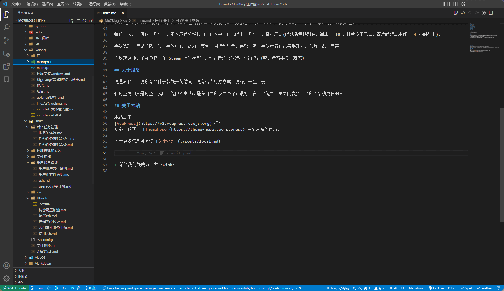

# 墨七(_Mo7_)

## 关于我

我叫『墨七』，一名非典型程序员。热爱编程，喜欢拥抱新技术，妄图改变世界，企图让世界因我而美好。

一名全站工程师，在多个开发领域都有着比较丰富的开发经验。

> 墨七 , mo7 , Mo7

## 关于爱好

写代码给我带来过很多快乐，也曾在我内心最悲伤的时候陪伴我走出阴影。

经常会突发奇想，喜欢自己设计构想，然后自己动手实现的那种成就感。写出来的东西被大家认可也会给我带来极大的满足感。

编码上头时，可以十几个小时不吃不睡依然精神；但也会一口气睡上十几个小时雷打不动(睡眠质量特别高，躺床上 10 分钟就没了意识，深度睡眠基本都在 4 小时往上)。

喜欢篮球，曾是校队成员；喜欢电影、游戏、美食、阅读和思考。喜欢创造，喜欢看着自己亲手建立的东西一点点完善。

喜欢玩原神、星际争霸、在 Steam 上体验各种大作。曾经的暴雪粉。

## 关于理想

愿世界和平，愿所有的种子都能开花结果，愿有情人终成眷属，愿好人一生平安。

但愿望终归只是愿望，我唯一能做的事情就是在目之所及之处做到最好，在自己能力范围之内发挥自己所长帮助更多的人。

## 关于本站

本站采用
[VuePress](https://v2.vuepress.vuejs.org) 搭建，
基于主题 [ThemeHope](https://theme-hope.vuejs.press) 由个人魔改而成。

关于更多信息可阅读 [关于本站](./website.md)

在日常的工作和学习当中我积累了大量的经验、知识和技巧，他们被我用 md 记录了下来存储在 Github 的私人仓库之上。

并且还有一些想法，想要表达的思想和观点等。我不太愿意将这些东西公布在各种公众平台之上，因为当我的知识变成了数据，那么这些数据的安全和版权应当由我自己负责，

写博客，并不仅仅只是为了表达，更是一种`记忆`和`修身养性`的方式，让自己浮躁的生活跟心情沉淀下来的一种手段。我希望过个七年八年的，再回首打开这个站点的时候，它能变成一种财富和寄托。

---

> 请记住域名 `mo7.cc` , 希望我们能成为朋友 :wink: ~
