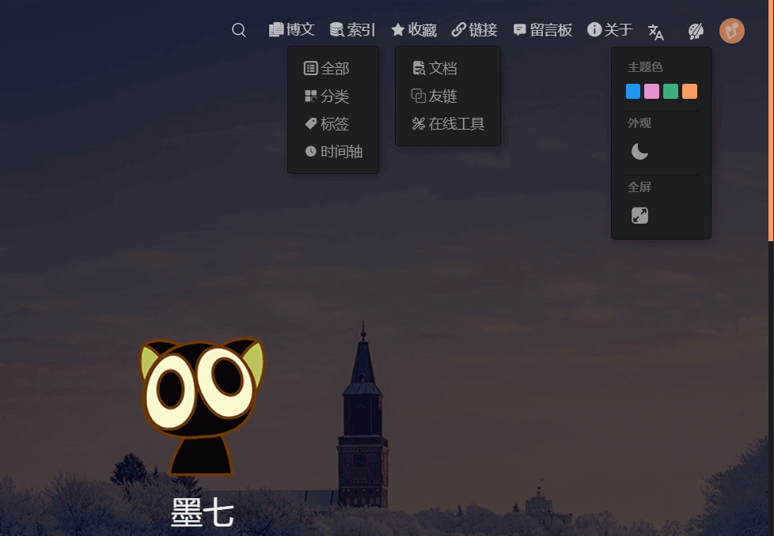
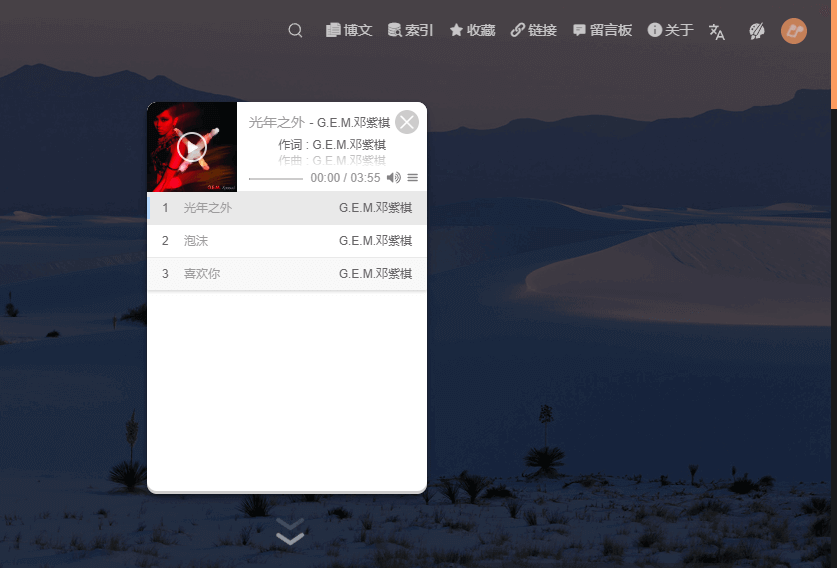
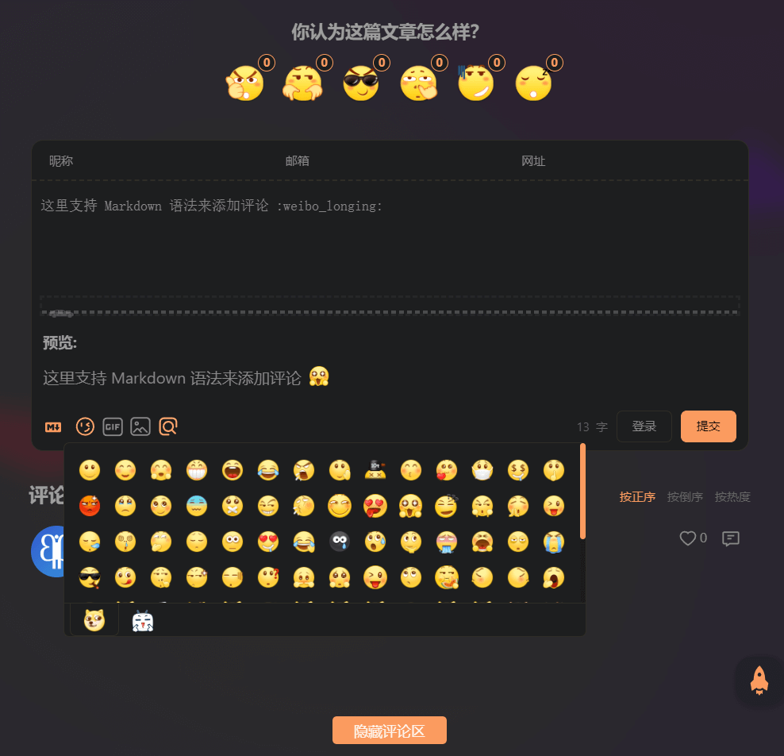
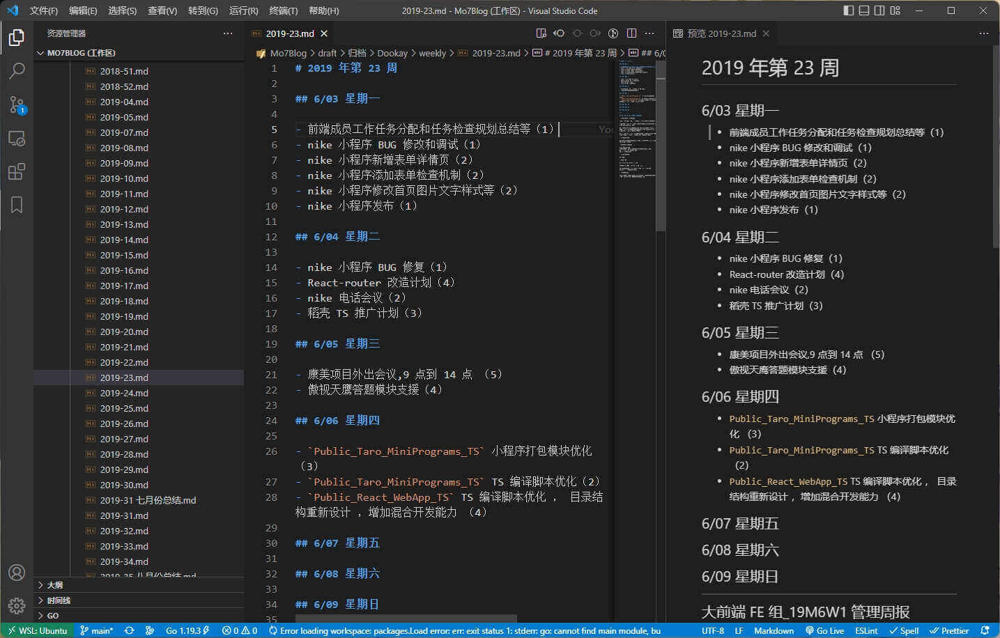

# 关于本站

## 前言

博主基于 [ThemeHope](https://theme-hope.vuejs.press) 这款主题做了一些小的修改，包括样式以及功能。每一处修改均以插件的形式进行了封装，但并未发布。喜欢的小伙伴可以留言。

### 顶栏功能介绍

这是顶部的一些下拉菜单，其中画板下拉菜单可以更改主题和全屏浏览。

### 音乐播放器

博主基于 [APlayer](https://aplayer.js.org) 开发了一款全局的音乐播放器。可以通过顶部导航栏右上角的 <MyIcon name="music" /> 按钮打开。音源来自于各大免费的音乐平台(侵删~)。 如果好的音乐推荐可以在评论区留言。

### 评论区介绍

评论区设置了发布频率限制，允许不登录匿名留言，支持 Markdown 语法，支持图片上传，支持预览和 Emoji 表情。

> 建议使用 Github 登录。

## 缘起

我最初学编程的目的就是为了能够拥有一个属于自己的网站，我觉得那会很酷，仿佛自己的心声可以被全世界所听到。我觉得程序员很酷，因为我觉得每一个程序员都拥有足以改变世界的力量。

时代变化如此之快，还没等我自己的第一行代码上线运行，微博，知乎，简书等各大平台如同雨后春笋一样拔地而起，互联网时代就在我身边悄然而至，这些应用也在悄然的改变我们每一个人的思考和生活方式。时光荏苒，回头再望发现自己只不过是沧海一粟。

## 缘落

我们细数一下，在当前时代如果你想从零搭建一个自己可以完全操控的稳定的站点，需要哪些知识和技巧:

1. 通过域名商购买符合自己心意的域名。
2. 通过云计算服务商购买符合自己心意的服务器（此时你需要最基本的计算机基础知识，和 Linux 最基本的操作技巧以及处理操作系统常见问题的能力。）
3. 了解基本的 HTTP 原理。
4. 掌握 HTML、javascript、css 网页编辑语言，掌握常见的开发调试技巧。
5. 如果你想让数据流动起来，你需要掌握一门服务器编程语言和最基本的数据库操作使用方法。

> 查看[本站用到的相关技术](../favorite/links/document.md)，除此之外，网站的运营还涉及到 SEO ，流量推广，PWA 等等知识。如果你在中国大陆，想让自己的站点稳定的运行，还得了解基本的法律法规和管理条例以及备案技巧。

如果你想让它变得内容变得更加丰富，界面变得更加生动，访问速度更快，或者功能性更强。
你还得深入掌握更多更加专业的知识或者技巧。如果想要让站点能够与时俱进，得保证技术的更迭和软件的维护。随着功能越来越多，所需要的各种专业知识也将更多。

> 当然我们这里的讨论排除掉各种站点的速成框架以及集成化的方案，这种囫囵吞枣式的搭建方式都带有铜臭味。毕竟作为程序员，对技术还是需要一点点小资品位的。

大到淘宝、Facebook，小到个人站点，他们所需要的最基本的技术和配置都差不多，只是所需要的深浅不太一样。随着技术大牛们的努力和开源世界的慷慨，这些事情越来越容易。

## 需求

在最初，我是采用下面这种方式去记录自己的日常工作和学习的:

后来还用过飞书、Excel、各种 ToDo 软件等。还是觉得 `Vscode + Markdown` 的方式最好。方便阅读、方便修改、简单、兼容性好。一次编写可以很轻松的在各种格式下进行转换，属于文档当中的【基本单元】。不管是 Word、还是 Excel，如果没有特定的软件读取则无法访问，并且由于商业竞争，它们对其它软件的兼容性都很差强人意，格式转换时也会出现排版混乱等情况。但是 Markdown 则不同，它排版简单，使用方便，长什么样子完全取决于阅读器的主题，不同主题下可以可以拥有不同的观感，排版也不会混乱。包括我的个人资料，文件，文档，心得体会，和一些日常的小记录等我全都采用 md 去记录的。

[Markdown](https://markdown.com.cn) 中图片的处理会比较麻烦，传统的例如 word 等文件格式它会将图片一起打包到文件中，但是在 md 当中图片更像是文档的`依赖文件`，是游离于文字之外的东西，除非你使用网络图片。我研究了各种图床，但是都存在各种限制。免费的图床很多，但是想要使用方便、免费、访问速度，稳定安全等因素兼得，实在是太难了。于是我最终选择了自己开发一个图床服务。

## Hexo

[Hexo](https://hexo.io/) ，这是我在经过认真对比后采用的博客构建工具，主题丰富，生态完善，采用 md 编写内容，基于 node 和 npm ，上手简单快捷。但是用起来总有不舒服的点:

> 热更新速度慢，静态资源路径的识别无法跟编辑器很好的兼容，框架想要进行二次编码和修改只能使用最原始的 css 和 js 覆盖，集成 less 或者 ts 等现代前端工具需要自己编写和配置很多东西。

[Hexo 制作的博客](http://blog2.mo7.cc) \
[Hexo 博客项目源码](https://github.com/mo7Code/hexo-blog)

## VuePress

后来发现了 [VuePress](https://v2.vuepress.vuejs.org) ，在仔细体验后，大爱！ 因为是基于 vite ，所以可以做到在编写 md 时几乎无感的热更新速度，保存之后页面无刷新渲染，使用体验媲美 VSCode 的本地预览！

基于 Vue 渲染引擎，Vite 的编译和打包，TypeScript，Sass 支持，包括 Vue 组件等。博客的开发体验跟 WebApp 达成了一致，比 Hexo 高出了好几个档次。虽然生态尚不成熟，且 2.0 尚未发布稳定版本，但是却无法挡住其锋芒。

缺点是主题和插件稀少，很多东西都得自己手动开发。

## vuepress-theme-hope

自己编写一款主题需要的细节和工作量是巨大的，我并不想投入那么多的时间和精力在这个上面。但是 VuePress 原本的默认主题又太过简陋。

在找寻许久后，我相中了 [ThemeHope](https://theme-hope.vuejs.press) 这款主题，它的作者是 VuePress 团队的成员，其更新速度和稳定性以及扩展性从基因层面就得到了保证。

于是基于 Hope 主题进行了一些细微的调教，自己写了一些功能模块，才有了本站当前的模样。

在这里感谢 [𝓜𝓻.𝓗𝓸𝓹𝓮](https://mrhope.site) 为我们带来这么棒的主题及其配套的插件。
