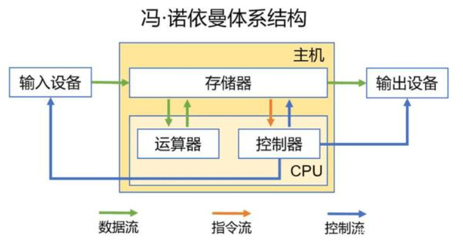

---
category:
  - developer
  - 基础
tag:
  - 演示

permalink: /developer/basic/computer_and_os.html
---

# 1.计算机和操作系统

## 一、计算机的基本组成和工作原理

先来一段计算机导论节选：

<PDF  url="//file.mo7.cc/static/book/basic-computers.pdf" />

> 原件链接 https://file.mo7.cc/static/book/basic-computers.pdf

当然，我知道你一定没耐心看完。

### 扼要总结

现代的大部分计算机基本都是采用的 [冯·诺依曼结构](https://zh.wikipedia.org/zh-cn/冯诺伊曼结构)，虽然计算机架构经过了多年的改良和优化，但实际上都没有跳脱出这个结构。

冯.诺依曼确定了`计算机结构`中的 5 大部件：

- **输入设备:** 如键盘、鼠标、触摸屏、游戏手柄、麦克风、摄像头等。
- **输出设备:** 显示器、打印机、扬声器、投影仪、手机屏幕等。
- **存储器:** 如内存条、硬盘、SD 卡、寄存器等，分为内存和外存。
- **运算器:** 计算机中执行各种算术和逻辑运算操作的部件，又叫做`算术逻辑部件（ALU）`。
- **控制器:** 计算机的神经中枢，指挥全机中各个部件自动协调工作。由程序计数器、指令寄存器、指令译码器、时序产生器和操作控制器组成，它是发布命令的“决策机构”。

现如今为了方便，`运算器`和`控制器`全部集成到同一个芯片上，统称为`中央处理器(CPU)`,其功能是从寄存器中取出指令、解释指令并执行指令。所以下面这张图更符合当下市场情况:

如果你自己亲手组装过游戏主机的话你应该知道，你最少需要购买[CPU](https://baike.baidu.com/item/中央处理器)、[主板](https://baike.baidu.com/item/主板)、[内存](https://baike.baidu.com/item/内存)、[电源](https://baike.baidu.com/item/电脑电源)、[硬盘](https://baike.baidu.com/item/固态硬盘)。
除此之外如果想让这些部件良好的运行，还需要[散热器](https://baike.baidu.com/item/电脑散热器)、[机箱](https://baike.baidu.com/item/电脑机箱)。如果想运行一些高画质的游戏，还需要[GPU](https://baike.baidu.com/item/显卡)。其中主板上会包含 [HDMI](https://baike.baidu.com/item/HDMI) 接口，外设控制器，甚至是 `蓝牙`和 `Wi-Fi` 模块。

如果我们进一步把 CPU、GPU、外设控制器，内存，网络连接模块等硬件功能集中到一块芯片上，那么这块芯片就被称为 [`SOC` (System on a Chip)](https://baike.baidu.com/item/soc)，如[高通骁龙](https://zh.wikipedia.org/wiki/高通驍龍)、[Apple M1](https://zh.wikipedia.org/wiki/Apple_M1)等。

CPU，存储器，外设控制器等模块都是无法独立运行的，模块之间的协作都是需要数据传递和能量消耗的，所以`SOC`把这些模块都集中在一个芯片上，信息之间的传递路径就会变得非常短。所以 `SOC`的运行能效比传统的 `CPU` 要高很多，非常适合电源局促的移动设备。

> 这就是`苹果M系列芯片`笔记本电脑续航牛逼的核心原因。

CPU 读取存储器中的程序和数据，完成一系列计算后再传递给外设控制器，然后对应的输出设备再做出相应的反应。我们生活中，大到火箭空间站，小到电视遥控器，路由器，电视机，手机。任何带有芯片控制的机器，其工作原理都基本类似。

> 对，没错，任何传统物件只要带上一颗芯片，就能被称为`智能设备`，这块芯片如果还能联网，就变成了`物联网`😂

这里有一个视频讲解:
<BiliBili bvid="BV1tM4y1B7qP" />

以上的这些部件都被称之为[硬件](https://baike.baidu.com/item/硬件)，硬件是软件运行的基础，也决定了一个设备能力的`上限`。如果对应的硬件能力不存在，则功能就无法实现。比如你下载了一个音乐播放器，如果扬声器损坏或没有，你也是无法播放音乐的。

但是，如果没有对应的软件，再牛逼的芯片也无法发挥作用，就像一个`年轻力壮的植物人`一样。

接下来我们要认识一下，世界上最复杂的软件之一: **`操作系统`**

## 二、操作系统初识

**这里放上一篇写的非常好的文档**

https://lfool.gitbook.io/operating-system/untitled-1/1.-cao-zuo-xi-tong-gai-lun-gong-neng

## 简明扼要

[操作系统（Operating System，OS）](https://zh.wikipedia.org/wiki/操作系统)是指控制和管理整个计算机系统的硬件和软件资源，并合理地组织调度计算机的工作和资源分配；以提供给用户和其他软件方便的接口和环境；它是硬件基础上的第一层软件，是硬件和其它软件沟通的桥梁。

操作系统会控制其他程序运行，管理系统资源，提供最基本的计算功能，如管理及配置内存、决定系统资源供需的优先次序等，同时还提供一些基本的服务程序，例如:

1. [用户接口](https://baike.baidu.com/item/用户接口)
   操作系统需要为用户提供一种运行程序和访问文件系统的方法。如常用的 Windows 图形界面，安卓和 iOS 的触控式反馈等， 可以理解为一种用户与操作系统交互的方式。
   用户接口还包含一个重要的分类: [shell](https://baike.baidu.com/item/shell)。
   如最常见的 [Windows Explorer](https://zh.wikipedia.org/wiki/檔案總管) 就是一种 `图形界面shell`；还有 Linux 上默认的 [Bash shell](https://zh.wikipedia.org/wiki/Bash)，一般也被称作`文字界面`；MacOS 上默认的[Zsh shell](https://www.duidaima.com/Group/Topic/OtherTools/17940)；当然还包括 Windows 上的 [PowerShell](https://zh.wikipedia.org/wiki/PowerShell)等。

2. [文件系统](https://baike.baidu.com/item/文件系统)
   提供计算机存储信息的结构，信息存储在文件中，文件主要存储在计算机的内部硬盘里，在目录的分层结构中组织文件。文件系统为操作系统提供了组织管理数据的方式。

3. [进程管理](https://baike.baidu.com/item/进程管理)
   当计算机启动时，会自启动许多系统服务程序，执行安装文件、启动网络服务、运行预设任务，启动驱动程序等，进程管理可以很方便的去管理这些进程。

4. [安装和卸载程序](https://zh.wikipedia.org/wiki/安裝程式)
   提供软件的卸载和安装服务，让用户可以随心所欲的拓展系统功能。

当然，除上述 4 条之外，操作系统还会提供非常非常多的功能和软件，但上面 4 个基本的功能是大多数系统都会有的。所以想要快速熟悉一个操作系统，上述 4 个功能是首当其冲需要掌握的。

常见的操作系统如：[Windows](https://zh.wikipedia.org/wiki/Microsoft_Windows) ， [MacOS](https://zh.wikipedia.org/wiki/MacOS) ， [Linux](https://zh.wikipedia.org/wiki/Linux) ，[Android](https://zh.wikipedia.org/wiki/Android) ， [iOS](https://zh.wikipedia.org/wiki/IOS) ，以及 各种 [类 Unix 系统](https://zh.wikipedia.org/wiki/类Unix系统)。
除此之外，还有根据硬件专门定制的简洁系统，一般被称为[嵌入式操作系统](https://zh.wikipedia.org/wiki/嵌入式操作系统)。

[吃瓜链接：各个操作系统之间的亲子关系](https://www.ofweek.com/im/2022-05/ART-201927-8120-30562861.html)。

<BiliBili bvid="BV1G94y1b7C5" />
