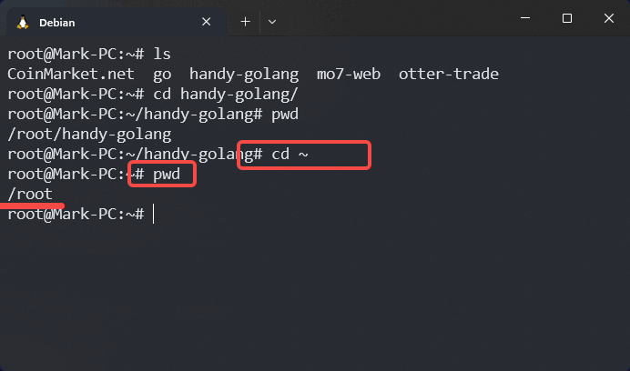
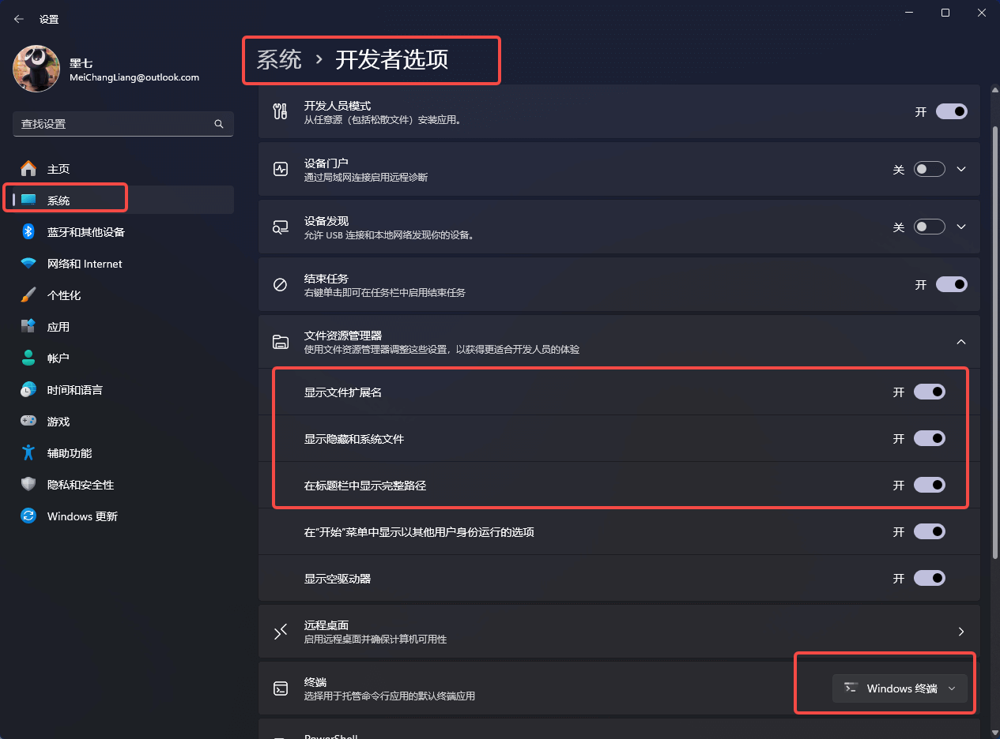

---
category:
  - developer
  - 基础
tag:
  - 演示

order: 2

permalink: /developer/basic/file_and_path.html
---

# 2.路径和文件

::: warning

注意：本文中的一些超链接你可能会打不开，那很可能是因为需要 [科学上网](/developer/basic/proxy_to_net.html)。

:::

[路径-维基百科](<https://zh.wikipedia.org/wiki/路径_(计算机科学)>)

文件路径是用于描述文件系统资源的一个文本标识。 文件系统是对文件存储设备的空间进行组织和分配，负责文件存储并对存入的文件进行保护和检索的系统。 文件存放在外部存储器中的某些位置上，经由文件系统管理后，被系统以文件路径标识，系统可以通过文件路径检索到对应文件。

## 文件、文件名、文件后缀名、文件拓展名

这里放上一篇解释的比较清楚的文章
https://www.ecdove.com/p/245.html

文件名就是文件的名称，是为了方便人们区分计算机中的不同文件，而给每个文件设定一个指定的名称。
文件名不能包含控制字符: `< > / \ | : " \* ?`

[文件扩展名](https://zh.wikipedia.org/wiki/文件扩展名) 也称为文件的延伸文件名、后缀名，是操作系统用来标记文件类型的一种机制。通常来说，一个扩展名是跟在主文件名后面的，由一个分隔符分隔。

文件扩展名其更重要的作用是让系统决定当用户想打开这个文件的时候用哪种软件运行，如 Windows 系统中 `.exe` 文件是可执行文件，`.doc` 文件默认用 `Microsoft Word` 打开的 Word 文件。

::: tip 误区

1. 文件扩展名是一个文件的必要构成部分。❌
   任何一个文件都可以没有扩展名。没有扩展名的文件需要选择程序去打开它，有扩展名的文件会自动用设置好的默认程序去打开。文件扩展名是一个常规文件的构成部分，但一个文件并不一定需要一个扩展名。

2. 文件扩展名表明了该文件是何种类型。❌
   文件扩展名可以人为设定，扩展名为 TXT 的文件有可能是一张图片，同样，扩展名为 MP3 的文件，依然可能是一个视频。

ps:凡是可以人为随意修改的东西，都是不可信的

:::

你可以试试 在桌面新建一个 `demo.txt` 文件，在里面写上一句话，然后修改后缀名为 `demo.html`，然后刷新桌面看看。它的内容都没有变，只是解析这个文件的默认程序和方法变了。

## 绝对路径与相对路径

**绝对路径例子：**

`c:\user\www\index.html`
`/user/www/index.html`
`/Users/mo7cc`

也就是说，路径的起始符号为路径分隔符 `/` 或者 `\` 或者盘符 `c:` , 该路径就表示为绝对路径，其中 `类Unix系统` 的路径分隔符都为 `/` , 只有 windows 系为 `\`, 这一点要注意。
绝对路径指向一个文件路径的固定位置，不会因为当前工作目录的变化而变化，所以为了准确描述，它必须包含根目录。

**相对路径例子：**

`./www/index.html`
`../index.html`
`www/index.html`

也就是说，路径起始符号为 `./` `../` 或者是 `www/` 这样的目录名 的就是相对路径。也就是以当前工作目录或文件所在目录为起点表示的相对位置。
其中 `./` 表示当前目录。 `../` 表示上一层目录。
其中 `./www` 和 `www` 是等价的，都表示当前目录下的 `www` 目录。
同理 `./www/index.html` 和 `www/index.html` 也是等价的，都表示当前目录下的 `www`目录下的 `index.html` 文件。

::: tip
通过相对路径和绝对路径，我们就可以在系统中准确的表示和定位一个文件或者目录了。
一般在项目开发中，一般都是基于于项目所在的目录为基准点使用相对路径来描述项目中文件和文件之间的关系。
:::

## 绝对路径和相对路径的应用

比如说，我们要在 main.js 文件中引入另一个 tools.js 文件。

main.js 文件在 `/user/mo7cc/my-project/main.js`
tools.js 文件在 `/user/mo7cc/my-project/tools.js`

绝对路径引用:

```js title="main.js"
import tools from '/user/mo7cc/my-project/tools.js';
```

相对路径引用:

```js title="main.js"
import tools from './tools.js';
```

此时，这两种引用方式都是正确的，代码都可以顺利运行。因为两个文件都在 `mo7cc/my-project` 下。

这个时候，如果另一个人下载了项目，他的工作目录不是 `mo7cc` ， 是 `mo8cc`，那么文件的的路径就变成了:

main.js 文件会变成 `/user/mo8cc/my-project/main.js`
tools.js 文件会变成 `/user/mo8cc/my-project/tools.js`

那么绝对路径引用就必须得修改成下面这样:

```js title="main.js"
import tools from '/user/mo8cc/my-project/tools.js';
```

而此时，相对路径不需要修改，因为两个文件依然在 `my-project` 下面。如果一个项目有上百个文件，那么移动项目的位置将会是一场灾难。

## 网络资源地址

windows 下一般定位资源必须得带上盘符，比如 `c:\user\mo7cc\image`
Linux 系统则是 `/home/mo7cc/image`
而一般的网络资源则是 `https://file.mo7.cc/static/lxh_gif/lxh_71.gif`

他们之间的区别是什么呢?

一般 windows 会存在很多磁盘，`c:\`、`d:\`、`e:\`，没有盘符则无法在系统中准确描述一个文件所在位置的。
而 Linux 一般会把拓展的硬盘分区放在 `/mnt/c`、`/mnt/d`、`/mnt/e`，下。所以 Linux 下表示根目录有且只有一种方式： `/`。

你自己本地的一个文件例如 `c:\user\mo7cc\my-project\index.html` 要怎么才能共享给别人，让别人都能访问到呢？不太可能把电脑搬到人家里去吧？

这个时候，你可能需要购买一台服务器，然后把文件放到服务器上面去，那么你的机器就有了一个公网的 ip 地址，这个时候就可以使用 [统一资源定位符](https://zh.wikipedia.org/wiki/统一资源定位符) 来表示该文件了。这个时候这个文件又叫做`网络资源`或者`公网资源`。

统一资源定位符的标准格式如下

```txt
[协议类型]://[服务器地址]:[端口号]/[资源层级Unix文件路径][文件名]
```

例如 http://123.123.123.1234:8080/static/lxh_gif/lxh_71.gif

协议类型为 `http`
服务器地址为 `123.123.123.1234`
端口号为 `8080`
资源层级文件路径为 `static/lxh_gif/lxh_71.gif`

如果你注册了一个域名`file.mo7.cc` 并指向了你的服务器 IP ，然后资源服务器的端口设定为 `80`，那么地址就变成了

http://file.mo7.cc/static/lxh_gif/lxh_71.gif

如果设定端口为 `443`，那么资源地址就会是

https://file.mo7.cc/static/lxh_gif/lxh_71.gif

::: tip 翻译成白话文就是

使用 HTTP 协议的方式(如浏览器)，去访问 ip 地址为 `123.123.123.1234` 的服务器，因为公网的 ip 地址都是唯一的，所以一定可以定位到该服务器。然后端口也有了，那么就可以准确定位到这个服务器上的这个服务了。然后就可以尝试去和这个服务索要 `static/lxh_gif/lxh_71.gif` 文件了。

这个就是，`统一资源定位符` 的唯一性。而且是全世界唯一，所以任何人都可以通过这个 **唯一性** 去定位和访问这个文件了。

路径，则是在这台机器上(也就是`本地`)具有 `唯一性`，所以`本地用户`就可以准确的定位这个文件并访问。
:::

一个文件的路径必须具备 `本地唯一性`，一个公网资源路径则必须具备`世界唯一性`。

::: warning 注意

`统一资源定位符` 中的域名一般是不区分大小写的
https://file.mo7.cc/static/lxh_gif/lxh_71.gif
和
HTTPS://FILE.MO7.CC/static/lxh_gif/lxh_71.gif
是一样的

---

windows 中的路径也不区分大小写

`c:\user\mo7cc\my-project\index.html`

和

`C:\User\Mo7cc\my-project\index.html`

表示同一个路径

---

但是 Linux 是区分的大小写的！大小写不一样的会被认为是两个不同的路径。

为了格式统一和降低心智负担，所以路径和文件名一般避免使用特殊符号和空格，并尽量使用小写，单词和单词之间使用 `_` 或 `-` 进行连接。

:::

参考文章: [Linux 文件（目录）命名规则](https://developer.aliyun.com/article/909794)

## 路径别名

比如，在 Linux 系统中 `~` 代表当前登录的用户主目录，
比如:
当前用户身份为 `root` 用户，则 `~/` 等价于 `/root/`
当前用户为一般用户且用户名为 `mo7cc` 用户，则 `~/` 等价于 `/home/mo7cc/`

如下图，使用命令 `cd ~` 进入 `~` 目录之后，打印绝对路径结果为 `/root`,
`cd ~/handy-golang` 等价于 `cd /root/handy-golang`



## 显示文件后缀名

**macOS**

[在 Mac 上显示或隐藏文件扩展名](https://support.apple.com/zh-cn/guide/mac-help/mchlp2304/mac)

**Linux**

```bash
ls -a
```

**windows**



