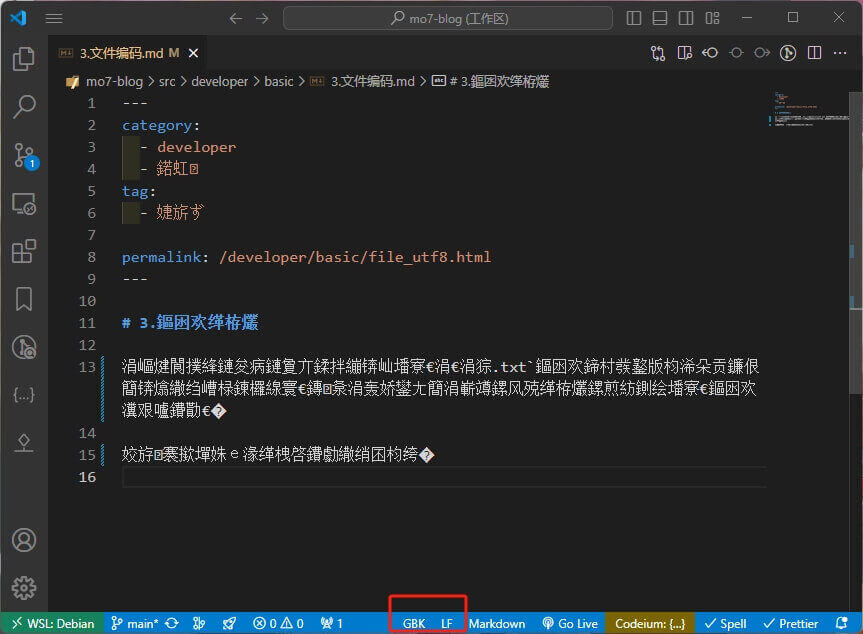

---
category:
  - developer
  - 基础
tag:
  - 演示

order: 3
permalink: /developer/basic/file_utf8.html
---

# 3.文件编码

::: warning

注意：本文中的一些超链接你可能会打不开，那很可能是因为需要 [科学上网](/developer/basic/proxy_to_net.html)。

:::

不知道你有没有遇到过，打开一个`.txt`文件却发现文件乱码了？这种时候往往是因为使用了不一样的编码格式去打开文件导致的。

比如当前正在编写的这篇文章，如果采用 [GBK](https://zh.wikipedia.org/wiki/汉字内码扩展规范) 编码打开，就会变成一堆不认识的字符：

但是同样的一篇文章采用 [UTF-8](https://zh.wikipedia.org/wiki/UTF-8) 打开则可以正常阅读：

因为这篇文章就是在 `UTF-8` 编码规则下编写的。 而`GBK`编码是 windows 系统早期的默认编码。

::: tip

如果没啥特殊需求，一般编写文件内容默认使用 `UTF-8` 是一定没错的。 `UTF-8` 现在基本是大多数操作系统的默认编码。

也是因为编码的问题，所以一般来说，很多国外开发的老式软件无法在 中文目录下成功运行，所以目录名一般不推荐使用中文。
:::

拓展阅读 [ASCII 编码、GBK 编码，Unicode 编码和 UTF-8](https://www.cnblogs.com/Rainingday/p/14641104.html)

<BiliBili bvid="BV1cB4y177QR" />
