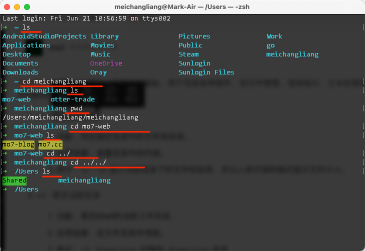

---
category:
  - developer
  - 基础
tag:
  - 演示

order: 4
permalink: /developer/basic/cmd_shell.html
---

# 4.终端与 shell

::: warning

注意：本文中的一些超链接你可能会打不开，那很可能是因为需要 [科学上网](/developer/basic/proxy_to_net.html)。

:::

我觉得这里放一个视频就足以解释清楚了。

<BiliBili bvid="BV17m411U7cC" />

这里再放上一篇文章

https://sspai.com/post/45534

## 简明扼要

终端，外表看起来就只是一个窗口，上面可以键入字符，当你输入特定字符的时候它会打印出一些反馈。这个字符一般就是[Shell 命令](https://www.runoob.com/linux/linux-shell.html)。
MacOS 现在默认的 shell 解释器是 [Zsh](https://www.duidaima.com/Group/Topic/OtherTools/17940);
Linux 上的一般默认为 [Bash](https://zh.wikipedia.org/wiki/Bash);
Windows 下默认为 [PowerShell](https://zh.wikipedia.org/wiki/PowerShell);

::: tip 相关阅读

[安装并开始设置 Windows 终端](https://learn.microsoft.com/zh-cn/windows/terminal/install)

[macOS 终端使用手册](https://support.apple.com/zh-cn/guide/terminal/welcome/mac)

[80 个常用 shell 命令及简单用法](https://blog.csdn.net/WQY867047910/article/details/134788517)

:::

命令行使用的示例：

::: warning

`PowerShell` 的语法和 `Bash shell` 并不相同，但是在编程领域，`Bash shell` 无疑是占据领导地位的，在很多场景下都可以开箱即用，所以十分建议专门学习一下 `Bash shell`。

在 windows 下推荐使用 [Git bash](https://moshanghua.net/details/2765) 或 [WSL](/tutorial/wsl_ready.html) 来进行日常操作。

:::

> 好了，到这一步为止，你终于学会了命令行的基本使用了。

## 拓展阅读

[Bash 脚本编程入门](https://linux.cn/article-16120-1.html)

> 不得不说，微软爸爸家的文档是真的优秀 \
> [什么是 PowerShell？](https://learn.microsoft.com/zh-cn/powershell/scripting/overview) \
> [PowerShell 入门](https://learn.microsoft.com/zh-cn/powershell/scripting/learn/ps101/01-getting-started)
