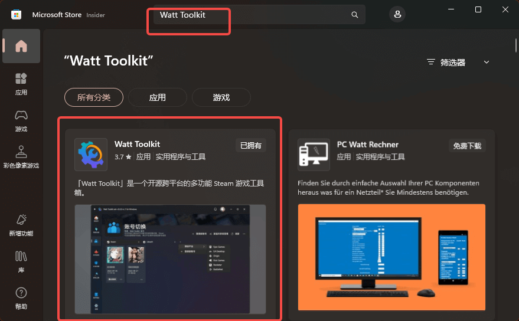
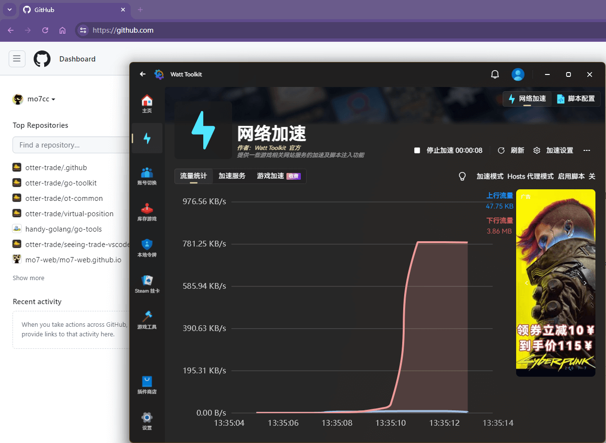

---
category:
  - developer
  - 基础
tag:
  - 演示

order: 9

permalink: /developer/basic/proxy_to_net.html
---

# 9.科学上网和国内镜像

什么是 [科学上网?](https://cn.bing.com/search?q=%E7%A7%91%E5%AD%A6%E4%B8%8A%E7%BD%91)

<BiliBili bvid="BV1LrgVeUEsJ" />

---

怎么讲呢，网络是自由的，但又不那么的自由。因为国内阻止了 **Google** 所以 **百度** 发家，百度又不干好事。

**Github** 被 **墙** 但是国内的 **Gitee** 简直 **依托答辩**。

**墙** 成了国内互联网企业发展护城河，让中国在孱弱时期避免被外来互联网技术和文化入侵，但是也一定程度上阻碍了科学技术的普及和发展。

我们使用的 编程语言、各种命令行工具、系统、开源仓库、包管理服务等大部分都是国外创造的。不翻墙，甚至很多工作都无法进行，文件资料无法查阅。

一般来说，比较大的公司有相关的 [合法的国际专线](http://www.elawcn.com/telecommunication/2020/0531/670.html) ，但是对于个人开发者来说，成本是巨大的，也是不现实的。

这么说吧，如果说 **科学上网** 是违法的，那么没有任何一名程序员是无辜的。出于 **学习** 为目的的翻墙无可厚非，**师夷之长技以制夷**。

如果想要 **合法** 的使用一些国外的程序相关服务，应该怎么办呢？

## 国内镜像

比如 `npm` 是 `Nodejs` 的包管理器，它的官网是 `https://www.npmjs.com/`，国内正常情况下你一定打不开。
`https://registry.npmjs.org/` 是 `npm` 的 **官方源**，`npm install` 指令依赖这个地址，但是在国内这个指令 90% 一定会执行失败。

类似的还有 `Python` 的 `pip` 指令；
`Golang` 的 `go get` 指令；
`Linux` 的 `apt install` 指令；
`Homebrew` 的 `brew install` 指令；
.....

不使用 `科学上网` 那应该怎么办呢？

**阿里开源镜像站：** https://developer.aliyun.com/mirror/
**网易开源镜像站：** http://mirrors.163.com/
**搜狐开源镜像站：** http://mirrors.sohu.com/
**北京交通大学开源镜像站：** http://mirror.bjtu.edu.cn
**兰州大学开源软件镜像站：** http://mirror.lzu.edu.cn/
**厦门大学开源软件镜像站：** http://mirrors.xmu.edu.cn/
**上海交通大学开源软件镜像站：** http://ftp.sjtu.edu.cn/
**清华大学开源软件镜像站：** http://mirrors.tuna.tsinghua.edu.cn/
**天津大学开源软件镜像站：** http://mirror.tju.edu.cn/
**中国科学技术大学开源软件镜像站：** http://mirrors.ustc.edu.cn/
**东北大学开源软件镜像站：** http://mirror.neu.edu.cn/
**东软信息学院开源软件镜像站：** http://mirrors.neusoft.edu.cn/
**浙江大学开源软件镜像站：** http://mirrors.zju.edu.cn
**北京理工大学开源软件镜像站：** http://mirror.bit.edu.cn
**华中科技大学开源软件镜像站：** http://mirrors.hust.edu.cn/
**中山大学开源软件镜像站：** http://mirror.sysu.edu.cn/
**大连理工大学开源软件镜像站：** http://mirror.dlut.edu.cn/

通常情况下

`go语言` 使用 https://goproxy.cn/
`npm` 使用 https://www.npmmirror.com/
`Linux Debian` 使用 https://mirrors.tuna.tsinghua.edu.cn/help/debian/
`Homebrew` 使用 https://developer.aliyun.com/mirror/homebrew

一般来说，阿里镜像源的稳定性最好，使用人数也比较多。

> 学会使用国内的镜像，一般的编程和包安装下载应该都不是什么大问题了。一般来说，安装类的命令执行失败，90% 的原因都和 **墙(GFW)** 有关。
> 在早期，国内的各大镜像源都喜欢**夹带私货**，比如把 官方包 替换成自己的 私人包，在命令行中打广告，甚至是在包中插入病毒和挖矿程序，包版本落后等等等.....
> 不过随着国内监管力度的加大，现在这种情况比较少见了。
> **我相信中国人是世界上最聪明的，但是这个世界上最伟大的发明创造却鲜有中国的身影。可能会有中国人参与其中，但他们都非中国籍。**
> (中国人的聪明才智，似乎也很少用到正道上。)

## Github 的流畅访问手段

很多资源的获取都离不开 https://github.com

但是大多数时候这个地址都无法被打开，如果还不会 **科学上网** 可以试试下面这个方案。

1. 打开 `Microsoft Store` 搜索 `Watt Toolkit` 并安装。

2. 启动 `Watt Toolkit` 并勾选 `Github`

3. 然后点击 `一键加速` 就可以正常访问 github.com 了

## 科学上网

如果你想要使用 `Google`、 `ChartGPT` 或者想要获取国内外一手资讯等，还是得了解一下 **科学上网** 这件事情的。

[中国网络防火长城简史](https://blog.tsingjyujing.com/spam/gfw-history)

[科学上网与本地代理教程](/tutorial/proxy_wall_ready.html)

> 请一定要做一个遵纪守法的好公民
