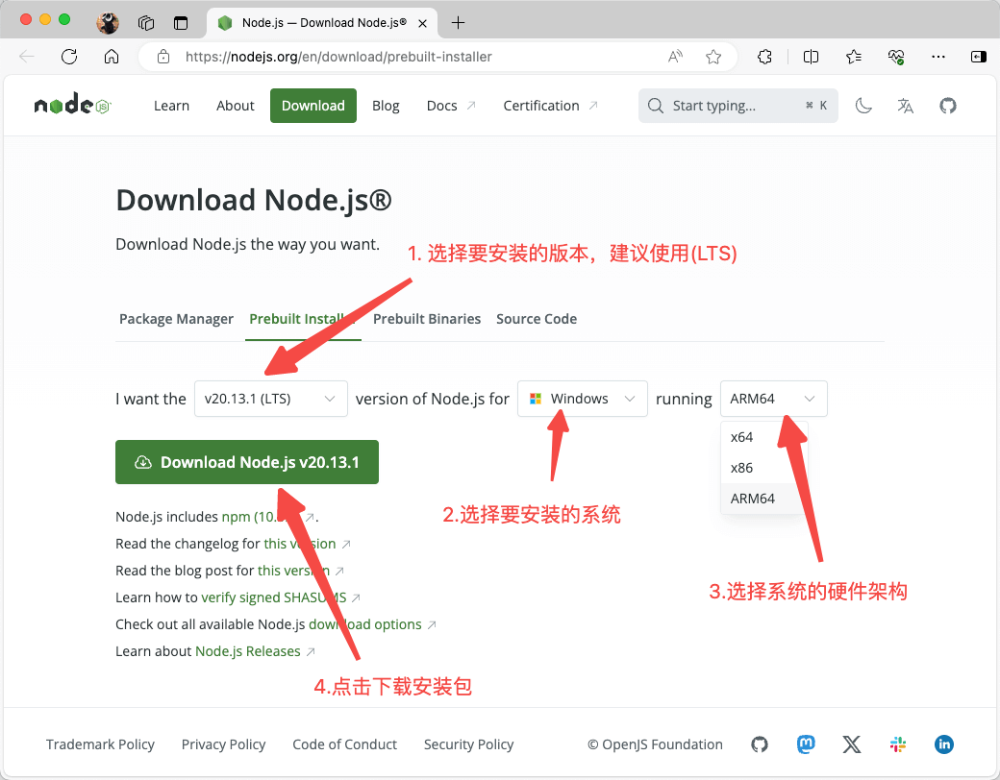
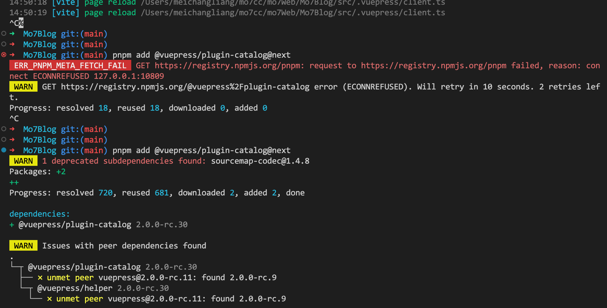

# 1.Nodejs 基础环境搭建.md

## 在 macOS 和 Windows 上安装 Node.js

::: warning
macOS 和 Windows 官方都有发布安专门的安装包，所以安装方式基本相同，但是得注意区分硬件架构。
:::

### 第一步，查看机器硬件架构类型

打开终端做如下输入并回车

```bash
arch
# 会打印显示如:  arm64 或 x86_64 或其它
```

::: details windows 下则是使用 sysyeminfo 命令

:::

### 第二步，下载安装包

https://nodejs.org/en/download/prebuilt-installer



然后双击运行无脑下一步。

## Linux 下安装 NodeJs

Github 文档:

https://github.com/nodesource/distributions

总结下来就两行命令

```bash
curl -fsSL https://deb.nodesource.com/setup_current.x | sudo -E bash -
sudo apt-get install -y nodejs
```

Github 文档写的非常详细，这里就不再赘述了。

## 验证安装结果

重启终端做如下输入

```bash
node -v
# 会打印当前 nodejs 版本如： v20.12.2

npm -v
# 会打印当前 npm 版本如： 10.5.2
```

> 至此 nodejs 安装成功

## npm 加速设置

::: warning
npm 是 nodejs 的默认包管理器，其官方镜像地址 <https://registry.npmjs.org> 在海外，直接使用会出现各种依赖安装失败的问题。
所以一般都会采用国内镜像，或者设置代理服务。
:::

### 1. 使用阿里云镜像

阿里云镜像应该是目前国内使用最普遍的 npm 镜像站了

镜像官网：
https://www.npmmirror.com/

直接执行如下命令即可完成镜像源的替换

```bash
npm config set registry https://registry.npmmirror.com
```

::: details
它会创建 `~/.npmrc` 文件，并填充如下内容

```js
registry=https://registry.npmmirror.com
```

这个配置文件如果放在 `~/.npmrc` 用户目录下就是全局设置，如果放在项目目录下 `./.npmrc`，则作为项目的独立设置。

同理，想要换回官方镜像，手动删除 `~/.npmrc` 中对应的配置项，或者执行如下命令

```bash
npm config delete registry
```

:::

### 2. 使用全局的命令行代理

> 具体细节可参考文章 [科学上网与本地代理](/tutorial/proxy_wall_ready.html)

如果你把代理关了，使用 npm 更新依赖时会有如下显示



---

::: info 提示

上述两种加速方式，可同时使用。

命令行代理则更为通用一些，本质上也会更安全纯粹一些。

不过一般情况下 使用阿里云镜像已经可以满足 90% 的场景了。

:::

---

## pnpm

pnpm 现在呼声很高，因为其非常优异的机制和设计，速度很快。避免了部分 npm 的坑。
是一个非常棒的 npm 的替代品。

pnpm 官网:
https://pnpm.io/zh/

官网给了很多的 pnpm 的安装方式，但是我推荐的安装方式只有一种

```bash
npm install -g pnpm
```

> 其余的安装方式多多少少都会存在一些问题

::: tip
全局依赖的安装依然推荐使用 `npm -g install` 命令，项目目录依赖则推荐使用 `pnpm install` 命令，这样不会乱，而且会很清爽，问题也最少。
:::

> pnpm 和 npm 一样，会优先使用项目目录的 `./.npmrc` 配置文件，如果项目目录不存在才会使用 用户目录下的 `~/.npmrc`

## windows 下 使用 git-bash 来执行 npm 指令中的脚本

```bash
npm config set script-shell "C:\\mo7cc\\soft\\Git\\bin\\bash.exe"

```

::: warning
命令中的 `"C:\\mo7cc\\soft\\Git\\bin\\bash.exe"` 地址需要更换为你 windows 系统中 Git 的安装目录。

地址里面 `\\` 中的第一个 `\` 实为转义符。
:::

详细可 参考 [Git 的基本安装和使用](../../tools/git/)

## 环境安装结果的验证

打开命令行工具，依次验证如下命令

```bash
node -v
# v20.12.2

npm -v
# 10.5.2

pnpm -v
# 9.1.2

npm config get registry
pnpm config get registry
# 如果设置了镜像源 则会输出 https://registry.npmmirror.com 的镜像地址

```
