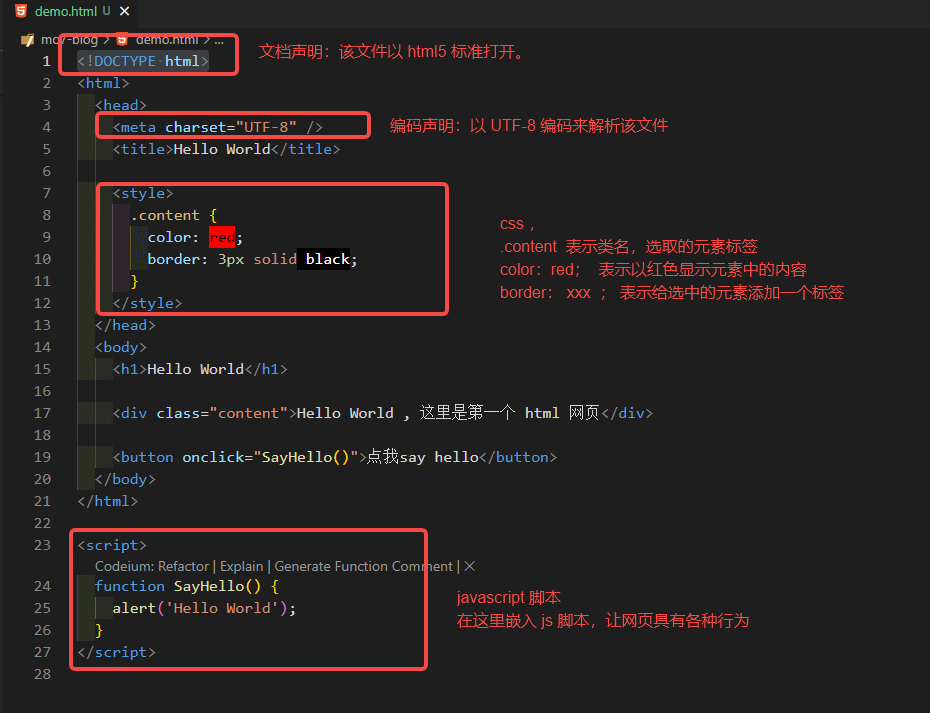

# 3.Web 前端开发入门

想一想这一篇应该怎么去讲解。

在任意位置新建文件 `demo.html` :

```html title="./demo.html"
<!DOCTYPE html>
<html>
  <head>
    <meta charset="UTF-8" />
    <title>Hello World</title>
    <style>
      .content {
        color: red;
        border: 3px solid black;
      }
    </style>
  </head>
  <body>
    <h1>Hello World</h1>
    <div class="content">Hello World , 这里是第一个 html 网页</div>
    <button onclick="SayHello()">点我say hello</button>
  </body>
</html>
<script>
  function SayHello() {
    alert('Hello World');
  }
</script>
```

保存后 浏览器打开会显示以下内容：


## html 结构说明



一般来说，一个 html 文件的基本结构如下：

1. 一个基本的文档类型声明

```html
<!DOCTYPE html>
```

2. `<html> </html>` 标签 包裹下的 `<body> </body>` 和 `<head> </head>` 标签

```html
<!DOCTYPE html>
<html>
  <head>
    <!-- head 头声明部分， 这里一般放置一些 title 声明。引用相关的 -->
  </head>
  <body>
    <!-- 文档的内容部分，这里是文档的主体部分，主要是表明浏览器需要渲染的标签内容 -->
  </body>
</html>
```

大部分的标签全部都是 **成对** 存在的，把内容包裹在其中。标签之间可以相互嵌套。

3. css 部分

```html
<style>
  /* css 样式内容  */
</style>

<!-- 引入外部的 css 文件: -->
<head>
  <link rel="stylesheet" type="text/css" href="./theme.css" />
</head>
```

CSS 又被成为 **层叠样式表** ，它更像是一份声明文件，声明该以什么样的形式去绘制 标签的外观。现在大部分的过渡动画都以 CSS 的形式去进行表述。CSS 具有极高的渲染性能。

4. javascript 脚本部分

```html
<script>
  /* javascript 脚本内容  */
</script>

<!-- 引入外部的 js 文件: -->
<script src="./main.js"></script>
```

`javascript` 是一门图灵完备的脚本语言，浏览器中的一等公民。
在 `nodejs` 的帮助下，它可以脱离浏览器运行在主机上面进行服务端开发。这是唯一一门 **全栈** 类型的编程语言。
也是目前全球使用最广泛的编程语言。 也是使用人数最多的编程语言。

它不仅仅只用于编写网页，包括服务端开发，小程序开发，在一些技术的加持下 还包括 Android 和 ios 应用开发。嗯，除此之外它还能做很多很多的事情。
虽然相比较其它编程语言它的执行效率比较低，但是它更加易于学习，用途更加广泛，上手门槛更低，开发速度更快。
得益于 各大浏览器内核的内卷，它在 `解释型语言` 中也属于性能最好的那一类。

`javascript` 是最适合小白入门的编程语言。

## 入门教学

因为实在是太过简单，基础部分的学习资料实在是太多了，这里我找到了一个夹带私货最少，废话最少的一个 B 站教学视频。

[3 小时前端入门教程（HTML+CSS+JS）](https://www.bilibili.com/video/BV1BT4y1W7Aw)

<BiliBili bvid="BV1BT4y1W7Aw" />

---

## 文档资料

一般来说，一边看文档，一边敲代码实操练习是掌握知识最快的方法。然后在实操中掌握每一行代码的特性。

[HTML 教程- (HTML5 标准)](https://www.runoob.com/html/html-tutorial.html)

[CSS 教程](https://www.runoob.com/css/css-tutorial.html)

[JavaScript 教程](https://www.runoob.com/js/js-tutorial.html)

::: info

当你熟练掌握一门编程语言之后，学习其它的编程语言基本上属于手到擒来。

:::
