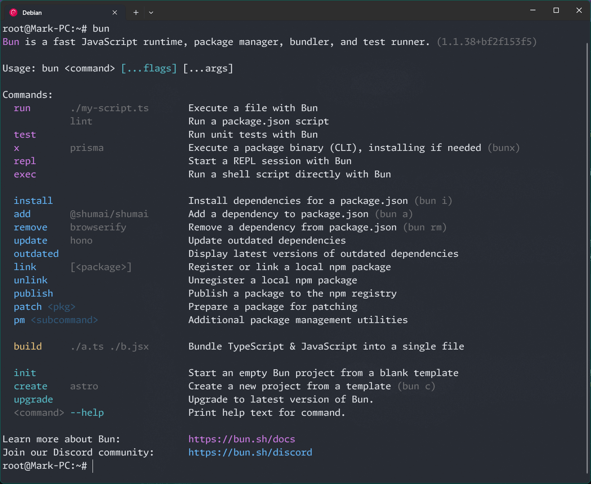

# Bun 学习笔记

Bun 和 NodeJs 都是 JavaScript 运行时。Bun 支持 TypeScript 直接运行。而且具有更快的运行速度。
并且官方文档声称其和 NodeJs 完全兼容，并且同时支持 `CommonJS` 和 `ESModule` 。

好吧，更快的执行和启动速度，完全兼容旧模组，听起来很是完美。
并且， Vue 、 Vite 、 VitePress 官方文档已经出现了 Bun 命令启动示例。也就是说，Vue 生态已经全面拥抱 Bun 。

并且，Bun 没有历史负担，社区和 Github 非常活跃。我们没有任何理由拒绝学习这么一个全新的，可以投入生产的，优先的 JavaScript RunTime 。

官方文档: https://bun.sh
中文文档: https://bun.dev.org.tw

**下面是 Vue、Vite、VitePress 最新的安装文档，可以看到全部支持了 Bun，并且可用于生产**

Vue: https://cn.vuejs.org/guide/quick-start.html
Vite: https://cn.vitejs.dev/guide
VitePress: https://vitepress.dev/zh/guide/getting-started

## 安装

**macOS and Linux**

> Linux 内核版本 >= 5.6 , 并且需要 `unzip` 套件

```bash
curl -fsSL https://bun.sh/install | bash
```

**Windows( >=Win10 )**

```powershell
powershell -c "irm bun.sh/install.ps1|iex"
```

**npm**

```bash
npm install -g bun
```

> 一般推荐使用 npm 安装，因为现阶段是无法完全脱离 NodeJs 环境的。需要学习 Bun 的人，设备上一定会有 NodeJs

官方安装文档 https://bun.dev.org.tw/docs/installation

## Cli 命令详解

命令行输入 run 可以看到常用命令



我们可以发现， bun 不需要用到 npm yarn 或者是 pnpm 这些 包管理器，它直接使用
`bun run`, `bun install`, `bun add` 等命令来管理项目依赖。

而且可以直接使用 `bun xxx.ts` 来解析和执行 Typescript 文件，不需要安装其它依赖。

使用 `bun x` 或者 `bunx` 来替代 `npx` 命令。 [bunx](https://bun.dev.org.tw/docs/cli/bunx)

而且内置 `bun test` 命令来执行单元测试，不需要安装`Jest`等模块 。[bun test](https://bun.dev.org.tw/docs/cli/test)

还有 `bun build` 命令，可以直接将一整个 js 项目进行离线打包，不需要安装`webpack`、`rollup` 等模块。

更多的 cli 命令和文档可以参照: [超越 Node.js：Bun 的创新与突破](https://juejin.cn/post/7327479054952398887)

> 在学习 Bun 的 Cli 命令过程中，它给我一种非常熟悉的感觉，那就是 Go 语言。
> 众所周知，Go 现在是一门非常成熟的编程语言，它的设计者更是大名鼎鼎，没有任何一门语言比 Go 语言更简单易学。
> 之前一直在使用 NodeJs ，自它诞生以来出现了形形色色的补丁和工具以及生态，天下苦 Js 久已，于是 TypeScript 大火。
> 但是 Bun 的问世和设计让我觉得，这才是一个真正的 Js 运行时该有的样子。

## Bun 使用国内代理：

`~/.bunfig.toml` 文件中写入如下内容：

```toml
[install]
registry = "https://registry.npmmirror.com"
```

## 将 Bun 用于生产环境

2023 年 9 月，bun 发布 1.0
2024 年 3 月发布 1.1 支持 Windows
直到 2024 年 12 月 17 日，Bun 的最新版本号为 1.1.38 ，[bun-releases](https://github.com/oven-sh/bun/releases)上显示它几乎是一个月发布一个新版本，每次更新都会修复大量的已知 BUG，而且会有多位开源贡献大佬参与其中，社区也非常跃度。
主分支的代码几乎是每天都在提交和更新。

再加上 Vue 生态对 bun 的全面拥抱，以及 1.1 之后的 近一年时间的迭代与修复，我觉得当下就是使用 bun 最好的时机。

我自己试了一下，将手头现有的两个 Vue 项目换成了 Bun。几乎是无缝切换，目前没出现啥问题。

具体做法如下:

1. 删除 node_modules 和 pnpm-lock.yaml
2. `pnpm install` 换成 `bun install`
3. `pnpm add <package>` 换成 `bun add <package>`
4. `pnpm run dev/build` 换成 `bun run dev/build`
5. `pnpm dlx <package>` 换成 `bunx <package>`

> 我想吐槽一下子，这里第一次执行 `bun install` 时感觉比 `pnpm install` 慢很多，直到我开启了代理后 速度直接秒杀 `pnpm install`
> 而且 dev/build 的速度明显提升了非常多。

如果在遇到 `bun install` 和 `bun add` 命令卡住的时候，可以加上 `--no-cache` 参数。(我觉得这是一个官方 BUG)

```bash
bun install --no-cache
bun add <package> --no-cache
```

> 遇到异常可以直接手动删除 `~/.bun/install/cache` 目录，这是 `bun install <package>` 的缓存目录。
