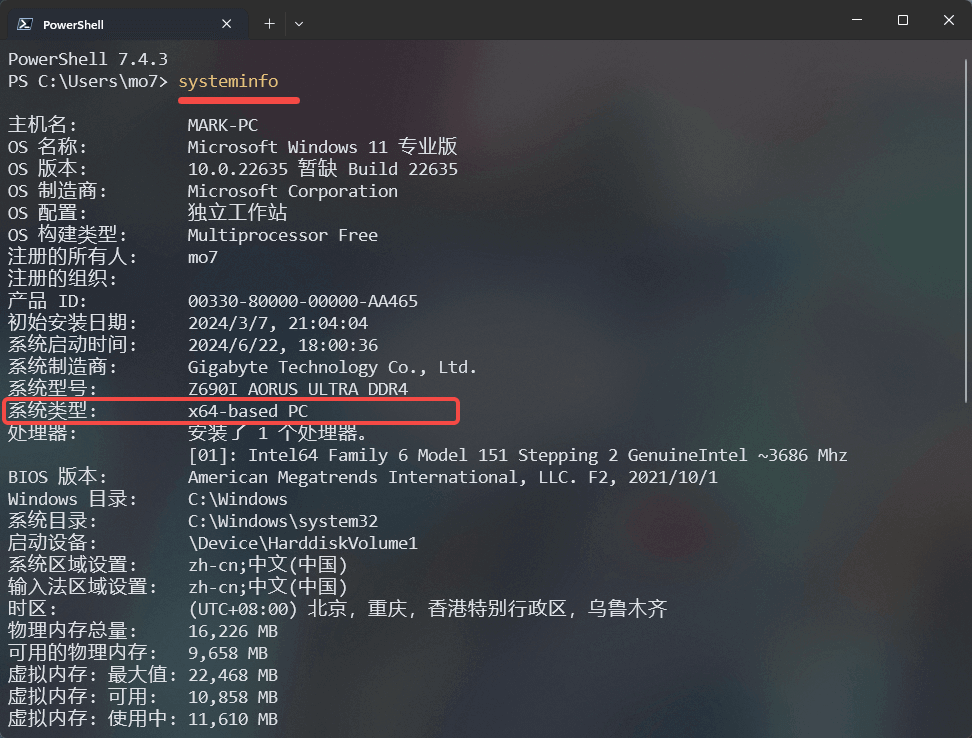

# 1.go 基础开发环境搭建

官网地址：
https://golang.google.cn/

国内 Wiki
https://learnku.com/go/wikis

## Windows && MacOS

第一步，在命令行输入 `arch` 查看机器硬件架构类型

```bash
arch
# 会打印显示:  arm64 或 x86_64 或其它
```

::: details windows 下则是使用 sysyeminfo 命令

:::

第二步，下载对应的安装包

官网安装包下载地址：
https://golang.google.cn/dl/

国内镜像站：
https://studygolang.com/dl

> 这利推荐使用官网的下载地址，实测国内镜像存在版本落后问题。


Windows 下载 `.mis` 文件，无脑下一步
MacOS 下载 `.pkg` 文件，无脑下一步

## Linux

相关操作脚本如下:

注意区分 amd 和 arm 架构，
每次版本更新时 只需要将版本号 `go1.22.4` 换成最新版本号即可。

然后就可以无脑的依次执行以下命令:

1. 查看机器硬件架构类型

```bash
arch
```

2. 下载 x86 版本

```bash
curl -o "goPackage" https://golang.google.cn/dl/go1.22.4.linux-amd64.tar.gz
```

或者 下载 ARM 版本

```bash
curl -o "goPackage" https://golang.google.cn/dl/go1.22.4.linux-arm64.tar.gz
```

3. 删除老版本(亲测，不删除老版本会出现各种莫名其妙的问题)

```bash
rm -rf /usr/lib/go
```

4. 解压 goPackage

```bash
sudo tar -zxvf goPackage -C /usr/lib
```

5. 删除 goPackage

```bash
rm -rf goPackage
```

6. 打开 `/etc/profile`

```bash
sudo vim /etc/profile
```

7. 在 `/etc/profile` 中追加如下内容

```bash
export GOROOT=/usr/lib/go
export PATH=$PATH:$GOROOT/bin:$GOPATH/bin
```

8. 重新加载 `/etc/profile` 或重启机器

```bash
source /etc/profile
```

9. 检查安装结果

```bash
go version
```

## 设置代理。 Linux 、 Windows 、 MacOS 均一样

https://goproxy.cn/

```bash
# 设置代理
go env -w GO111MODULE=on
go env -w GOPROXY=https://goproxy.cn,direct


# 查看当前go环境配置，是否修改成功
go env
```

## Hello World

```bash
## 初始化仓库
go mod init <projectName>
```

新建 `main.go` 文件:

```go title="./main.go"
package main

import (
	"fmt"
	"os"
)

func main() {
	fmt.Println("Hello", os.Args[1])
	os.Exit(42)
}
```

然后使用 `go` 命令执行和编译该文件：

```bash
## 运行
go run main.go

## 编译
go build
# 会输出一个二进制运行文件

```

## 多版本管理

https://www.cnblogs.com/pebblecome/p/14815365.html

> go 并不需要版本管理，我的建议是直接使用最新版本
