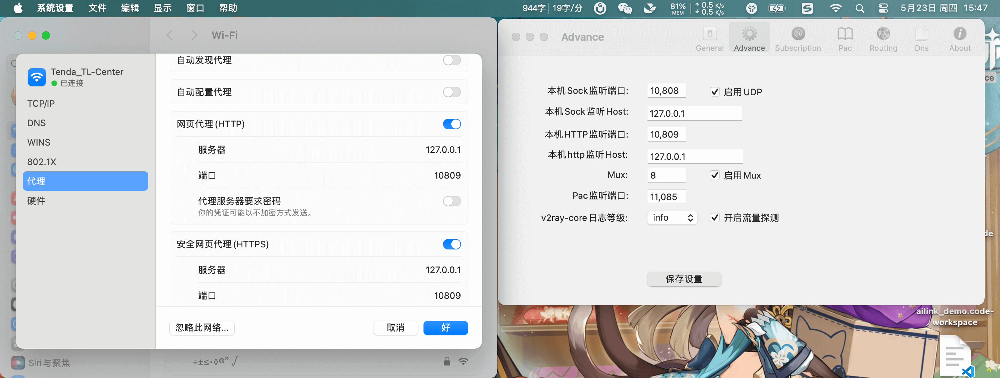

---
category:
  - developer
tag:
  - 代理
  - 科学上网
  - 技巧
  - 教程

order: 1
permalink: /developer/proxy_ready.html
---

# 科学上网与本地代理

有的时候为了写个代码，访问 Github，访问国外的镜像，用下 Google 搜索学术资料，包括使用 `OpenAi`等。
这些在国内都非常麻烦，这个时候就必须得使用`科学上网`才能访问。

我推荐的第三方梯子是 Bywave , 实测还蛮好用的。我自己也会搭建代理服务，只不过经常会被封禁 ip 。

## 自建不会被封 IP 的梯子

这里我简单提一下自己实测过的，永远不会被封禁的梯子搭建方案。

1. 准备一台国内的 `服务器A` (`123.123.123.1234`) 并开放端口 10086

2. 准备一台国外 `服务器B` (`456.456.456.4567`) 并设置安全组开放 10808 端口，且该端口只对 ip 为 `123.123.123.1234` 的机器开放

3. 然后在服务器 B 上搭建搭建 `v2ray` 服务，并设置端口为 10808

4. 在服务器 A 中的 Nginx 做如下配置

```conf

stream {
  upstream v2ray {
    server 456.456.456.4567:10808;
  }
  server {
    listen 10086;
    proxy_pass v2ray;
    ssl_preread on;
  }
}

```

然后在使用 v2ray 服务时，把 ip 地址和端口改为 `服务器A` 的端口和地址即可。

这样在正常看来，你只是在访问国内的某一台服务器，然后国内服务器将所有流量和请求全部转发为国外的那台服务器，国外的那台服务器的 代理端口只对 国内这台服务器开放。 这样在进行 `GFW` 扫描的时候，你的服务器是不会有任何问题的。

当然，两台服务的成本确实会有点点高，是否划算见仁见智了。

## V2ray 搭建教程

https://github.com/233boy/v2ray

## 本地代理客户端

https://github.com/v2rayU/v2rayU

Windows:
https://github.com/2dust/v2rayn/releases

> 这个一般来说是 下载 `v2rayN-With-Core.zip` 和 `v2rayN.zip` 并解压，然后将前者目录中的内容覆盖替换到后者目录中，然后就可以双击 `.exe` 文件进行使用了。

安卓:
https://github.com/2dust/v2rayNG/releases

MacOS:
https://github.com/yanue/V2rayU/releases

> 仅供学习交流使用，如违反相关规定将会立即删除。

## 设置命令行代理

第一步，如下图所示，打开代理软件(这里用的是 V2rayU)，设置好 http 端口，确认系统代理已生效



第二步，设置如下环境变量。

```bash
#  ~/.zshenv 或 ~/.bashrc 文件中:
export http_proxy=http://127.0.0.1:10809
export https_proxy=http://127.0.0.1:10809
export ALL_PROXY=http://127.0.0.1:10809

```

> Windows，Linux，WSL，MacOS 基本同理

```powershell
# Powershell 是这么设置的
$env:ALL_PROXY="http://127.0.0.1:10809"

```
