# 伊隆·马斯克 (Elon Musk) 励志名言

::: info

虽然不我确定这是不是 ElonMusk 的名言，但这些句子的确给了我很大的力量。

:::

## 关于人生低谷

人生的至暗时刻  
大道理没用，鸡汤没用  
蛋糕可乐奶茶火锅都没用  
甚至家人和朋友们的爱  
也只能减缓焦虑  
却不能击退黑暗

真正把我从深渊里拉出来的  
是我自己  
没有人知道那段时光里  
我经历了什么  
分一秒熬过去之后  
就已经不是从前那个自己了

这个世界上  
最困难的时候  
往往只有自己  
能把自己从泥潭中拉出来  
没有人能替你感受痛苦  
也没有人能替你幸福

::: details

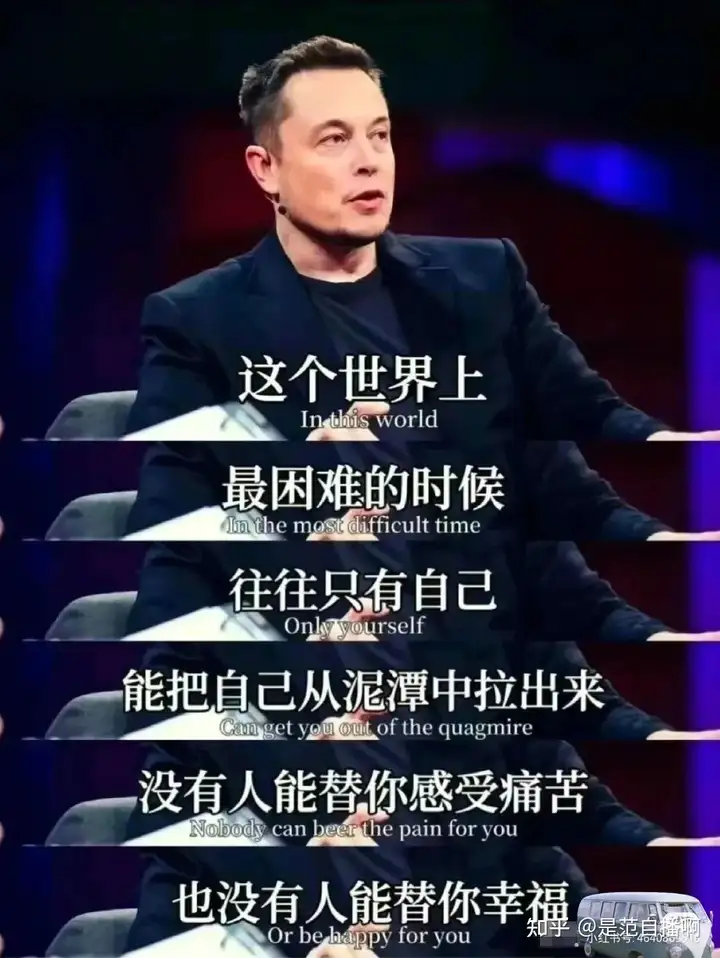

:::

## 面对不舒服的事情，一定要有一个自洽的解释

我 30 岁养成了一个终生受益的习惯  
就是每次在我遇到了  
让我感觉不对劲的事情之后  
冲突也好，不公正的待遇也罢  
我都会用我自己的语言把它们捋顺  
并且用自洽的框架解释出来  
这个解释可以是对一个特定的人说出来  
也可以选择写出来，自己再来看

这么做的好处就是  
你会越来越有底气，智慧和勇敢  
因为用自己的语言去解释一个事件  
本质上做这个动作的底层逻辑  
就是在塑造自我，强化自我  
哥德说过:任何在积累知识的同时  
却不思考如何去善加利用的人  
最终都将毒害自己的生活和人类社会

如果你感觉到了不舒服却不表态  
那么你就一直处于没有话语权的状态  
更重要的是这些困扰在未来的生活工作  
还是会迟迟不断的找上你并无限放大  
每次我和我的工程师伙伴吵架的时候  
我有一个让彼此都非常受用的点  
就是我会保持冷静地对他说  
现在请把你的感受和观点分两边写给我

即便我可能最终并不能认同他的观点  
他也在这个过程当中把自己捋了一遍  
我们就能在沟通当中照见彼此的感受  
还原并表达底层最真实的观点和立场  
不做无意义的情绪内耗  
这个世界是极其复杂的，大家都会迷茫  
你只有了解自己内心真正的想法和诉求  
你才能抵挡住负面事物对你的侵蚀

不要混沌无序，不要觉得无所谓  
不要得过且过，不要不了了之  
即便你的看法是不受别人认同的  
也要勇敢地去表达自己  
最起码让你自己清楚  
自己内心的真实所想  
并且坚定地站在自己的这一边  
这是你真诚而热烈地活着的底气

## 如何使自己变得强大优秀

你要想变得超乎常人的强大  
必须在某个 3-5 年里  
疯狂的行动，高密度的锻炼  
这个锻炼可能包含了  
你人性上的锻炼  
你勇气上的锻炼  
你心力上的锻炼

你专业技能上的锻炼  
这些都是关系你命运最核心的锻炼  
总之，  
你就是千万不能停  
只要你停了，你就开始凉了  
能量和智商就开始下降了  
在这个 3-5 年  
你必须疯狂的在你专业领域

日日不断的深耕  
日复一日的死磕  
不要情绪化，努力干活  
去犁地，去翻土  
累了就变换耕作方式  
直行动下去  
就一定会有奇迹发生

::: details

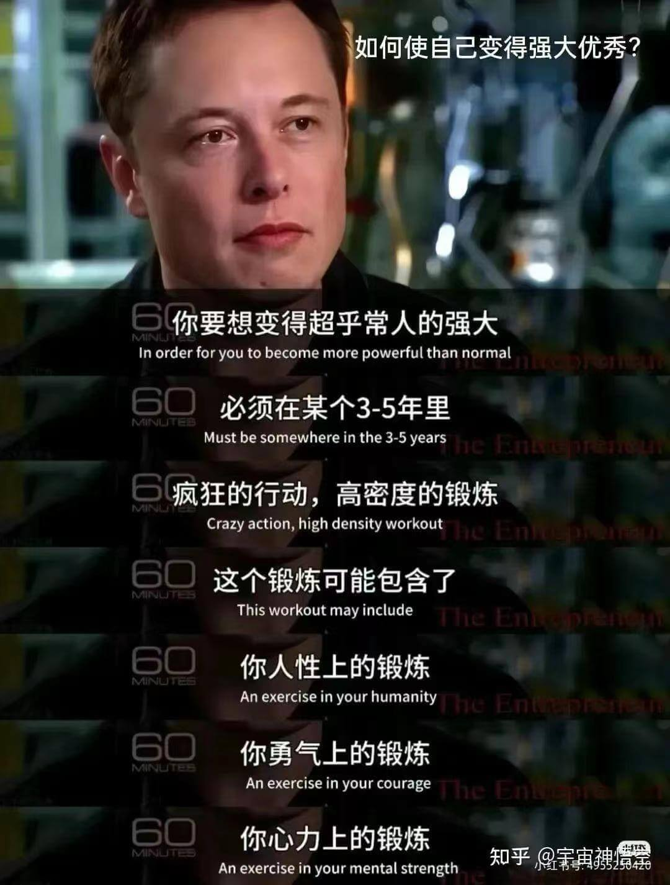

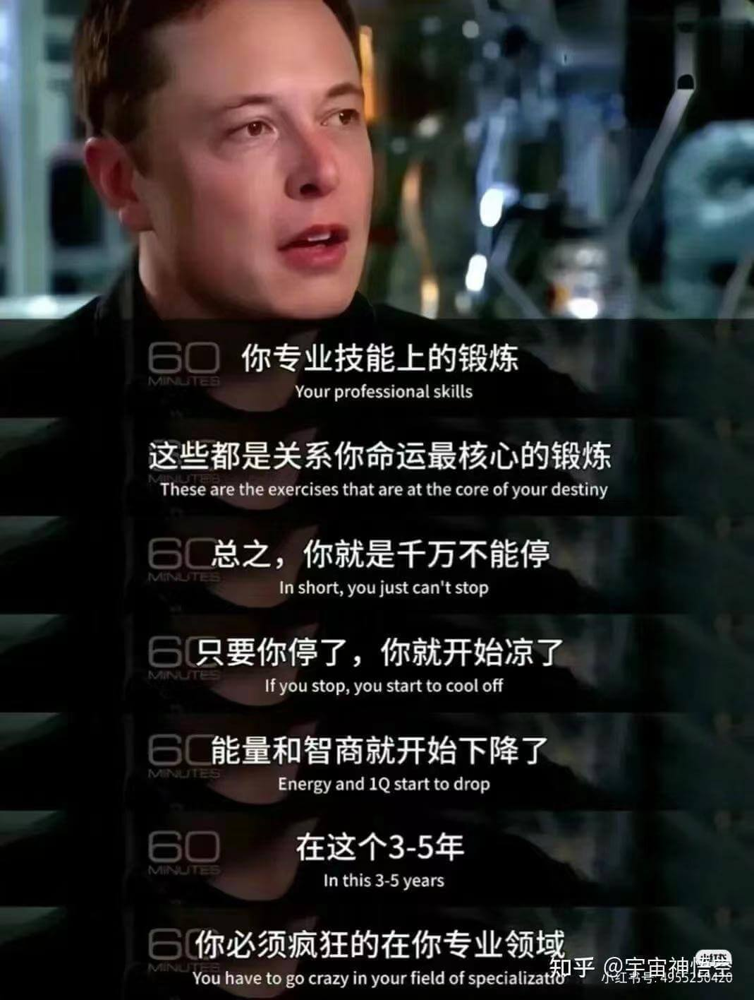

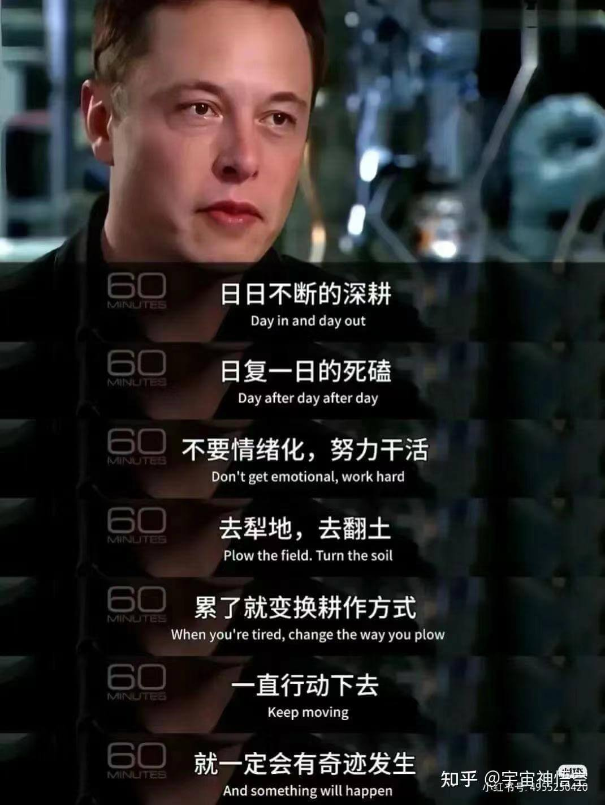

:::

## 关于行动力

人类的基因有这样一种设定  
对模糊不清、不可名状的东西感到害怕  
那些现实生活中行动力很糟糕的人  
他们并不是懒惰、好吃懒做  
也并不是害怕要处理的事情本身  
他们的恐惧是来自于任务的模糊性

我从来都不相信  
这个世界上有什么行动力不足的事情  
因为所有的行动力的问题  
其实都来源于精确性的不足  
普通人生活中几乎所有的不幸  
都是由精确性的丧失开始的

如果你要一件事情发生  
就只需要去集齐  
这件事情要发生的所有的要素就行了  
就像造火箭，关键步骤也只有 27 个  
当你提高了对客观世界评估的精准性  
一切你觉得遥不可及的事情都会很简单

::: details

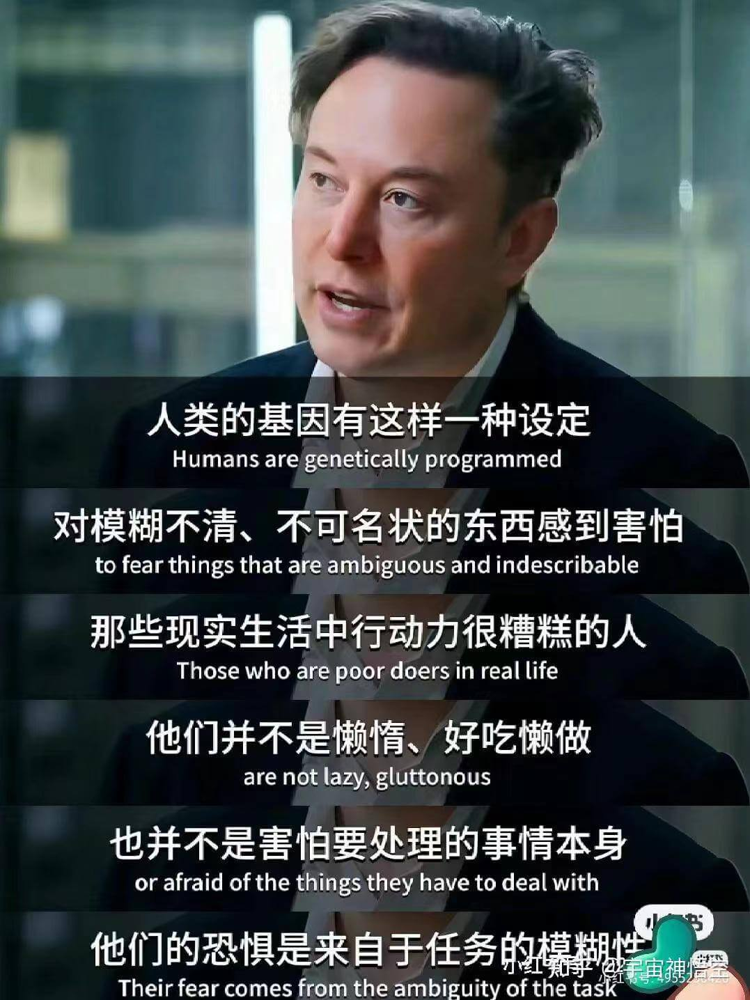

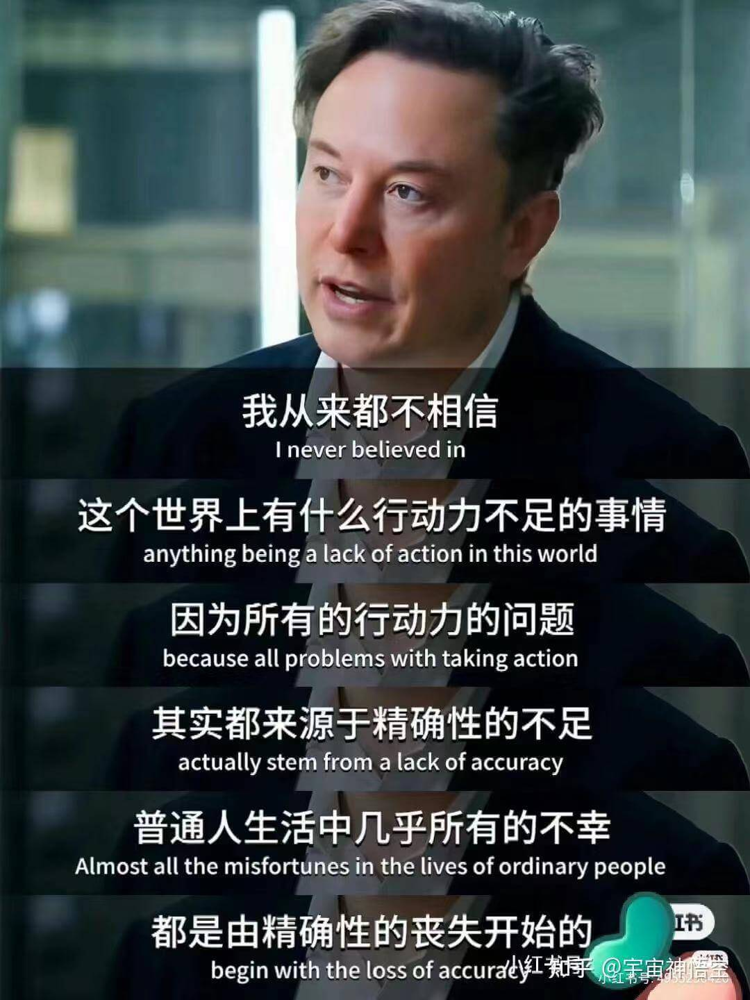

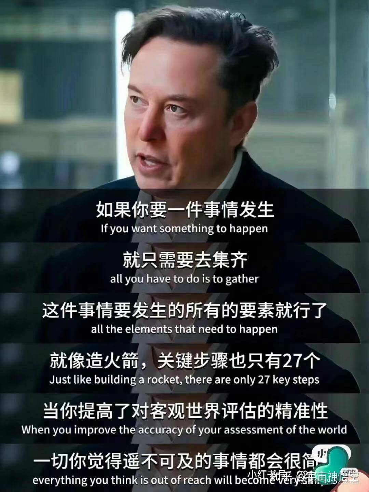

:::

## 关于面对新事物

我的成功得益于养成了一种很绝的心态  
它叫做 10% 目标定律  
这个想法就是  
无论你在生活中想要什么  
你都要做 10 次尝试  
但问题在于  
大多数人都不会尝试次 10 次

大多数人连一次都不想尝试  
让他们尝试比登天还难  
而 10% 目标定律的意义就在于  
学会积极面对 90% 的失败  
现在我敢向你保证  
如果你今后做任何事情  
都愿意先尝试 10 次  
那么，其中一个必定会成功

::: details

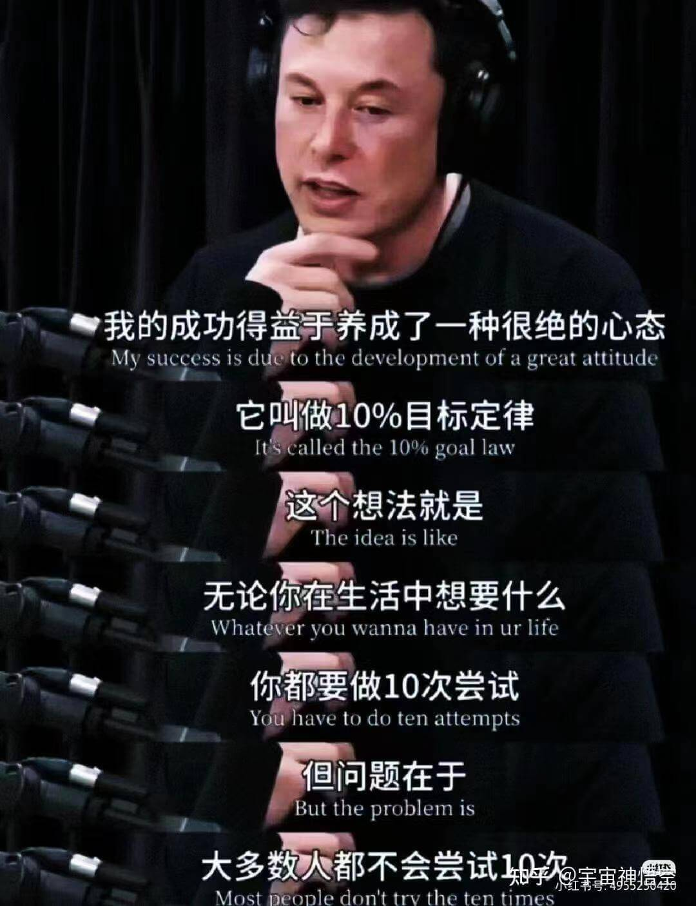

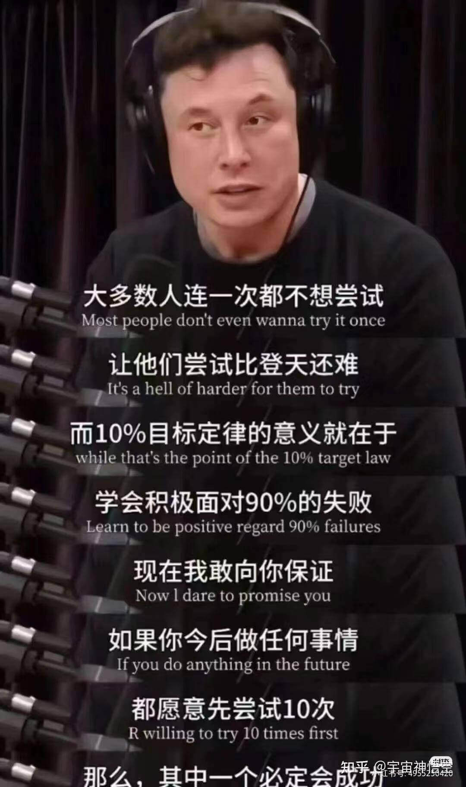

:::

## 关于人生态度

一个人在任何年龄  
都应提防的四大陷阱  
不读书爱思考  
不独立爱自由  
没经济谈真爱  
缺理智想发财  
撑下去的方法很简单

爱具体的人  
做具体的事  
只有这样  
才能抵抗那些宏大的、抽象的  
试图让我们变消极的人东西  
愿你我时刻谨记

我宁愿选择乐观，哪怕是错的  
也不想选择悲观，即使那是对的

努力成为你想成为的那种人
就算不成功
至少你喜欢现在努力的自己
停止精神深处无意义的内耗
你要留点精力
去读书、去运动、去爱人
去奔赴你想要的生活

::: details

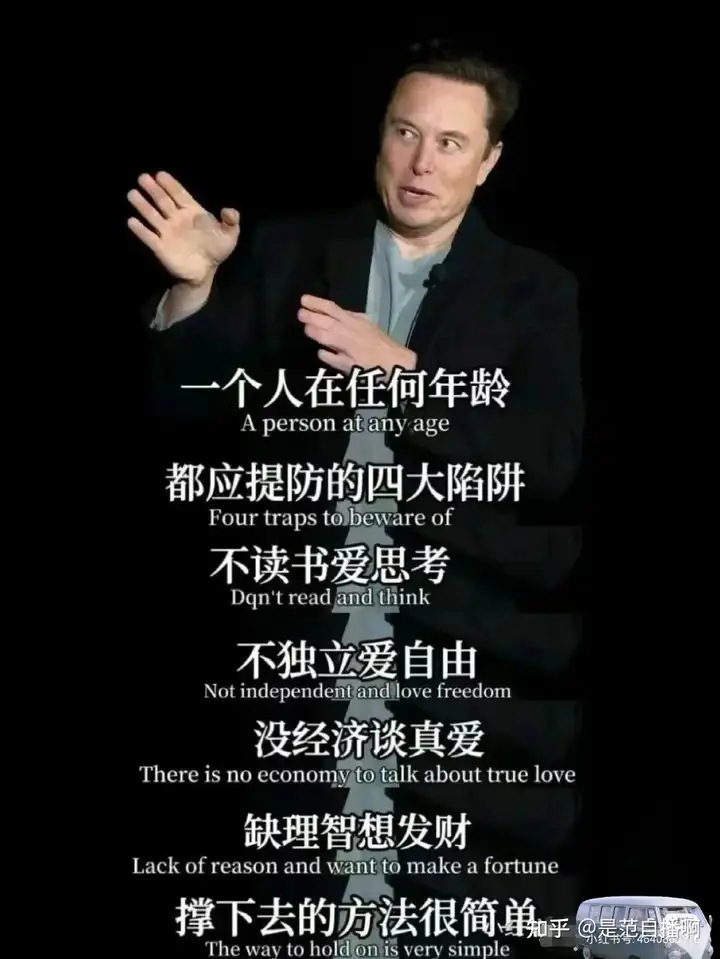

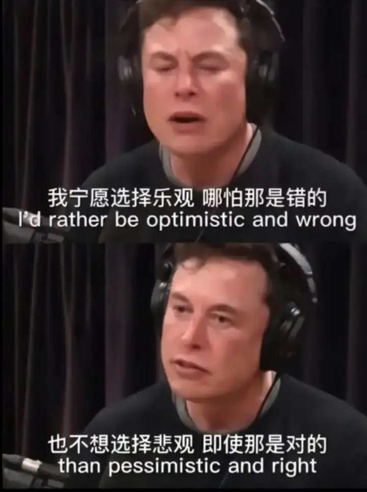

:::

## 最后

> 愿每个人最后都能成功 ~！
