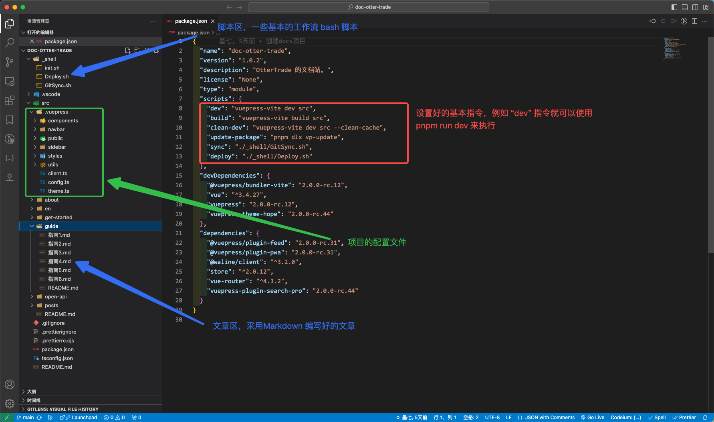
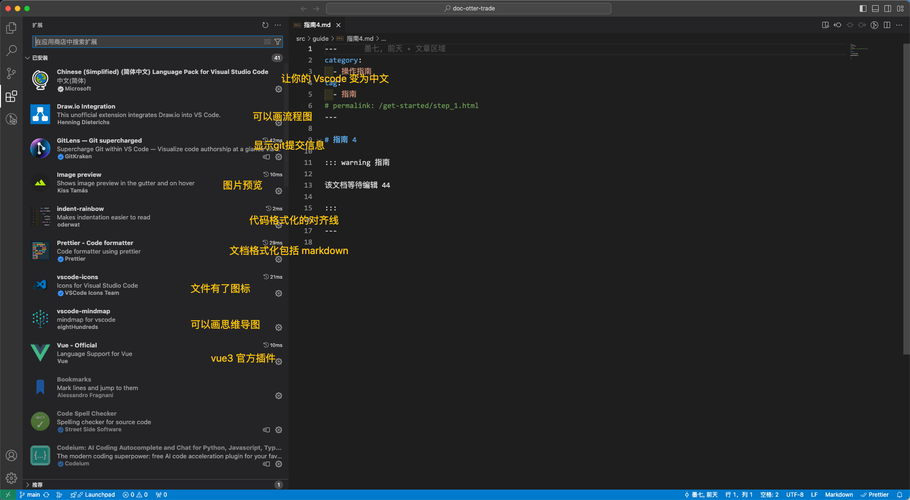
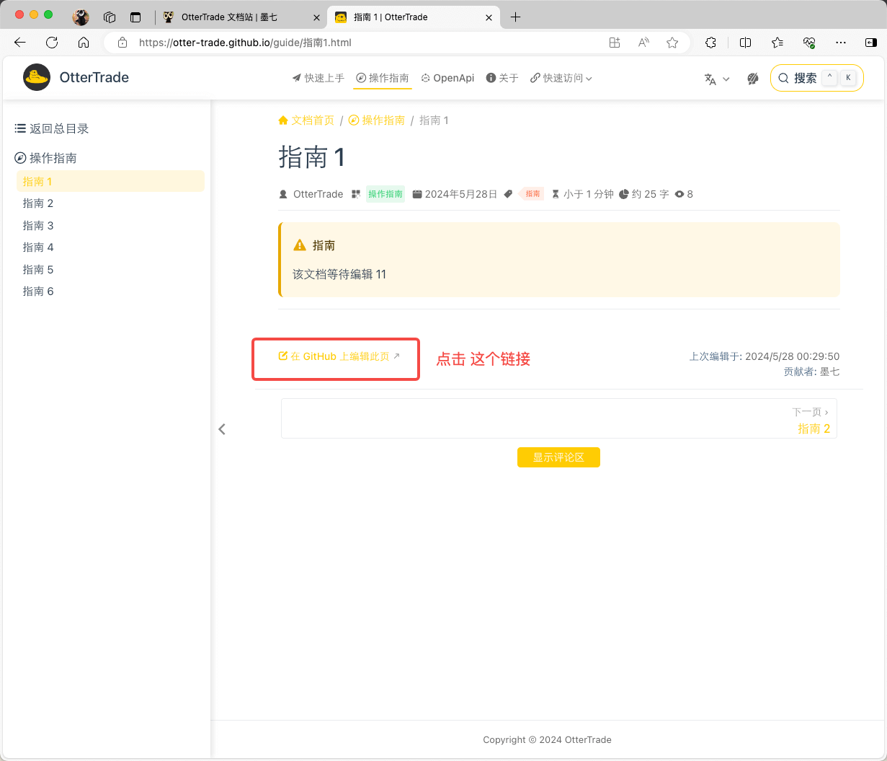
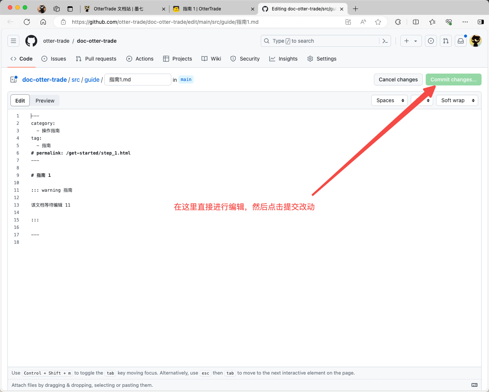

---
category:
  - 教程
tag:
  - OtterTrade

order: 3
permalink: /posts/ot-doc_ready.html
---

# OtterTrade 文档站

**起源**

::: info
有独立开发完成一个量化系统开发的人吗？ - 墨七的回答 - 知乎
https://www.zhihu.com/question/35977425/answer/3001448431
:::

基于知乎的一篇回答建了一个群，拉起了一支团队，\
并成立了一个 [Github 组织](https://github.com/otter-trade) ，\
然后大家一起研发了[OtterTrade.com](https://OtterTrade.com) ，\
在最开始进行产品定位的时候，就要求主站必须精简、美观、大方、易使用。但是再怎么易使用，必要的文档说明是无法避免的。
于是计划所有的解释说明的工作全部交给一个独立的文档站去承担。

文档站中包含了平台介绍，快速上手，系列教程，团队介绍，起源，愿景，规划等等等。可以说现阶段文档站的重要程度不亚于 OtterTrade.com 主站。在运营设计上，文档站有三个地址:

文档站(Github Pages)
https://otter-trade.github.io

::: details 宣发主站
`Github Pages` 的好处是完全免费，且不用担心服务器挂掉，或者出什么问题，维护简单，没有任何成本。而且 `github.io` 具有高度的辨识性，不用担心会被封禁。所以这个地址将会作为将来的宣发主站。

缺点是国内访问速度可能略慢。
:::

文档站(新加坡备用地址)
https://doc.OtterTrade.com

文档站(国内备用地址)
https://ot-doc.mo7.cc

文档站是导航，是回家的路，所以安全可靠的访问途径非常重要。

## 文档站的构成

文档站的源码存放于 <https://github.com/otter-trade/doc-otter-trade> ，是个开源仓库，主体由 [vuepress-hope](https://theme-hope.vuejs.press/zh/) 搭建。

其编译结果存放于 <https://github.com/otter-trade/otter-trade.github.io> 仓库，因此可以直接利用 [Github Pages](https://pages.github.com/) 的特性。

然后通过 [Webhooks](https://cloud.tencent.com/developer/article/2151039) 机制同时部署在两台不同的服务器之上。

所以文档站的基本工作流就是:

1. 向 [墨七](https://github.com/mo7cc) 申请 [doc-otter-trade](https://github.com/otter-trade/doc-otter-trade) 和 [otter-trade.github.io](https://github.com/otter-trade/otter-trade.github.io) 这两个仓库的权限；
2. 利用 `git clone` 命令下载文档站源码；
3. 在编写完对应文档之后，编译打包并推送至 [otter-trade.github.io](https://github.com/otter-trade/otter-trade.github.io) 仓库完成发布。

```bash
# 克隆 文档站 源码到本地
git clone git@github.com:otter-trade/doc-otter-trade.git
# 用 Vscode 打开
code ./doc-otter-trade
```

然后你就获得了如下界面



除此之外你可能还需要安装如下插件



然后你就可以愉快的开始编写文档了！

## 命令介绍

在项目目录的 `./package.json` 文件中我提前编写了如下指令

```json
{
  // ....
  "scripts": {
    "dev": "vuepress-vite dev src",
    "build": "vuepress-vite build src",
    "clean-dev": "vuepress-vite dev src --clean-cache",
    "update-package": "pnpm dlx vp-update",
    "sync": "./.vscode/shell/GitSync.sh",
    "deploy": "./.vscode/shell/Deploy.sh"
  }
  // ....
}
```

使用方法如下:

```bash
pnpm run dev
# 在本地启动该项目

pnpm run build
# 编译该项目

pnpm run clean-dev
# 清除所有的编译缓存，并启动项目，如果一些配置或者编写的文章没有生效则可以使用该指令

pnpm run update-package
# 更新项目依赖

pnpm run sync
# 拉取 Github 上的最新改动，并保存和提交当前改动 同时 推送至 Github ，需要仓库权限

pnpm run  deploy
# 编译本项目并同时推送至  otter-trade.github.io 仓库， 然后将会自动完成项目的部署与发布, 需要仓库权限

```

## 其它

如果你想编写出华丽的可交互的文档可以查看和学习如下教程
<https://theme-hope.vuejs.press/zh/guide/markdown/intro.html>

如果你想让文档具有更多功能可以学习如下教程
<https://theme-hope.vuejs.press/zh/guide/component/built-in.html>

## 另外一种更新文档的方式





---
