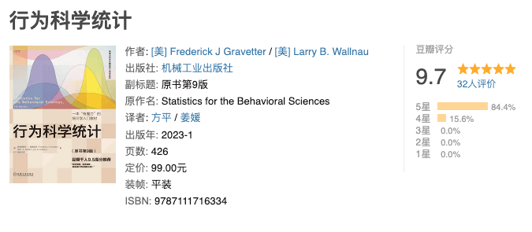
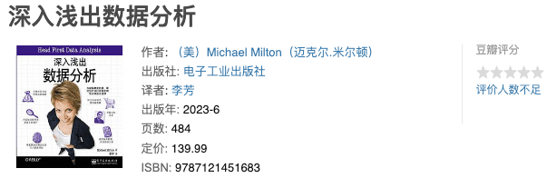
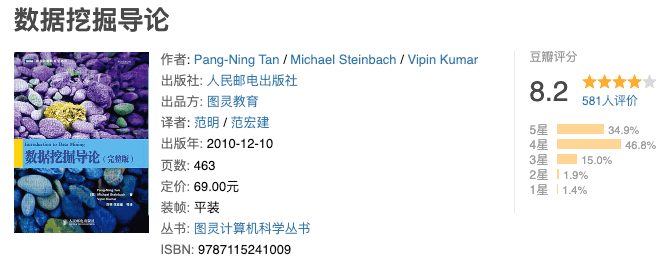
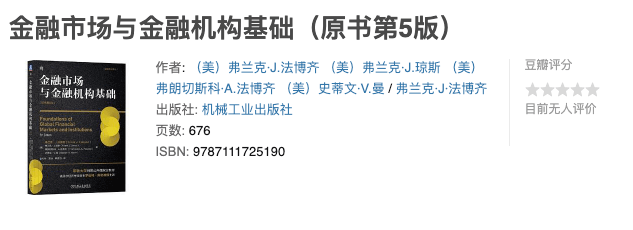

# 墨七的书单

## 《 行为科学统计 》

[豆瓣读书-行为科学统计](https://book.douban.com/subject/36140702/)

> 这是本极佳的统计学入门书籍，不单讲理论，还会让你明白为什么要这么做，应该怎么做。

## 《 深入浅出数据分析 》

[豆瓣读书-深入浅出数据分析](https://book.douban.com/subject/36418715/)

> 够浅白，然后还会讲一下为什么要这么做。唯一不好就是废话比较多吧，对有基础的人，不是很合适。

## 《 数据挖掘导论 》

[豆瓣读书-数据挖掘导论](https://book.douban.com/subject/5377669)

> 这个主要用于挖掘数据之间的内在联系。和传统意义上的统计学不太一样。比起另外一本黑色的数据挖掘教材要新一点。

## 《 金融市场与金融机构基础 》

[豆瓣读书-金融市场与金融机构基础](https://book.douban.com/subject/36430235)

> 讲金融体系的扫盲书籍
>
> 书不厚但是作为一个完全的金融外行来说我觉得啃掉他至少需要半年时间。
> 刚刚看完引论觉得浅显易懂，每章节前后都有引导和总结，十分适合入门。

## 《 投资学 》

[豆瓣读书-投资学](https://book.douban.com/subject/27159606)

> 金融领域必读书籍

## Go 语言书单

[Go 语言中文开源图书、资料或文档](https://books.studygolang.com/)

> 在线工具书，随用随查，社区翻译的最佳版本
