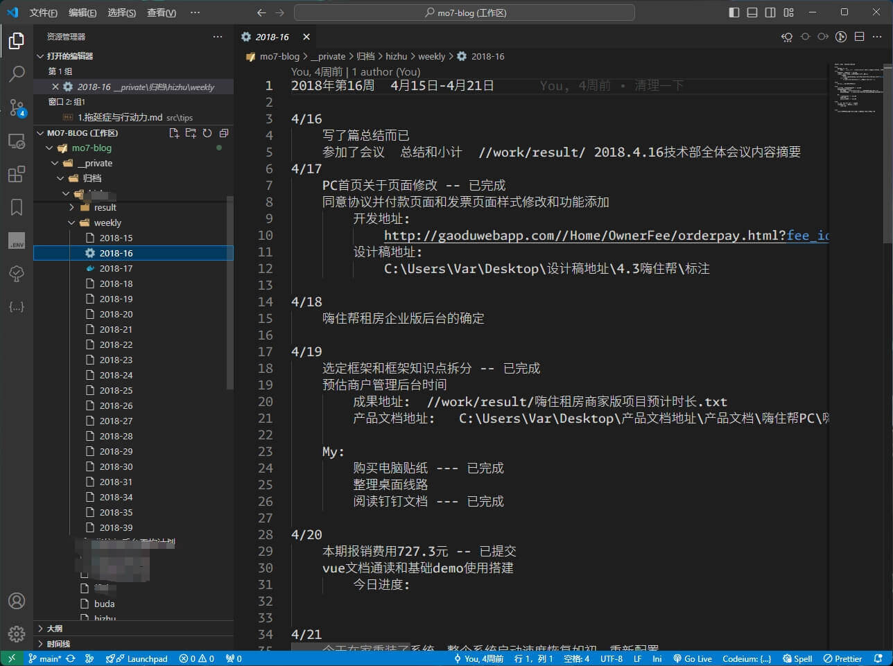
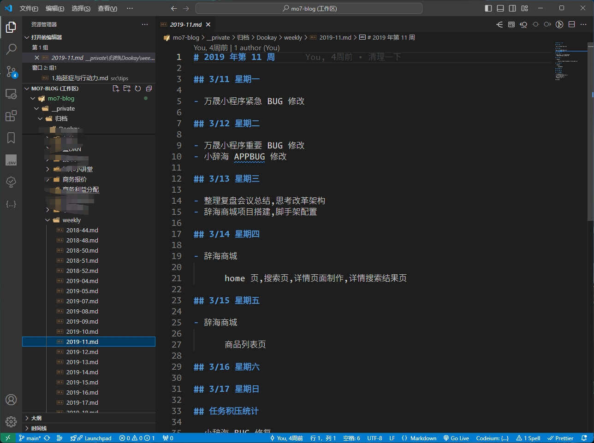
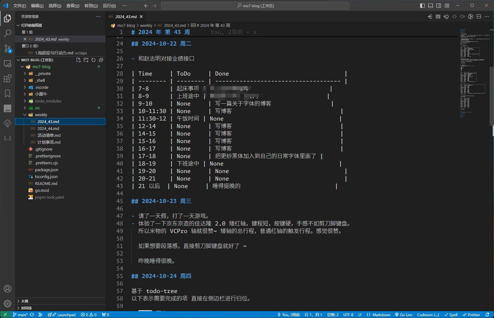
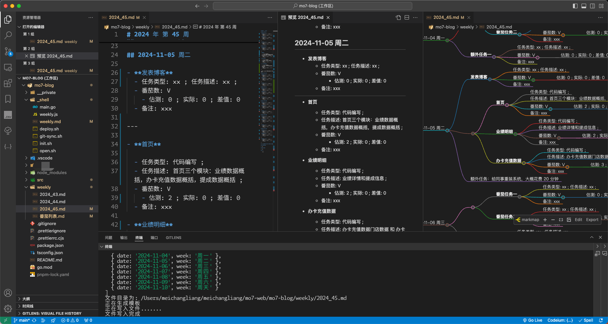

# 重新认识番茄工作法

::: tip
根据我自己的亲身实践，番茄工作法可以非常切实有效，实打实的减轻焦虑和压力。并且可以显著的提升工作效率并治疗拖延症。但是我用的是根据自身情况进行改良的 **墨七番茄工作法**。

:::

## 什么是番茄工作法

<BiliBili bvid="BV1eT4y157M8" />

[番茄工作法 wiki](https://zh.wikipedia.org/zh-sg/番茄工作法)

> 如果你能在 25 分钟专注做一件事情并且不受打扰，这将是一个美好的开始。如果你能坚持无数个这样的 25 分钟，那么你几乎可以做成所有的事情。你可以拍着胸脯告诉自己，这些时间你都没有虚度。 \
> 这种方法就叫做 `番茄工作法` 。

你需要一个`计时器`，或者闹钟，用于记录你的`番茄时间`。
一份随时写下待办事项的`活动清单`，用于记录你所有你需要要做的事情或者计划。 \
另外再准备一份`今日待办`工作计划表，用于记录你今天要完成的工作。 \
一份用于记录原始数据的`记录表`。
不止如此，还需要经历五个基本流程:

1. 计划

   从一天的`活动清单`当中挑选出今天要完成的任务，按照优先级排列在`今日待办`当中。

2. 追踪

   打开计时器设定一个 25 分钟的倒计时，从`今日待办`中的第一个任务开始工作。 \
   这 25 分钟内不可以做当前任务外的任何事情， 也不可以被其他人或事打断或者打扰，否则这就是一个`烂番茄`，你需要重新开始计时。 \
   一个番茄时间结束后在后面打上一个 x ，接下来的 3-5 分钟不可以做任何根当前工作相关的事情。可以喝点儿，吃点，走一走，和周围人聊聊天。 \
   休息完成后重复以上步骤，开始第二个番茄时间，直到第四个番茄结束开始进入长时间休息。休息 15-30 分钟，这期间不能给大脑增加任何负担。\
   `今日待办`中完成一项任务就划掉这个任务。 \
   如果当前番茄时间没有结束，那就回顾和检查刚才的工作。 \
   如果任务结束当前的番茄才进行了不到 5 分钟，那就把这个番茄时间作废。 \
   如此往复直到一天的工作结束。

3. 记录

   在提前准备好的记录表中写下日期，时间，任务(任务类型，任务描述等)，以及使用的番茄数量(估测番茄数，实际番茄数，估测和实际之间的差值)，以及在备注中写上自己获得的成果，遇到的问题。 把这些记录作为原始数据。

4. 分析

   从原始数据中获取有用的信息，比如我在哪些地方花费了过多的番茄钟，哪些地方还能更加高效一点。

5. 可视化处理，

   把觉得有效的信息标记出来以便在长期实践中督促自己进步。

时间具有生成性和事件的连续性两个特点。我们有了具体的日期，时、分、秒的定义，才有了迟到、DeadLine 等概念，也才有了随之而来的时间流逝感、焦虑感。
如果我们用一个个的具体事件去衡量，吃饭、洗澡、背一篇文章 时间的连续性带来的焦虑感就会减少。

番茄时钟就是利用这种基本原理来减少焦虑感。

还有一部分焦虑来自内外部的频繁打断。

内部因素主要来自于自己。神奇的大脑和身体机能有的时候会突然冒出一个奇妙的想法，比如突然饿了，或者突然想知道陈奕迅的下一场演唱会什么时候开，就得在`今日待办`表中标记一下，表示被打断了，打个顿号或者其它简短的符号。如果这件事情今天或者待会儿就得完成，在今日待办中的`计划外紧急事件`部分写上它，然后继续当前的工作。如果这件事不一定要今天做，那就写进`活动清单`并标注截止日期。

如果是来自于外部的打断，我们需要做的就是快速记录，推迟打断你的这件事，并写进日程表。并记录打断，比如选择短横线。

为每一个`活动清单`来进行番茄时间的估算，如果一项任务需要 5-7 个番茄数，那就拆分为小任务。 \
如果多个任务估算值小于一个番茄数，则可以酌情整合在一个番茄时间内完成。 \
更精确的番茄数估算，可以方便我们把活动清单中的任务合理安排到`今日待办`中。 \
总体任务不超过当日可用番茄数，完成一个番茄，打上一个 x，完成一项任务划掉它。\
如果一项任务完成后发现预估番茄数还有剩余，留空即可，如果一项任务花费的番茄数比原来多，那就再行预估用圈圈表示。

一天的工作结束后，在记录表中写上详细记录。长期坚持尽量消除三次预估。

这就是`番茄工作法`。

::: tip

是不是看起来非常繁琐？ 如果你真的严格按照视频中所说的流程来做，你会发现你将会浪费大量的时间和精力。然后彻底对番茄工作法失去兴趣。
一堆符号，一堆文件，一堆列表，还有一堆清单，到底谁是谁啊？

番茄工作法不总是有效，以至于很多人会认为番茄工作法是一个骗局，但事实真的是如此吗？

:::

## 番茄工作法核心概要提炼

25 分钟专注做一件事情 ， 休息 5 分钟 为一个 **番茄时间** 或者称之为 一个 **番茄钟**。 \
完成 4 个番茄时间 休息 15-30 分钟，被称为 **一组番茄时间** 或者 **一组番茄钟**。 \
这只是番茄工作法的执行部分 。

除此之外，一个完整的番茄工作法体系有 6 个流程或者是目标

1. 必须制定 **番茄列表**

   在第一个番茄时间里，明确自己要完成哪些任务，任务的优先顺序，先做什么，后做什么。
   每个任务需要多少番茄时间。
   超过一个番茄时间的大任务需要拆分成许多单独的番茄时钟，不满一个番茄时间的多个小任务可以合并成一个番茄时间。
   我称之为 **番茄列表**

2. 执行番茄时间

   这个过程中要对抗各种内部或者外部的干扰，尽量完成完整的番茄时间
   如果被打断了，这个番茄时间就不成立，称之为一个`烂番茄`。

3. 需要根据任务完成情况，记录每个任务实际使用的番茄时间。

4. 复盘

   需要结合自己在第一步中制定的番茄工作计划，以及在第三步中实际记录的番茄时间对比、复盘、分析对改进自己的工作有用的信息。 \
   比如我在哪些地方花费了比原先计划更多的番茄时间，哪些任务超时了，超时的原因是什么。 \
   产生了多少烂番茄， 烂番茄是内因还是外因。

5. 根据复盘中得出的经验，灵活的制定你的番茄时间计划表。

   比如，你发现自己下午效率更高上午其实一般，可以把上午做的番茄时间移动两个到下午。 \
   这种调整也是可以根据具体的事情。或者实际可以利用的时间来调整，从而形成一段时间内的番茄工作计划表。

6. 最近几年番茄工作法官方加上的一些内容

   在完成了前面任务的情况下寻找到个人目标，并且利用番茄工作法节省出来的时间来实现。
   这个和番茄工作法本身是无关的，但是它使得`番茄工作法` 更加完善。

整个番茄工作法可以区分为 `计划 -> 执行 -> 复盘` 三个不断循环的环节，从而形成了一个完整的番茄工作体系。 \
这其中我认为制定计划和进行复盘对于番茄工作法来说是更加重要的。 \

## 番茄工作法与拖延症

在上一篇 [拖延症与行动力](./1.拖延症与行动力.md) 一文中，我们知道想要带打破拖延有五个行动策略：

1. 正视内心的**恐惧**与**焦虑**
2. 制定明确、可操作的**目标**
3. 列出自己的非**计划表格**
4. 学会**拒绝**与**聚焦**
5. 用正念减轻压力

抛开第一条不谈，番茄工作法仿佛是专门针对 第 2~5 条 进行设计的。而且我们一旦开始按照番茄工作法开始执行了，那么第一条也会随着时间解决。

番茄工作法需要罗列`活动清单`。 \
番茄工作法需要划分出今天需要明确执行的任务也就是`今日待办`。 \
番茄工作法在执行过程中需要集中注意力并且不允许被打断，如果临时有任务穿插，也必须得放到`计划外紧急事件`中去。 \
番茄工作法在执行过程中要求你必须专注与聚焦。 \
番茄工作法每 25 分钟要求你休息一次，并且不要进行任何工作。

这在我看来，番茄工作法简直就是专为 `拖延症` 而设计的。

制定良好的合适的番茄计划，把一个任务拆分成多个步骤，并且预估好合适的工时，可以有效的帮助我们更好的去规划自己的时间。尤其是面对一大堆的琐碎的任务，一张合理的`番茄计划表`可以让我们不再焦虑，并提高工作效率。

按照番茄工作法一条条的去执行，在一个个番茄时间中不断的树立信心与积累成就感，从而让我们做事越来越主动和高效。 \
当现实的问题全部被转换成一条条 `番茄计划表` 的时候，我们剩下的就只有行动，那么现实问题自然而然也会得到解决。 \
当你专注于手头的 `番茄ToDo` ，焦虑与不安自然而然也会一并消失。日积月累之下，你会感觉自己正在逐步成长。

## 番茄工作法常见问题

1. 番茄时钟进行时的内部因素和外部因素的打断。

   内部因素：主要是我们自己的注意力或者是情绪引起的。比如，你刚刚分手，然后让你专注的学习两个番茄时间，绝大多数人肯定都做不到的。 \
   外部因素：手机电话，同事领导时不时找你有事，快递等。如果你所处的环境会时常会被打断，那你就得考虑番茄工作法可能并不适用于你。

2. 另外一个问题是，25 分钟的番茄时间可能不太合适。

   一个番茄钟开始了，可能刚刚找一点点状态，就要开始休息，然后又要重新找状态。 一个 25 分钟的番茄时间大部分都用来进入状态了。 \
   一个网课大多数都是 1 个小时或者更长的，好不容易跟上思路结果就因为番茄时间到了要休息 5 分钟。 \
   对于逻辑性比较强的一些工作，可能得花个十几分钟才能理清楚做题的思路，不可能做题做到一半就休息 5 分钟。

3. 有的时候 5 分钟的休息时间感觉可能也不太够。

   整个番茄法的原理认为，我们的注意力会随着时间下降的，所以每学习 25 分钟休息 5 分钟，就能让你注意力水平恢复到最高的状态。 \
   但实际的情况可能有变，比如注意力下降的比较快，休息 5 分钟注意力可能只能恢复到一半。

4. 刚开始使用番茄工作法时，可能会不知不觉的追求番茄工作法的数量，而不是工作的质量。

   当工具本身变成了任务就失去了它的价值。如果只是把问题拆分成番茄时间，可能会给人一种 “达到了数量就解决了问题的错觉” ，这个就是心理学上的 “计数器陷阱” 。 \
   所以很多时候完成的往往是量的积累而不是质的改变，看不到明显的提升效果，后面就不太想要坚持了。

## 番茄工作法的升级建议

看起来番茄工作法的实践要求比较苛刻，所以我们得根据番茄工作法的核心理念提炼出其核心理念，然后根据自身做出一些更改和升级。

1. 要个性化你的番茄时间。

   一个番茄时钟不一定非得是工作 25 分钟 休息 5 分钟。这种可能比较适合普通人或者是搬砖的简单工作。 \
   如果工作本身逻辑性和推理性比较强，可能更加适合比较长的周期。 比如工作 50 分钟休息 10 分钟就比较适合专注类的工作。 \
   或者我们将任务进行分类，比如简单一点的重复性劳作，就 25-3 的番茄钟；学习类的任务，可以根据课时进行动态划分，比如番茄钟可以设置为 40-5；如果是研发类的，需要专注思考的，可以设置为 60-10。 \
   这个需要花上几周的时间，不断的进行番茄钟的复盘，来找到适合自己的节奏。

2. 计划和复盘很重要

   计划的作用是在于让我们分清楚事情的重要程度，排好优先级，否则可能 不重要的事情忙了一天，但是大事却一样没办。 \
   复盘的作用是让我们知道哪里做的好哪里做的不好，从而形成快速的、可执行的迭代方案，才能帮助我们快速成长。 \
   同时也可以不断的提高我们对`番茄时间`的预估精准度，更快的找到适合自己的番茄时间。 \
   同时也可以提高下次`番茄时间`的效率，让自己的番茄时间更加均匀，更加自主可控。更加合理高效的安排一天的工作和学习任务。

3. 使用番茄工作法的前提，是这些时间是你能够完全自主可控的。

   如果你是学生党，那么你的课余时间都可以是自己的。 \
   如果你是上班族，上班的时间又经常会被打断，那么番茄工作法很难起到作用。 \
   所以可以判断一下，如果接下来的几个小时自己可以全完全做主，那么就可以使用番茄工作法。 \
   如果工作中打断只是偶然发生的事件，那么就可以快速记录一下，把打断外的事件立即标记到 `计划外紧急事件`中，并做好时间记录，然后立即重新投入到当前番茄时间里面去。尽量让自己的番茄钟更加完整。

4. 排除环境干扰，在开始之前给自己制造一个安静的环境。

   找一个尽量不会被其他人打扰的时间来进行。 \
   然后给自己创造一个专注的环境，比如可以去图书馆，或者把桌面的杂物清理掉，把干扰因素提前排除， 手机调成免打扰模式等等。

5. 番茄计时器的使用

   尽量不要使用手机，因为手机本身就是一个很大的干扰。 \
   可以买一个专门的计时器。 \
   更加推荐使用手表或者手环。 \
   我现在就用的小米手环，它本身也带有倒计时功能，时间到了就振动两下。这样休息时间我可以不带手机在公司里面到处溜达，做一做拉伸运动，倒计时结束后返回工位继续下一个番茄时间。

6. 珍惜心流的状态

   如果一旦进入心流状态，就不要再管什么番茄时间了，好好把握这种状态，专注做好自己手里面的事情，直到感觉到疲累或者心流的状态消失。再继续番茄钟。 \
   根据我以往的经验，一个心流的时间不宜太长。就比如我，一个有效的心流时长不会超过 1 个小时，一旦超过思维敏捷度就会下降，甚至会开始钻牛角尖，导致思路打不开。 \
   所以还是更加建议隔一段时间就去休息一下，休息的过程中可以四处走一走，喝一喝水，看看四周的人事物，尽量减少对工作的思考。不过在开始休息之前可以做好记录，方便休息结束后更快的回到工作当中去。 \
   如果是非常需要深度的工作，休息的时间可以定在 3-5 分钟左右，让自己可以缓一缓，同时也不至于忘了之前推理的内容。然后去除

7. 学会休息

   番茄工作法休息时间和工作时间一样重要。休息的不好可能会无法回到之前的注意力水平。 \
   所以休息的时候最好不要思考任何和任务相关的事情，也不要刷视频刷朋友圈，因为这些事情会偷偷占用你的注意力或者影响你的情绪。 \
   番茄休息时间多看看远处，或者多看看绿色的植物可以缓解视疲劳，或者深呼吸几次甚至闭上眼睛用一下`全身扫描放松法`来放松身体。 或者做一点拉伸运动等等。 \
   一个番茄时间加上休息是 30 分钟，一组四个番茄钟也就是两个小时。连续工作两个小时则必须要好好休息一下。 \

## 合适的工具

专注清单：

https://www.focustodo.cn

这个 APP 是我前不久发现的一款神器，基于番茄工作法设计的，每个任务可以单独设定番茄时间的时长，休息时长等都可以自定义。 \
它可以收集和管理你所有的事情。 \
可以帮助你统计和分析历史数据。 \
兼容各种设备，Android、ios、Mac、Windows，以及 Chrome 插件，而且完全免费，全端数据互通。

因为我的工作大多数都是在电脑端完成的，所以开着 `专注清单` 去工作，并严格遵照番茄工作法去执行，对于提效率是非常快的。

另外一个就是 带有倒计时功能的 手表 、 手环。直接开启 25 分钟倒计时，工作完了设定一个 5 分钟倒计时即可。

番茄清单可以理解为是一个带有倒计时功能的 `ToDoList`，非常方便好用。

## 设计自己的 `番茄计划表`

[专注清单 App](https://www.focustodo.cn) 确实不错，但是依然是不够自由的。因为每个人体质，精神，习惯都不太一样，工作属性和性质也不太一样。尤其是在前期我们还不习惯`番茄工作法`的时候，番茄时长很难预估的准确。我们也不清楚自己一个番茄钟能做多少工作，一个工作需要花几个番茄钟。 \
这个时候可能一个任务的番茄时间的长度我们可能会非常频繁的进行更换。

比如，如果你的工作经常进入到了心流状态，番茄钟这个时候反而是一种干扰，会打断你的思路，这个时候可能就需要临时修改一个番茄钟的时长。 而 `专注清单` 当中没有这个功能，同时也无法统计这一块的变化。

根据我自身的经验，有的时候长时间的从事某一问题的思考，其实效率是有所下降的，即使你对这种思考进入了 `心流状态` ，但是这种心流持续一段时间后效率就会开始下降，毕竟对于身体和大脑而言都是需要休息的。也就是说我们有的时候，需要被`打断`，然后休息一下，换个思路，然后再重新进入思考可能会有很多新的发现。但是这个被打断的时长应该是多少呢？这个可能得因人而异了。如何找出这个时间节点是非常重要的。

所以我们得根据自身的情况设计出自己的 `番茄计划表`。

下面是我自己的 `番茄计划表` 模板。

> 因为我一半是使用 Markdown 来进行任务管理的，所以我的计划表模板全部采用 Markdown 格式进行设计。

::: details 墨七之前的任务清单和记录格式

<div class="ImgGroup">







</div>

:::

> 我从 2018 年开始就在记录任务清单了，把每天的工作，琐事，以及遇到的各种奇奇怪怪的想法，每天的经历进行简要的记录。一开始是以天为单位，但是文件太多了，就开始以周为单位。 最开始是使用没有后缀名的文件进行记录的，后来学习了 Markdown。 \
> 我觉得这种记录习惯很好，包括现在，我都可以根据全局搜索特定的单词或者语句去找回之前的任何一段回忆。 \
> 一年 52 个周，十年也才 520 个周。 \
> 我为此还专门写了一个脚本进行模板文件的生成。

::: details 脚本源码与任务清单模板

```js title="weekly.js"
<!-- @include: ../../_shell/weekly.js -->
```

```md title="weekly.md"
<!-- @include: ../../_shell/weekly.md -->
```

> 只要在每周一 执行 `node weekly.js` 会生成一份新的模板文件，然后把模板文件放在 `weekly/` 目录下。然后就可以在这个模板文件下面开始整理一天的待办事项了。

:::

这个模板文件经历了很多次的不同迭代，但始终是以周为单位。周一到周日，一周为七天，超过七天的事件我们完全不需要去关注，只需要大致的记录一下即可，七天之内的事件这需要我们不断的去追踪和执行。

## 重新设计`墨七的任务清单模板`

第 1 份列表: **计划事项**

在这个文件中，列出所有自己想要做的事情，可以是凌乱的随手记录，一些奇奇怪怪的想法，等等等，想到什么就记录什么。最主要的是要快。把想做但不紧急的事情迅速的记录下来，然后放在那里，空闲时候再进行处理。

::: details 计划事项文件 Demo

```md
# 计划事项

- 我要八块腹肌，我要变帅变美变漂亮。

  我要每天 xxx ，然后注意 xxx， 坚持 xxx 天，还要注意 xxxx，以什么途径 xxx

- 我想去看陈奕迅的演唱会

      演唱会在 xxxx 时候  xxx 地举办，我想和 xxx 一起。

- 学习 xxx

      https://www.xxx.com/study  目的是 xxxx

- 做一个 xxx

- 完成 xxx

- 在什么什么时候完成 xxx 事情

- 我想摆脱拖延症提高执行力

  初步想法是 xxx

/// 。。。
```

:::

---

第 2 份列表: **活动清单**

本质上是 **计划事项** 的提纯，把一个想法，或者念头，变成一个个切实可行的**活动**。

::: details 活动清单文件 Demo

```md
# 活动清单

- 活动 111(如：学习并掌握番茄工作法)

  - 活动类型: 技能学习
  - 活动描述: 学习并尝试番茄工作法
  - 活动目的: 掌握快速高效的工作方式，思考如何通过番茄工作法来改掉拖延习惯
  - 创建时间: 2024-11-04 17:31:35
  - 截止时间: 2024-11-06
  - 预估番茄: 3
  - 活动备注:
    - https://www.focustodo.cn
    - https://www.bilibili.com/video/BV1eT4y157M8

- 活动 222(如：给老旧照片进行整理和分类)

  - 活动类型: 文件整理
  - 活动描述: 给 OneDrive `老照片` 目录下的照片文件行整理和分类
  - 活动目的: 腾出更多而云空间，让照片更好被找到
  - 创建时间：2024-11-04 17:44:11
  - 截止时间：无
  - 预估番茄: 9
  - 备注：照片太多了，已经超过 1 个 T 了，而且很不好翻找。

- 活动 333
  - xxx
- 活动 444
  - xxx
    // ...
```

:::

> 在活动列表中列出活动的类型，以及目的，这样就可以很容易的分辨出这个任务的优先级和重要性了，比如 `给老旧照片进行整理和分类` 有两个目的：
>
> 1. 给云盘腾空间
> 2. 让照片更好被找到
>
> 然后我们思考一下就会发现，这个任务的优先级会非常低，因为照片杂乱的堆在云空间不是一天两天了，而且照片太多了，如果手动整理需要花费巨额的时间和精力。则我们就可以思考其它更加简便的途径：花钱。
> 比如买一块更大的硬盘，把云空间腾出来，或者充值会员增大云空间。我们就可以瞬间达到目的 1 ，然后节省出至少 9 个番茄钟。或者搭建一个 NAS ，然后搭建一个本地的照片筛选大模型，利用 ai 快速的将照片进行各种维度的分类整理。目的 2 也就完成了。

> 我们再反观 `学习和整理番茄工作法` 的目的是摆脱拖延提高效率，而且花费的番茄钟并不太多，所以可以放到前面执行。因为它除了需要掌握之外，可能还需要花时间去习惯和适应，尽早掌握可以帮助我们更好的生活和工作，磨刀不误砍柴工。

---

第 3 份列表: **今日待办**

比如我们规定：
字母 `V(victory)` 表示一个完整的番茄时间 ；
字母`F(fail)` 表示一个烂番茄；
符号 `~` 表示内因打断；
符号 `!` 表示外因打断；

那么一个完整的今日待办可能长这样：

::: details 今日待办文件 Demo

```md
## 今日待办 2024-11-04

- 了解什么是番茄工作法

  - 任务类型: 学习
  - 任务描述: 通过网络搜索相关的课程和资料，并研读
  - 番茄数: V ~ ! F5 ~ V V10
    - 估测: 1
    - 实际: 3
    - 差值: 2
  - 备注：我发现不同的人对于番茄工作法的理解完全不同，甚至很多人并不真正了解番茄工作法

> 番茄数后面的符号表示，我们完成了两个完整的番茄钟喝一个 10 分钟的番茄钟，一个执行了 5 分钟的烂番茄，思想开小差两次，被外因打断 1 次，

- 整理使用番茄工作法的注意事项

  - 任务类型: 思考和整理
  - 任务描述: 查找资料，并整理归纳
  - 番茄数: V V ~ ~ V
    - 估测: 2
    - 实际: 3
    - 差值: 1
  - 备注：专注的不被打断的 25 分钟很重要，也很难

- 编写一篇关于番茄工作法的博客

  - 任务类型: 编写和归纳
  - 任务描述: 写博客
  - 番茄数: V V ~ ~ V ~ V ~ ~
    - 估测: 3
    - 实际: 4
    - 差值: 1
  - 备注：专注的不被打断的 25 分钟很重要，也很难

-

## 计划外紧急事件

1. BUG 修复，会员登录无反应，需要优先处理

   - 任务类型: debug
   - 任务描述: 估计是接口有问题
   - 番茄数 V
     - 估测: 1
     - 实际: 1
     - 差值: 0
   - 备注：RedisToken 缓存出现了问题，应该设置自动清理

2. 开会，会议内容为 xxxxx
   xxxxxxxxxxx

3. 需要制作一份报表。

   - 任务类型: 报表制作
   - 任务描述: 常规报表制作
   - 番茄数 V~~!FV
     - 估测: 1
     - 实际: 2
     - 差值: 0
   - 备注：应该抽时间写一个一键报表生成脚本。已加入`活动清单`
```

:::

事实上这里是把 `记录表` 和 `今日待办` 进行合而为一了，然后通过脚本或者设置输入法，或者是 `VSCode` 的`代码块`设置，可以一键生成对应结构。一般的智能输入法，输入 `sj` 就能直接打出当前的时分秒了。所以看似内容很多，其实熟练了以后非常快捷方便。
格式统一的好处就是，如果有必要，后期可以自己编写脚本进行分析和归类。日积月累也是一笔财富。

```md
- 一个活动标题
  - 活动类型: xxx
  - 活动描述: xxx
  - 活动目的: xxx
  - 创建时间: xxx
  - 截止时间: xxx
  - 预估番茄: 0
  - 备注：xxx
```

```md
- 番茄任务
  - 任务类型: xx ; 任务描述: xx ;
  - 番茄数: V
    - 估测: 0 ; 实际: 0 ; 差值: 0
  - 备注: xxx
```

::: tip

因此我们每天的第一个番茄钟是 `整理今日待办`，最后一个番茄钟是`今日总结与番茄列表分析`。

是不是看起来就很充实。
:::

我们再复习一下： `活动清单.md` 是从 `计划事项.md` 中提炼出来的，切实可行的具有明确目标的可执行活动以及解决方案。
`今日待办.md` 是从活动清单中拆分出来的一个个子任务，并且在进行拆分的时候我们就要根据实际情况，去预估番茄数。

现阶段我给自己设定的常规`番茄钟`是 30-5，也就是工作 30 分钟休息 5 分钟。

我们来大致估算一下: \
早上 9:00 到 11:30 一共 150 分钟，也就是 4 个番茄钟，刚好一组。 \
下午 14 - 18 点，最多容纳 6 个番茄钟，也就是刚好一组番茄钟外加一个番茄时间。 \
如果你很勤奋，晚上回家还想学习一会儿，最多也就 一组番茄钟。

换句话说，如果设定番茄钟为 30-5。 \
在没有烂番茄干扰的情况下，高效的番茄钟也就只有三组，共计 `12` 个番茄钟。 \
如果你是个超人，头脑框框清楚，晚上灌了 4 杯黑咖啡，最多再挤出来一组 也就是一共 4 组 `16` 个番茄钟。

如果你不上班，是个自由工作者，或者你是个独立开发者，你全程在家办公，拥有大量的无人打扰的时间。而且你的思想还不开小差，能够长时间进行专注的学习和工作，那么你一天的有效番茄钟大概也就 `16-20` 个了，也就是 4-5 组番茄钟。如果一个人真的能做到这一步，好吧，你是个妥妥的超人，再加上方向正确和一点点基于，我相信你将来的成就不会亚于 **雷军** 。

我归纳和整理这篇文章，`专注清单`显示花了大概 13 个番茄钟(25-5 的)，也就是完完整整的一天时间都在整理和归纳这篇文章。

> 包括视频博主自媒体博主等，他们可能第一天录制视频，第二天剪辑视频，第三天发布，充其量也就两天一个视频出炉。随着熟练度增高，可能速度会越来越快，但一天最多也就一个观感完美的视频出炉了。

所以你看，时间真的很宝贵，当你开始专注于某一件事情的时候它一晃就过去了。**但是无论你做什么，怎么做，一天的时间依然会过去。干嘛不撸起袖子朝着梦想前进呢？**

如果熟练了`番茄列表`的制定，再搭配[专注清单](https://www.focustodo.cn)这个神器 组合使用，事实上每天的番茄列表的规划占用的时间是很少的，到了后期对于番茄钟的预估很准确的时候，就可以只用 `专注清单`即可。

你可以根据自身的情况设计属于自己的`番茄列表` 模式。

## 墨七的`番茄列表`演示



上图是就是我根据 `番茄工作法` 重新设计的`任务清单`展示结果。通过之前的脚本可以一键生成 基础模板。然后每天第一件事情就是在里面填空，然后就是按照番茄工作法去执行和复盘就好了。
最终产生的 Markdown 文件通过 VSCode 的 `Markmap` 插件可以很好的渲染出来。这样一看，远比之前的 任务列表模式清晰很多。


> 我们把整理好的今日待办输入到 `专注清单` 中，然后按照番茄工作法去执行。执行的过程中，如果被打断，就在 Markdown 中做好符号标记。当一天结束时，可以在今日已完成中回顾每天的任务，结合 Markdown 中的记录，可以非常方便的回顾今天一天的番茄工作情况。 然后改进工作方式，以待下次做得更好。

::: tip

怎么说呢，因为 **番茄工作法** 的基本理念， 使得 **To Do List** 的执行和制定方式得到了 **精确** 。
只要足够精确，那么就会知道具体应该怎么做，怎么开始。

那么就会避免对于 **模糊不清的恐惧** 。

自然也就不会再焦虑和拖延。**严格掐好一个任务的时间，也会提醒自己，不要在一个任务上浪费太多时间。我们提高效率是因为还有更重要的事情在等着我们。**

我们用的不仅仅是一种工具，而是一种“生活和工作理念”。

:::

::: details 脚本源码

```js title="weekly.js"
<!-- @include: ../../_shell/weekly.js -->
```

:::

::: details 模板文件源码

```md title="weekly.md"
<!-- @include: ../../_shell/weekly.md -->
```

:::

> 你可以自行修改脚本和模板来满足自身的需求。

项目开源地址: https://github.com/mo7cc/blog-source/tree/main/_shell
