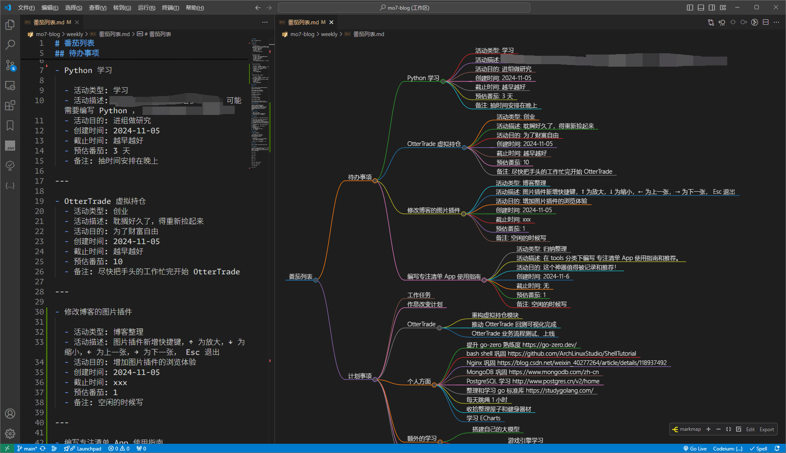
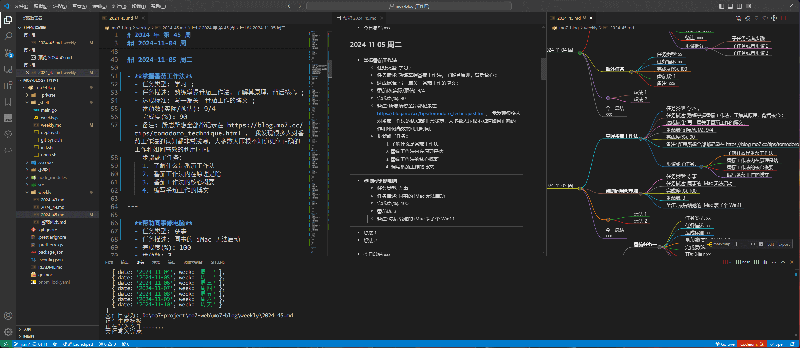

# 重新认识番茄工作法

## 什么是番茄工作法

[番茄工作法 wiki](https://zh.wikipedia.org/zh-sg/番茄工作法)

25 分钟专注做一件事情 ， 休息 5 分钟 为一个 **番茄时间** 或者称之为 一个 **番茄钟**。
完成 4 个番茄时间 休息 15-30 分钟，被称为 **一组番茄时间** 或者 **一组番茄钟**。
这就是 **番茄工作法** 。

你需要一个**计时器**，或者闹钟，用于记录你的**番茄时间**。
一份随时写下待办事项的**活动清单**，用于记录你所有你需要要做的事情或者计划。
另外再准备一份**今日待办**工作计划表，用于记录你今天要完成的工作。
一份用于记录原始数据的**记录表**。

除此之外，一个完整的番茄工作法体系有 6 个流程或者是目标

1. 必须制定 **今日待办**

   在第一个番茄时间里，明确自己要完成哪些任务，任务的优先顺序，先做什么，后做什么。
   每个任务需要多少番茄时间。
   超过一个番茄时间的大任务需要拆分成许多单独的番茄时间，不满一个番茄时间的多个小任务可以合并成一个番茄时间。

2. 执行 **今日待办**

   这个过程中要对抗各种内部或者外部的干扰，尽量完成完整的番茄时间
   如果被打断了，这个番茄时间就不成立，称之为一个 **烂番茄**。
   打开计时器设定一个 25 分钟的倒计时，从 **今日待办** 中的第一个任务开始工作。
   这 25 分钟内不可以做当前任务外的任何事情， 也不可以被其他人或事打断或者打扰，否则这就是一个 **烂番茄** ，你需要重新开始计时。
   一个番茄时间结束后在后面打上一个 x ，接下来的 3-5 分钟不可以做任何根当前工作相关的事情。可以喝点儿，吃点，走一走，和周围人聊聊天。
   休息完成后重复以上步骤，开始第二个番茄时间，直到第四个番茄结束开始进入长时间休息。休息 15-30 分钟，这期间不能给大脑增加任何负担。
   **今日待办** 中完成一项任务就划掉这个任务。
   如果当前番茄时间没有结束，那就回顾和检查刚才的工作。
   如果任务结束当前的番茄才进行了不到 5 分钟，那就把这个番茄时间作废。
   如此往复直到一天的工作结束。

3. 需要根据任务完成情况，记录每个任务实际使用的番茄时间。

   最好是在任务开始之前先估测将要使用的番茄数，然后再任务完成之后记录实际使用的番茄数，然后在统计出差值，包括任务的开始时间，结束时间，中间被打断了几次等。并把这些数据统计到 **记录表** 中 。

4. 复盘

   需要结合自己在第一步中制定的番茄工作计划，以及在第三步中实际记录的番茄时间对比、复盘、分析对改进自己的工作有用的信息。
   比如我在哪些地方花费了比原先计划更多的番茄时间，哪些任务超时了，超时的原因是什么。
   产生了多少烂番茄。 **烂番茄** 是内因还是外因造成的。

5. 根据复盘中得出的经验，灵活的制定你的番茄时间计划表。

   比如，你发现自己下午效率更高上午其实一般，可以把上午做的番茄时间移动两个到下午。
   这种调整也是可以根据具体的事情。或者实际可以利用的时间来调整，从而形成一段时间内的 **番茄工作计划表** 。

6. 在完成了前面任务的情况下寻找到个人目标，并且利用番茄工作法节省出来的时间来实现。

   这个是最近几年番茄工作法官方加上的一些额外内容。这个和番茄工作法本身是无关的，但是它使得**番茄工作法** 更加完善。

整个番茄工作法可以区分为 **`计划 -> 执行 -> 复盘`** 三个不断循环的环节，从而形成了一个完整的番茄工作体系。
这其中我认为制定计划和进行复盘对于番茄工作法来说是更加重要的。

> [!note]
> 如果能在 25 分钟专注做一件事情并且不受打扰，这将是一个美好的开始。如果能坚持无数个这样的 25 分钟，那么你几乎可以做成所有的事情。

时间具有生成性和事件的连续性两个特点。我们有了具体的日期，时、分、秒的定义，才有了迟到、DeadLine 等概念，也才有了随之而来的时间流逝感、焦虑感。
如果我们用一个个的具体事件去衡量，吃饭、洗澡、背一篇文章 时间的连续性带来的焦虑感就会减少。

番茄时钟就是利用这种基本原理来减少焦虑感。

还有一部分焦虑来自内外部的频繁打断。

内部因素主要来自于自己。神奇的大脑和身体机能有的时候会突然冒出一个奇妙的想法，比如突然饿了，或者突然想知道陈奕迅的下一场演唱会什么时候开，那么就在 **活动清单** 中记录一下 想法。
如果这件事情今天或者待会儿就得完成，在今日待办中的 **今日待办** 里面添加一行，然后继续当前的工作。
如果这件事不一定要今天做，那就写进 **活动清单** 并标注截止日期。
如果是来自于外部的打断，我们需要做的就是快速记录，推迟打断你的这件事。

为每一个 **活动清单** 来进行番茄时间的估算，如果一项任务需要 5-7 个番茄数，那就拆分为小任务。
如果多个任务估算值小于一个番茄数，则可以酌情整合在一个番茄时间内完成。
更精确的番茄数估算，可以方便我们把 **活动清单** 的任务合理安排到 **今日待办** 中。
总体任务不超过当日可用番茄数，完成一个番茄，打上一个 x，完成一项任务划掉它。
如果一项任务完成后发现预估番茄数还有剩余，那么就记录一下留作复盘。

一天的工作结束后，记得复盘。长期坚持尽量让预估越来越准确。

## 番茄工作法与拖延症

在上一篇 [拖延症与行动力](./1.拖延症与行动力.md) 一文中，我们知道想要带打破拖延有五个行动策略：

1. 正视内心的**恐惧**与**焦虑**
2. 制定明确、可操作的**目标**
3. 列出自己的非**计划表格**
4. 学会**拒绝**与**聚焦**
5. 用正念减轻压力

抛开第一条不谈，番茄工作法仿佛是专门针对 第 2~5 条 进行设计的。而且我们一旦开始按照番茄工作法开始执行了，那么第一条也会随着时间得以缓解。

番茄工作法需要罗列 **活动清单** ;
番茄工作法需要划分出今天需要明确执行的任务也就是 **今日待办** ;
番茄工作法在执行过程中需要集中注意力并且不允许被打断 ;
番茄工作法在执行过程中要求你必须 **专注与聚焦** ，哪怕是胡思乱想也算是打断 ;
番茄工作法每 25 分钟要求你休息一次，并且这期间不允许进行和思考任何与工作相关的事情。

这在我看来，番茄工作法简直就是专为 **拖延症** 而设计的。

制定良好的合适的 **番茄计划** ，把一个任务拆分成多个步骤，并且预估好合适的工作时间，可以有效的帮助我们更好的去协调自己的生活和理想。尤其是面对一大堆的琐碎的任务，一张合理的 **番茄计划表** 可以让我们不再焦虑，并提高工作效率。

按照 **番茄工作法** 一条条的去执行。在一个个 **番茄时间** 中不断的树立信心与积累 **成就感**，从而让我们做事越来越主动和高效。
当现实的问题全部被转换成一条条 **番茄计划表** 的时候，我们就只需按照番茄工作法严格执行，那么现实问题自然而然也会得到解决。
当你专注于手头的 **今日待办** 时 ，焦虑与不安自然而然也会一并消失。日积月累之下，你会感觉自己正在逐步成长。

如果你有一个非常远大的目标，将它拆分成一个个的 **“小番茄”**，然后不断的吃掉这些 **“番茄”** ，你离自己的目标也会越来越近。

## 番茄工作法常见问题

1.  **内部因素** 和 **外部因素** 的打断。

    **内部因素**：主要是我们自己的注意力或者是情绪引起的。比如，你刚刚分手，然后让你专注的学习两个番茄时间，绝大多数人肯定都做不到的。还有突如其来的思想抛锚，想入非非，突然发生的奇思妙想等。
    **外部因素**：手机电话，同事领导时不时找你有事，快递，外卖等等。如果你所处的环境会时常会被打断，是你无法做到专注，那你就得考虑番茄工作法可能并不适合你。

2.  另外一个问题是，25 分钟的番茄时间可能不太合适。

    一个番茄钟开始了，可能刚刚找一点点状态，就要开始休息，然后又要重新找状态。 一个 25 分钟的番茄时间大部分都用来进入状态了。
    一个网课大多数都是 1 个小时或者更长的，好不容易跟上思路结果就因为番茄时间到了要休息 5 分钟。
    对于逻辑性比较强的一些工作，可能得花个十几分钟才能理清楚做题的思路，不可能做题做到一半就休息 5 分钟。

3.  有的时候 5 分钟的休息时间感觉可能也不太够。

    整个番茄法的原理认为，我们的注意力会随着时间下降的，所以每学习 25 分钟休息 5 分钟，就能让你注意力水平恢复到最高的状态。
    但实际的情况可能有变，比如注意力下降的比较快，休息 5 分钟注意力可能只恢复到一半。

4.  刚开始使用番茄工作法时，可能会不知不觉的追求番茄工作法的数量，而不是工作的质量。

    当工具本身变成了任务就失去了它的价值。如果只是把问题拆分成番茄时间，可能会给人一种 “达到了数量就解决了问题的错觉” ，这个就是心理学上的 “计数器陷阱” 。
    所以很多时候完成的往往是量的积累而不是质的改变，看不到明显的提升效果，后面就不太想要坚持了。

## 番茄工作法的升级建议

1. 要个性化你的番茄时间。

   一个番茄时钟不一定非得是工作 25 分钟 休息 5 分钟。这种可能比较适合普通人或者是搬砖的简单工作。
   如果工作本身逻辑性和推理性比较强，可能更加适合比较长的周期。 比如工作 50 分钟休息 10 分钟就比较适合专注类的工作。
   或者我们将任务进行分类，比如简单一点的重复性劳作，就 25-3 的番茄钟；学习类的任务，可以根据课时进行动态划分，比如番茄钟可以设置为 40-5；如果是研发类的，需要专注思考的，可以设置为 60-10。
   这个需要花上几周的时间，不断的进行番茄钟的 **复盘** ，来找到适合自己的节奏。
   可以给 自己的日常任务进行 **分类** ，不同类型的任务使用不同的 番茄时间 。

2. **计划** 和 **复盘** 很重要

   计划的作用是在于让我们分清楚事情的重要程度，排好优先级，否则可能 **小事情忙了一天，大事一样没做**。
   复盘的作用是让我们知道哪里做的好哪里做的不好，从而形成快速的、可执行的迭代方案，才能帮助我们快速成长。
   同时也可以不断的提高我们对 **番茄时间** 的预估精准度，更快的找到适合自己的番茄时间。
   同时也可以提高下次 **番茄时间** 的效率，让自己的番茄时间更加均匀，更加自主可控。更加合理高效的安排一天的工作和学习任务。

3. 使用番茄工作法的前提，是这些时间是你能够**完全自主可控**的。

   如果你是学生党，那么你的课余时间都可以是自己的。
   如果你是上班族，上班的时间又经常会被打断，那么番茄工作法很难起到作用。
   所以可以判断一下，如果接下来的几个小时自己可以全完全做主，那么就可以使用番茄工作法。
   如果工作中打断只是偶然发生的事件，那么就可以快速记录一下，把打断外的事件立即标记到 **计划外紧急事件** 中，并做好时间记录，然后立即重新投入到当前番茄时间里面去。尽量让自己的番茄钟更加完整。

4. 排除环境干扰，在开始之前给自己制造一个安静的环境。

   在开始 **“吃番茄”** 之前找一个尽量不会被其他人打扰的时间和地点来进行。
   然后给自己创造一个专注的环境，比如可以去图书馆，或者把桌面的杂物清理掉，把干扰因素提前排除。如:手机调成免打扰模式等等。

5. 番茄计时器的使用

   尽量不要使用手机，因为手机本身就是一个很大的干扰。
   可以买一个专门的计时器。
   更加推荐使用手表或者手环。
   我现在就用的小米手环，它本身也带有倒计时功能，时间到了就振动两下。这样休息时间我可以不带手机在公司里面到处溜达，做一做拉伸运动，倒计时结束后返回工位继续下一个番茄时间。

6. 珍惜心流的状态

   如果一旦进入心流状态，就不要再管什么番茄时间了，好好把握这种状态，专注做好自己手里面的事情，直到感觉到疲累或者心流的状态消失。再继续番茄钟。
   根据我以往的经验，一个心流的时间不宜太长。就比如我，一个有效的心流时长不会超过 1 个小时，一旦超过思维敏捷度就会下降，甚至会开始钻牛角尖，导致思路打不开。
   所以还是更加建议隔一段时间就去休息一下，休息的过程中可以四处走一走，喝一喝水，看看四周的人事物，尽量减少对工作的思考。不过在开始休息之前可以做好记录，方便休息结束后更快的回到工作当中去。
   如果是非常需要深度的工作，休息的时间可以稍微定短一点，比如 3 分钟，让自己可以缓一缓，同时也不至于忘了之前推理的内容。

7. 学会休息

   番茄工作法休息时间和工作时间一样重要。休息的不好可能会无法回到之前的注意力水平。
   所以休息的时候最好不要思考任何和任务相关的事情，也不要刷视频刷朋友圈，因为这些事情会偷偷占用你的注意力或者影响你的情绪。
   休息时多看看远处，或者多看看绿色的植物可以缓解视疲劳，或者深呼吸几次甚至闭上眼睛用一下 [全身扫描放松法](https://zhuanlan.zhihu.com/p/359464590) 来放松身体。 或者做一点拉伸运动等等。
   一个番茄时间加上休息是 30 分钟，一组四个番茄钟也就是两个小时。一组番茄结束之后可以找个舒服的地方睡 10 分钟。
   每个小番茄之间的休息间隔也不一定非得是 5 分钟，比如你可以放下手头的工作来调整自己的状态，当你的状态调整好了之后你再进入下一个**番茄时间** 效果可能会更好一些。

## 工具推荐

`专注清单App`：

https://www.focustodo.cn

这是我前不久发现的一款神器，它基于番茄工作法设计的。

- 每个任务可以单独设定番茄时间的时长和番茄数，休息时长等都可以自定义。
- 任务完成后会自动归类到完成列表中。点击任务详情可以直接查看开始时间和消耗的番茄数。
- 它会在每个任务下面直接显示你的预估番茄数，和实际使用的番茄数。
- 它支持将一个大的任务拆分成多个子任务，并且单独的番茄钟计算。
- 它不会记录你的休息时间，但是会记录你每一个番茄钟的开始时间和耗时。
- 它支持给每个任务添加备注。
- 它兼容几乎所有平台，Android、ios、Mac、Windows，以及 Chrome 插件，而且完全免费，全端数据互通。
- 它提供了 **番茄工作法** 的所有核心功能。

因为我的工作大多数都是在电脑端完成的，所以开着 **`专注清单App`** 去工作，到时间了自动弹出提醒界面，非常方便。

另外一个就是 带有倒计时功能的 手表 、 手环。直接开启 25 分钟倒计时，工作完了设定一个 5 分钟倒计时即可。

番茄清单可以理解为是一个全平台通用的带有倒计时功能的 **ToDoList**。 秒杀市面上的各种 **ToDo** 软件。

## 结束语

我们每天的第一个番茄钟必然是 **整理今日待办** ，每天最后一个番茄钟必然是 **今日总结与分析** 。
总结分析的第一件事情就是统计 **今日待办** 。

> PS: **整理今日待办** 和 **今日总结与分析** 大概 10 分钟左右足矣。

我根据自身情况设定的常规**番茄钟**是 30-5，也就是工作 30 分钟休息 5 分钟。

我们来大致估算一下:
早上 9:00 到 11:30 一共 150 分钟，也就是 4 个番茄钟，刚好完成一组。开始午休。
下午 14 - 18 点，最多容纳 6 个番茄钟，也就是刚好一组番茄钟外加一个番茄时间。
如果你很勤奋，晚上回家还想学习一会儿，最多也就腾出来 一组番茄钟。

换句话说，如果设定番茄钟为 30-5。
在没有烂番茄干扰的情况下，每天理论可以完成 **3 组番茄时间** 共计 **12 个番茄钟**。

如果你不上班，是个自由工作者，或者你是个独立开发者，你全程在家办公，拥有大量的无人打扰的时间。而且你还是个超人，能够长时间进行专注的学习和工作，那么你一天的有效番茄钟大概也就 16 个了，也就是 4-5 组番茄钟。如果一个人真的能持续不断的做到这一步，再加上方向正确和一点点机遇，再加上时间沉淀，你一定可以完成任何你想完成的事情 。

我归纳和整理这篇文章，**`专注清单App`** 显示花了大概 10 个番茄钟，也就是完完整整的一天时间都在整理和归纳这篇文章。

> 包括各大视频博主自媒体博主等，他们可能第一天录制视频，第二天剪辑视频，第三天发布，充其量也就两天一个视频出炉。随着熟练度增高，可能速度会越来越快，但一天最多也就一个观感完美的视频出炉。

所以你看，时间真的很宝贵也很不经用。当你开始专注于某一件事情的时候它一晃就过去了。**所以当你真正的开始做实事的时候才会明确感觉到时间的宝贵。**

> [!tip]
> 事实上，我统计了一下，哪怕很顺利，一天有效的番茄钟也就 7-9 个。来自内因的打断比外因要多很多。

你可以根据自身的情况设计属于自己的 **番茄列表** ，甚至可以使用 **Excel** 设计成表格。

## 墨七的 **番茄列表** 展示




上图是就是我根据 **番茄工作法** 重新设计的 **番茄列表** 工作区的演示。通过之前的脚本可以一键生成 基础模板。然后每天第一件事情就是在里面填空，然后就是按照番茄工作法去执行和复盘就好了。
最终产生的 Markdown 文件通过 VSCode 的 **Markmap** 插件可以很好的渲染成脑图。这样一来，远比之前的 任务列表 清晰很多。


> 我们把整理好的今日待办输入到 **`专注清单App`** 中，然后按照番茄工作法去执行。执行的过程中，内因打断就记一下想法，事件打断就记一下吐槽，任务穿插就在 **今日待办** 中新增一个额外事项并列一下优先级 。
> 当一天结束时，可以在 **今日已完** 成中回顾每天的任务，整合到 **今日待办** 中，可以非常方便的回顾今天一天的 **“番茄情况”**。 然后改进工作方式，以待下次做得更好。

::: tip

**番茄工作法** 使得 **To Do List** 的执行和制定方式得到了 **精确** 和指导。

只要足够精确，那么就会知道具体应该怎么做，怎么开始。面对一种情况应该怎么处理。
那么就不会产生 **模糊不清的恐惧** 。

自然也就不会再焦虑和拖延。**严格掐好一个任务的时间，也是在提醒自己，不要在一个任务上浪费太多时间。提高效率是因为还有更重要的事情在等着我们。**

**番茄工作法** 不仅仅是一种工具，而是一种 生活和工作的 **“理念与态度”** 。

有的时候，我们进行了一件事情的深度思考，就可以把 番茄钟 抛开到一边，然后专注醉心于工作，等到结束后再把数据补全到 **今日待办** 中去。

:::

::: details 脚本源码

```js title="weekly.js"
<!-- @include: ../../.vscode/shell/weekly.js -->
```

:::

::: details 模板文件源码

```md title="weekly.md"
<!-- @include: ../../.vscode/shell/weekly.md -->
```

:::

> 你可以自行修改脚本和模板来满足自身的需求。

项目开源地址: https://github.com/mo7cc/blog-source/tree/main/_shell

## `番茄工作法` 七天使用心得

在开始做事情之前，点击一下**开始计时**按钮，意味着要开始专心干活了。保持注意力集中。
计时结束，表示你该休息了，然后进入休息计时。这个时候可以处理一下聊天列表，邮件，四处走一走，闭目养神，做两个瑜伽动作。做好迎接下一个番茄钟的准备。
如果工作的状态正酣但是进入休息计时了，则可以直接点击 **完成休息** 立马开始下一个番茄钟。直到感觉自己状态逐渐无法集中的时候，可以立即点击 **暂停** ，然后手环设置一个 5 分钟的倒计时，开始四处溜达直到自己状态恢复。
状态恢复后，回到电脑前，点击 **继续** 然后继续开始工作。

这样使用 **番茄工作法** 的好处是十分灵活。

也就是说，干杂活的时候每 30 分钟休息一会儿，然后再继续专注 30 分钟，可以让自己持续性的高效。
做需要深入思考的工作时，提醒休息的闹钟响起，立即点击结束休息，然后再次立即点击开始计时，直接跳过休息立马进入下一个番茄钟，直到自己下一次闹钟响起或者自己注意力涣散。

`专注清单App`5 分钟的休息计时我基本上很少用到，休息计时基本上都是用 **手环倒计时** 功能完成的。

如此一来，每项任务花了多少个番茄钟，`专注清单App`都帮我做了很好的记录，方便估算自己的效率。然后看着任务列表一项项的任务被完成非常具有成就感。
早上先整理一下今日待办，然后把今日待办输入到 `专注清单App` 里面去，然后定时休息。开始工作前点一下开始计时。如果状态好就跳过休息立即开始下一个番茄钟。休息的时候也不用非得严格限定时间，等到自己的状态好的时候就可以开始下一个番茄了。

如此使用七天，工作和生活效率得到了质的飞跃，简直就像打游戏一样: **不断的完成任务获得成就，然后开始挑战下一个任务，不断的积累成就。让自身越来越高效，同时离目标也越来越近。**

然后我还把每天必须要做的事情，比如：今日总结、打扫卫生、更换床单被罩、锻炼身体等都设定了 **任务循环**，每天要干的事情就是清空任务列表，每天的生活非常充实且自律，而且很有成就感。
