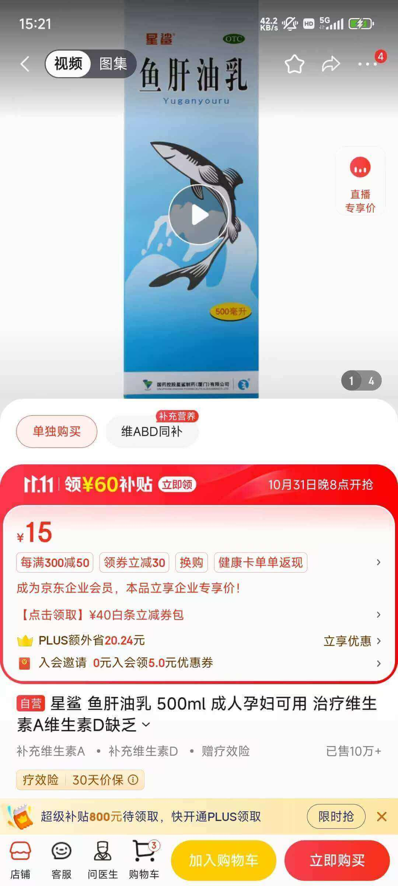
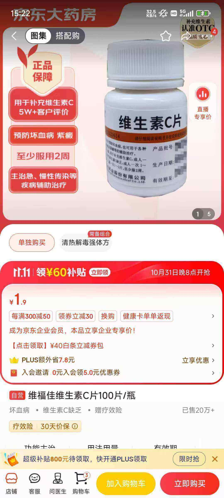
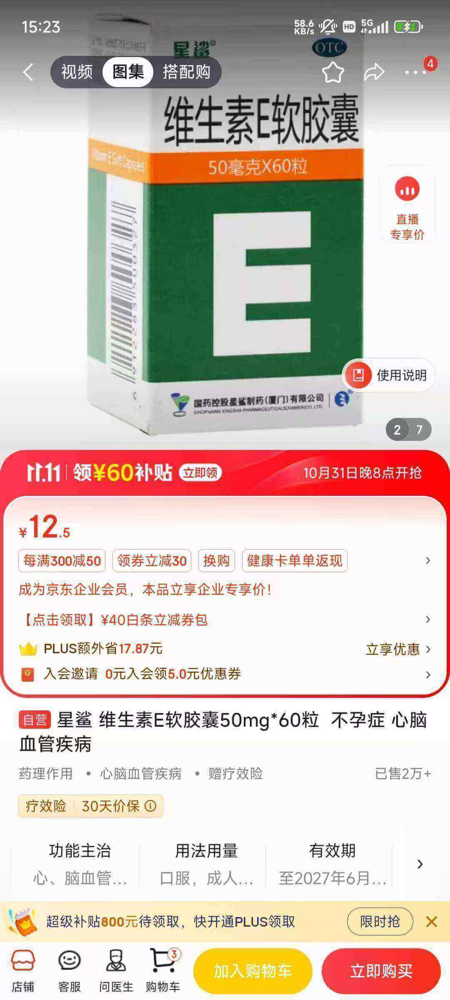
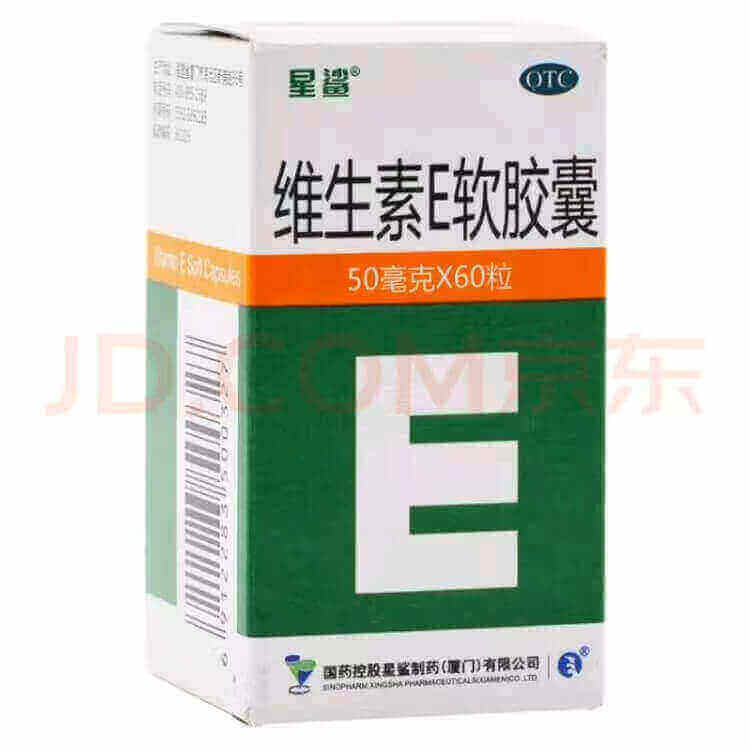

# 关于减脂

> [!tip]
> 肥胖是许多慢性疾病的主要风险因素，如高血压、糖尿病、冠心病等等，不利于自身健康。
> 而减轻体重可以降低身体耗氧量，提升身体运转能力，有效地降低这些疾病的患病风险，改善身体的健康状况，并减缓衰老。
> **减脂不是一种方法，而是一种生活方式。**

## 方案总结

早餐一杯牛奶咖啡，然后刷牙洗漱。做一些运动(可以是走路上下班，可以是跑步，俯卧撑，跳绳都行)。  
午餐正常吃，四菜一汤一饭，自己估摸着 8 分饱即可，注意营养搭配，总结一下就是要吃饱吃好。(大脑感受是存在延迟的，你觉得饱了，其实胃已经撑了)
晚餐戒掉，如果感觉很饿就来一杯牛奶。如果非常想吃东西，牛奶+咖啡。  
一杯咖啡下肚，食欲什么的直接就没了，搭配牛奶效果很好，不仅好喝而且可以有效压制食欲。  
上述的饮食之外，除了纯净水，其余的一概不要进嘴。  
晚上可以适当加一些空腹运动，但是运动前最好一来杯牛奶补充一下。
中途如果很饿想吃东西，就喝水，或者来一杯蔬菜汁(芹菜，黄瓜，大西红柿)。  
保持空腹入睡。

## 核心理念

::: important

不要惧怕饥饿。

:::

我自己试了一下，在 60 小时内(两天三夜)一共只喝了一瓶牛奶，饿了就只是喝纯净水。尽量去适应空腹和饥饿的感觉。在此期间会伴随着四肢无力，双手无力发抖的情况，但是我本人并没有出现任何问题，正常的打游戏，刷剧，敲代码，看书，学习。然后从第三天早上开始，一杯牛奶下肚，然后直到 12 点午餐正常吃，然后晚餐也只是一瓶牛奶。如此的饮食习惯坚持了一个周就适应了，而且不会再出现什么无力感。

完全不要担心自己被饿坏了或者营养不良，也不要怕会养成胃病之类的。事实上大多数胃病都是因为吃的太多暴饮暴食，给胃的负担太大造成的。

坚持一段时间后，我还会担心自己会不会有厌食症的倾向，发现完全没问题，因为自己看到美食还是会很想吃，不过这个时候我会专心去做其它事情并喝一大口水。

> 所以不要害怕饥饿，要学会享受和适应饥饿感。

虽然饥饿，但是也要营养要均衡。中午那顿只要吃好一天所需能量就完全足够了。然后牛奶和纯净水(5.5L 纯净水不足 10 元人民币，够喝很多天)是作为蛋白质以及空腹时期消化物的替代品。当然，也可以用一个鸡蛋来替代牛奶，总之就是要吃得少，而且得保证足够优质蛋白的摄入。

也不要担心长此以往会让自己状态下降，一旦身体适应了这个饮食节奏，你的身体和精神状态不会有任何变化，甚至精神状态会更好。

这么做的本质上其实就是屏蔽大脑信号并按时按量的饮食，然后用优质蛋白和纯净水来充当空腹时期的消化物，并给予身体额外的养分。

每个人的日常生活情况可能不太一样，但是核心理念是一样的，就是饿，并且要学会享受和习惯饥饿感。然后每天规律并且定时定量的饮食，同时还要注意营养均衡。

::: details 疑虑 1：靠饥饿来减肥，不是容易反弹么？

这里有个思维误区，是不健康的饮食和生活习惯以及理念导致了你的肥胖，这种饮食方式只是让你回归了正常而已。如果你长期坚持这种饮食习惯，自然就不会反弹了。吃太多，本身就是一种非常不健康的饮食方式，尤其是晚餐吃太多。

:::

::: details 疑虑 2：营养不良维生素等营养物质缺乏怎么办

很多担心其实完全都是多余的，维生素缺乏就补充维生素就好了。而且中午那顿饭是完全正常饮食，可以正常的摄入碳水，摄入大量的能量，牛肉，米饭，面条什么的都很随意。所以中午那顿饭必须得吃好，要荤素搭配，要营养均衡。

但是以上的饮食结构还会存在另一个问题，那就是水果的摄入。如果是 12 点吃的午饭，那么水果就可以放到 15 点左右吃，或者干脆不吃。

然后饭后可以搭配鱼肝油和维生素补充剂来进行食用，认准 OTC 标志，而不是保健品标志。

> 吃上一片顶得上几篮子水果了，而且价格便宜，买上一瓶能吃好几个月。维生素缺乏的病人可能得一天吃三顿。身体健康的人 1-3 天吃一片补充一下就可以了。以此类推，只要不过量任何营养物质都可以使用这种方式来补充。
> 什么维生素 abcdefg，蛋白质，鱼肝油啥的 都可以根据自身需求去选用补充剂。比如 VC 是美白，VE 会让皮肤好，VB 提高免疫力啥的 那么就可以提高频率为一天一片而不是 2 天一片。
> 京东大药房或者阿里大药房就有的卖，认准 OTC 价格很便宜。

> 一定要认准 右上角的 **OTC** 标志。

[延伸阅读: 食品、药品、保健品的标志有哪些？](https://www.hopebiol.com/asphtml/refere9268.htm)

我分析过市面上大多数的保健食品，无一例外基本都是**智商税**。高昂的价格，复杂的成分，主打一个只要吃不死人就随便给你吃。

:::

::: details 疑虑 3：这么吃会不会导致肠胃或者排便问题？

前文提到过，肥胖是因为不健康的饮食和生活习惯而来的，这么做只是在把饮食拉回正常。亲身实测，压根不会出现任何肠胃问题，正常 1-2 天排便一次。 只要多喝水就好了。

:::

## 循序渐进的做法，长久的坚持

第一阶段：戒零食
第二阶段：减小饭量
第三阶段：早晚餐换成优质蛋白
第四阶段：加入运动

每个阶段根据个人情况不同可能会持续 1-2 周甚至是几个月。
比如我，第一阶段的完成花了 3 个多月的时间，第一阶段+第二阶段足足花了半年多。直到现在，我的生活中再也没出现过任何零食。每天只有 1-2 顿有主食。

当然优质蛋白也不仅仅是牛奶鸡蛋，[优质蛋白十佳食物排行榜](https://hospital.pku.edu.cn/info/1056/1935.htm)，原理基本一样，根据自身口味需求混搭也都可以。

肥胖从某种角度来说本身就是不健康的生活习惯和生活理念造成的，所以一定得注重习惯的养成和理念的精确。

所谓的精确就是：这顿饭我不能吃，不吃就是不吃，没有中间选项；我现在饿了那么我就只能喝水，没有其它选项；我早餐就只喝牛奶，或者鸡蛋，没有其它选项。

一开始可以试着把零食彻底戒掉。什么奶茶，甜品，辣条，小零食之类的统统不要。
适应没有零食的饮食之后，下一步试着减小饭量，饿了就喝水；
每顿饭坚持 8 分饱，然后试着适应和享受饥饿感，8 分饱就是 8 分饱，多一分都不行，下午四五点会很饿，饿就对了；
适应没有晚餐的生活之后，可以试着把早餐换成一个鸡蛋或者牛奶。
最后再试着开始加入一些运动在你的日常生活中。

试着找一个拥有相同理念的健身搭子，并记录习惯养成结果。这样做的好处是，不会一口气瘦太快，而且给了身体一个很长的适应期。循序渐进也不会太过痛苦。最主要的是做法简单，容易坚持。

你吃进胃里的任何东西本质上都会变成身体的**负担**，少吃等于是在给身体 **减负**。

相信我，作为一个成年人，每天仅有的一顿 **大餐** 已经足够养成你的身体了。

不过，我是个上班族每天上班就是坐在办公室敲键盘，每天中午有安静的 2 小时午休，公司食堂的午餐非常安全丰盛且搭配合理。每个人情况不同，所以第三阶段可以自己根据自己的情况去调整，但是第一、二、四 阶段是必经之路。

> 运动只能增长你的肌肉，只有减少饮食才能让你真正的减少脂肪。

当你很饿的时候，不妨找点事情来做，比如打游戏，思考问题，看书或者是学习，当你沉浸到某一件事情之后你会完全忘记饥饿这件事情，等时间到了就按照规划好的去计划饮食就好了。

> 困了就去睡，别和疲劳做对抗，不要留恋和让无聊的事情占据你的大脑，自然而然就能做到早睡了。
> 午休很重要，一定要睡好睡足。
> 无聊了，就去找事情干，制定自己的 To Do List，一项项的去完成。
> 情绪不好了就去做适合自己的运动，任何运动都可以，一定要发泄出来。
> 饿了就去喝咖啡牛奶，补充优质蛋白，而不是吃一大堆乱七八糟的东西。一天一顿的美食奖励还不够吗？莫贪心。
> 提升和改变都是一点点的事情，一定要把这种进步当作是日常。

::: details 七宗罪
人有七宗罪 傲慢、贪婪、色欲、嫉妒、暴食、愤怒、怠惰。

戒**傲慢**可以笼络人缘，傲慢的反义词是谦逊，谦逊使人进步。

戒**贪婪**可以让你时刻警醒危机和陷阱，能量和馅饼不会凭空产生。适当贪婪让人进步，过度贪婪使人毁灭。

**嫉妒**只是在你的浪费时间而已，它不仅会让你心理扭曲还会打击你的信心，有时间嫉妒不如自己发奋图强。

**暴食**使人肥胖，肥胖往往会伴随一大堆的不健康的身体指标和慢性病。

**愤怒**的时候一定要采取合理的方式发泄出来，人有七情六欲更何况是愤怒，但是在情绪平稳之前不要做任何决定。

**怠惰**会让人退化、腐朽，无论生活如何富足和闲暇也一定要找点事情做，可以是钓鱼、绘画、写小说、射击、烹饪、汽车改装。也一定要有所产出，哪怕只是写篇文章或者是拍个短视频或者是参加比赛甚至是组织比赛。如果只是光看、光玩没有任何产出，那么最终也会厌倦。

:::

减脂这种事情本身就是在和自身欲望以及懒惰做对抗，不要小瞧任何原本肥胖但是靠自己减肥成功的人，他们都拥有绝对的**自信**和**毅力**以及**坚定且正确的信念**，还具有很强的计划和目标管理能力，同时还拥有强大的执行力。

## 一些延伸阅读和必要的知识储备

[间歇性断食如何起作用？好处、风险以及如何安全地进行断食](https://www.mountelizabeth.com.sg/zh/health-plus/article/intermittent-fasting-benefits-risks)

> 也就是说，饥饿其实并没那么恐惧，尤其是现在这个物质发达的年代，吃太多很容易，管住嘴反而更不容易。

[食品、药品、保健品的标志有哪些？](https://www.hopebiol.com/asphtml/refere9268.htm)

> 东西千万不要乱吃。商人为了逐利什么事情都敢做，现在的各种商品都参杂着各种 **科技与狠活**，主打一个只要吃不死人就随便给你吃。假的鸭血，假的腐竹，假的粉丝粉条，假的牛肉等等等。一日三餐简单而纯粹，不仅省钱还健康。
> 我目前把大多数的二次加工产品都从自己的日常饮食中剔除了:
> 比如鸭血，我干嘛不吃鸭肉呢？ 想吃牛肉那么就一定得去好一点的店铺或者自己去菜市场买新鲜牛肉，而不是各种二次的肉制品等等。相信我，哪怕仅仅只是用原材料也能 100%满足你的味蕾。

[人在感到饥饿时，是因为胃里没有食物了，还是没有「热量」了?](https://www.zhihu.com/question/509745291)

[一个胖子如果一直不吃饭，是会直接饿死还是会变瘦？](https://www.zhihu.com/question/491683365)

[人体所需的营养物质都有哪些？](https://www.zhihu.com/question/485420297/answer/2111674981)

[脂肪是人体的「战略储备」，那么胖子就一定比瘦子耐饿吗？同等情况下谁先饿死？](https://www.zhihu.com/question/21313585/answer/3401406462)

> 所以不能不吃饭，得营养均衡并且依据自身情况科学的减少饭量。

[一天只吃一顿饭能瘦吗? - 离愁的回答](https://www.zhihu.com/question/415889635/answer/3128109769)

## 瘦到什么样算是成功的？

[成人体重指数](https://www.cchrchealth.org/zh/body-mass-index-bmi-for-adults/)

[免费在线 BMI 计算器](https://cn.onlinebmicalculator.com/)

[BMI 測試](https://health99.hpa.gov.tw/onlineQuiz/bmi)

**`BMI=体重÷身高的平方`**， 现在大多数的体重秤，体脂秤都自带 BMI 计算。
一般体重处于正常范围内的人是不需要减脂的。只要保持好现在的饮食和生活节奏就好了。如果觉得体弱就适当加一点运动。

---

::: details 墨七的心路历程

如果硬要计算的话，我减脂确实也花了不少钱。
健身房的 VIP 黑金卡，包括私教课，还有一些减肥和运动器械等，零零散散加起来 8-10W 应该是有了。
大家都知道，减肥嘛，只要管住嘴迈开腿就好了，但是做起来其实就是很难。
其根本的原因本质上是因为 **不够精确** 。

没人比我更懂三天打鱼两天晒网的了，我还反思并写了这么一篇文章 [拖延症与行动力](https://mo7.cc/tips/procrastination_and_action.html)。确实很有效果，当我剖析和了解自身之后，之前拖延了很久的计划最近都在逐步稳定的推进着。

为什么 **不够精确** 会导致一件事情无法坚持呢？
无论是思想亦或是理念，如果没有明确的指标或者理论依据就会很容产生动摇，也就是所谓的不足够坚定，不够坚定就无法形成信念。哎呀今天多吃一点没关系，这个再往后拖一拖没关系。一次，两次，三次，四次...... 到最后你会发现这件事情永远都无法完成。再加上现在信息如此发达，各种各样的声音以各种各样的方式进入我们的脑袋里面，不够坚定和精确会很容易造成更多的延误。当然，也不可以只是埋头执行而忽略了选择和思考的重要性。

想象很美好，但是现实却非常残酷。当我意识到自己的体重开始有点不受控制了，于是我就开始思考如何有效的减肥。办了 VIP 但实际上没什么太大的用处，去了几次就没有再去的动力了；买了私教课，但是教练一开始会认真，到了后面就会想尽一切办法跟你推销各种东西，甚至很多理念和方法根本就是错误的，目的就是为了引导消费，甚至你后知后觉才能察觉到。

这种方案之下你想瘦下来不仅依然要忍受痛苦，而且效果还不好，且不可持续，还很费钱。

到最后的最后我意识到减肥这种事情和开公司一样，如果你想成功，只能靠自己(除非有很多很多的钱，多到可以让他人为你着想的地步)。于是我开始思考和学习。从人体构造，饮食结构，脂肪，运动，健康，营养，意志力等各个方面提升自己的认知。

其中彻底使我打开思维和坚定信仰的是知乎的这个问题: [为啥子精神小妹都那么瘦？](https://www.zhihu.com/question/438687594)
说白了，就是饿，也没有那么多技巧，就是少吃多动。 但是要合理的科学的 **饿** 。然后我开始意识到所有的执行力不足和痛苦其实大多数都是因为自身思想认知和既定目标没有达到和谐和统一。

根据相关的研究资料和自身体验来看，只有绝食超过 4 天以上才会给身体造成损伤，其余的时候人体都能很快的恢复过来。总结一下就是：
多挨饿，多休息，不要劳累，适量运动。

但是只是挨饿或者多休息，时间久了身体素质必然会下降，所以在挨饿的同时要保证身体营养得全面，作息得规律，然后还要适量科学的运动。
如果想要有效果，还得持续。所以方案必须得具有可持续性，同时还要容易执行。

所以我根据自身情况才有了现在的减脂方案。【一天一顿饭，早晚餐用牛奶替代，早上早起牛奶咖啡后空腹运动。】
其中最重要的是核心理念的确立，也就是所谓的**信仰**，你得坚信这么做是有用的，是科学的，你才会坚定的去执行。
同时方案不能制定的太过苛刻，得循序渐进，分阶段达到目标才更加容易执行和坚持。
如果你能胖的起来，说明生活理念和生活方法有问题。所以本质上减脂是 **生活习惯和理念的改变** 。

想要改变一个习惯是很难的，更何况是改变一系列的生活习惯。**除掉杂草最好的方式就是种上庄稼**。

于是我用看书学习打游戏来戒掉零食，用牛奶替换早晚餐，用专心做事来缓解饥饿感。我提高自己的效率，让自己拥有大量的空闲时间。我限定自己不抽烟喝酒，不夜店泡吧。所以我拥有大量的空闲时间和精力去做自己想做的事情，然后我规定自己要少做无聊的事情。用不做无聊的事来强迫自己去运动和锻炼身体，比如你早上 6:30 洗好脸了不做点什么多尴尬啊？来一组俯卧撑吧！。

不让无聊的事情占据自己的时间，于是我也就有了更多的精力和时间去投入到有价值且有意义的事情上面去。

如何才能避免无聊的事情占据自己呢？
比如刷抖音，看番剧，打游戏。其实只要你对自己有着比较高的要求，认知足够高了之后，你就会觉得抖音上面大多数内容都非常无趣且浅薄，自然而然就会觉得刷抖音很无聊。
而当你了解了足够多的日本历史和思想形成原因之后，你也自然而然就会明白很多番剧为啥会这么设定，剧情走向为何会如此了，会觉得很多番剧的格局其实很小，自然而然也会觉得番剧无聊了。
打游戏同理，当你体验了足够多的优秀的游戏作品后，当你理解了“上瘾的机制和运用方法”后，自然而然大多数游戏在你看来也非常无聊和无趣....
以此类推，只要不断的提高自己的认知和思维，很多不良的爱好和兴趣在你眼里都会变的逐渐无聊。
然后规定自己不做无聊的事情，那么你开始就会有大量的空闲时间让你无事可做。这会迫使你去寻找更加有意思的事情来做。

因为对自己相对苛刻的**底线要求**，所以我获取**快乐**的门槛很高，这驱使我不断的向上追求**高级快感**，比如思考，创造，学习，阅读，产出，获得认同，获得肯定，让自己被**成就感**裹挟。

从饮食和无聊中可以解脱出大量的时间、精力和金钱，利用好这些资源去做更多自己想做的事情，完成更多自己想要完成的目标。不断的在**做更好的自己**的路上越走越远。
如此一来你永远都不会无聊，无趣，更加不会沉沦或者是堕落。

:::

---

> 减脂、减肥本质上是健康的生活和饮食习惯的**修订**和**培养**。是和自身**陋习**的对抗。是前往更好的自己，改变自己的路上。
>
> **减脂不是一种方法，而是一种生活方式。**
