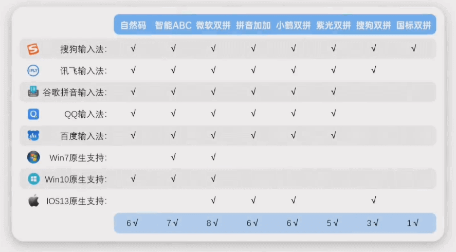
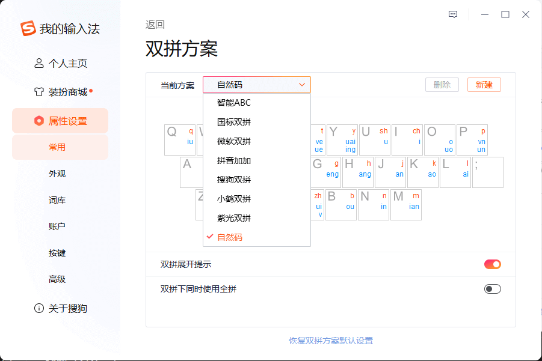
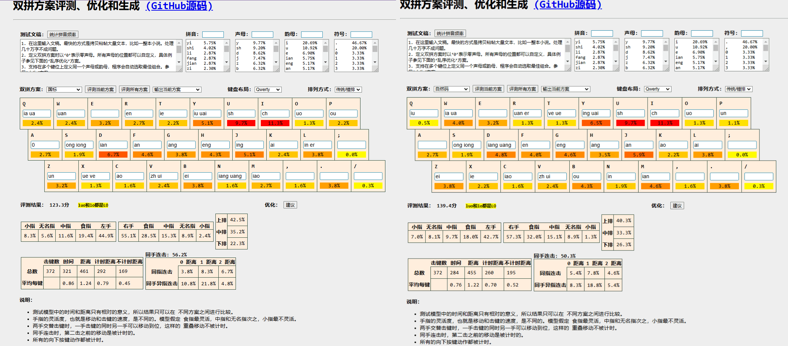
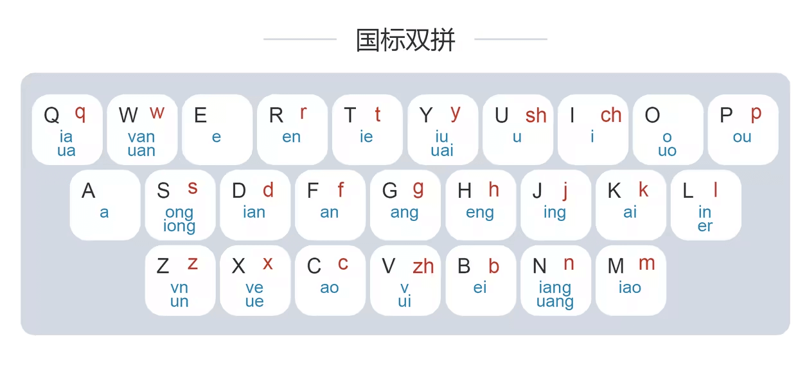
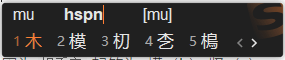
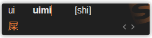
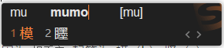

# 双拼输入法

因为拼音的广泛普及，拼音输入法也就成为了目前最为流行的输入法，因为它几乎没有任何学习成本。
尤其是云词库和 AI 的发展，很多时候只需要输入拼音首字母，输入法们就能猜到我们想要输入的内容。

但是拼音输入法也存在很多局限性，因为汉语中同音字实在是太多了，也就是拼音输入法的**重码率**很高，导致输入一个拼音很多时候需要翻很久很久才能找到想输入的汉字。
大多数拼音包含的字母都在 3-6 位，也就是说为了打出一个汉字，再加上重码率 需要敲击 3-8 次键盘才能完成一个拼音的输入(比如:`shuang,zhuang,rang`)，短短一句话可能就得按键上百次。
相反，五笔输入法一句话可能只需要按 4-8 次就能完成，这落差十分巨大。但是随着智能词库和云数据库的发展，简单易学的拼音输入法也越来越高效。相比较而言，五笔输入法上手难度太高了，直到今天已经已经没人愿意学习五笔输入法了。

拼音，是用 26 个字母的拼读来表示汉语发音。拼音是由 `23个声母`，`24个韵母` ，`16个整体认读音节` 组成的。
如果按一次 按键 表示声母，再按一次 就表示韵母，那么任何汉字的拼音就只需要按**两次**就能完成了输入了，所以命名为 **双拼**输入法 。

而且 **双拼输入法** 还能和现有的拼音提示词库完美结合。

---

**课外阅读**

[40 年前，它曾强悍到被纳入国家战略，五笔到底有多牛](https://www.bilibili.com/video/BV1Se4y1Z79t)

[十分钟了解双拼到底是啥](https://www.bilibili.com/video/BV16J411G7YT)

## 双拼方案的选择

[输入法双拼方案哪个好？](https://www.cnblogs.com/PeterJXL/p/18537635)

每种双拼编码都有其个自的特点，其中 **自然码** 的普及度最好，大多数如 **搜狗双拼** ， **微软双拼** 都是基于 **自然码** 发展而来的。
其中 **小鹤双拼** 这几年非常流行，包括其`小鹤音形` 等。

经过研究之后我这里比较推荐 **自然码双拼方案**，因为它生态支持度最好。`自然码+辅码` 的输入方式哪怕是生僻字也可以输入的很快。在任何平台上 **自然码** 很快就能设置好，你所有的输入习惯都能一直保留。

---

> [!important]
> 如果你常用输入法软件是 **搜狗输入法** ，那么也可以试试 **国标双拼方案** ， 这套方案是 2017 年 **国家标准委** 出台的，目前只有搜狗输入法支持。而搜狗输入法也是目前最主流的输入法软件，支持全平台。
>
> 来自 `gov.cn` 和 `org.cn` 的背书：
> https://std.samr.gov.cn/gb/search/gbDetailed?id=71F772D82608D3A7E05397BE0A0AB82A
>
> https://www.nssi.org.cn/nssi/front/107310086.html

> 我们可以注意到，两者评测结果基本一致，但是国标的每根指头敲击节奏分布更为均衡。国标毕竟出来的比较晚，所以键位分更加科学一点。但是国标码支持度不如自然码。毕竟国标码 2017 年才推出，其生态发展和普及程度仍有待提高。
> 个人觉得 **国标双拼** 的码位是最合理的那一个，例外规则也最少。

[主流双拼方案键位图](https://www.bilibili.com/opus/550351671882601523)

[双拼方案评测、优化和生成](https://macroxue.github.io/shuangpin/eval.html)

## 国标双拼 教学

> [!tip]
> 以下所有内容均为 **国标双拼** 逐字输入，新手觉得很好玩。

一般情况下， **国标双拼** 30 分钟就能基本掌握。因为双拼就是拼音，只需要理解其键位划分和编码逻辑很快就能上手。
2 天左右就能熟练。

我们先理解键位图:

黑字代表 按键
红字代表 声母
蓝字代表 韵母
一个拼音的双拼输入则为: 红字 + 蓝字

代表案例讲解：

| 汉字 | 拼音    | 国标双拼按键 | 说明                                             |
| ---- | ------- | ------------ | ------------------------------------------------ |
| 学   | x-ue    | XX           | 声母为 x，韵母为 ue，所以是 XX                   |
| 双   | sh-uang | UN           | 声母为 sh，韵母为 uang，所以是 UN                |
| 拼   | p-in    | PL           | 同上                                             |
| 按   | an      | AF           | A 键代表空音占位，F 键是 an 音，所以是 AF        |
| 啊   | a       | AA           | 同上                                             |
| 爱   | ai      | AK           | 同上                                             |
| 二   | er      | AL           | 同上                                             |
| 昂   | ang     | AG           | 同上                                             |
| 一   | y-i     | YI           | 如果拼音只有两位且键位图上没有，直接字母拼写即可 |
| 图   | t-u     | TU           | 同上                                             |

这里有一个双拼练习的工具网站，很好用: https://api.ihint.me/shuang/

B 站讲解: [一个视频学会各种主流的双拼方案](https://www.bilibili.com/video/BV1Jv411K7rG)

## 双拼进阶：搜狗辅码

在按下 Tab 键 后即可输入辅码。

[你真的会用搜狗输入法吗？双拼+tab 键让你的打字速度飞起来](https://zhuanlan.zhihu.com/p/369416735)

**❀ 笔画法**

`MU  + Tab键  +  HSPN  =  木`

因为 `木` 起笔为: 横、竖、撇、捺，所以按下 Tab 键，再按下 HSPN 键，就可以完成筛选了。

> 横（h）、竖（s）、撇（p）、捺（n）、折（z）
> `一 丨 丿 丶 乛`

[搜狗输入法-笔画筛选](https://pinyin.sogou.com/help.php?list=3&q=9)

---

**❀ 拆字法**

| 汉字 | 拼音 | 国标双拼按键      | 说明              |
| ---- | ---- | ----------------- | ----------------- |
| 尸   | sh-i | UI                |                   |
| 米   | m-i  | MI                |                   |
| 屎   | sh-i | SH -> Tab -> UIMI | 因为 `屎 = 尸+米` |

因为 `木(MU) + 莫(MO) = 模`，所以同样的 `MU`，Tab 后 输入 `MUMO`，就是 `模`。

[搜狗输入法-拆字辅助码](https://pinyin.sogou.com/help.php?list=3&q=12)

> [!tip]
> 双拼 + 搜狗辅码，打字节奏直接起飞~！

## 快速熟练

**记住码位，脱离码表**。

大多数情况下，声字母对应字母，只要记住以下特殊键位即可:

| 声母 | 按键 |
| ---- | ---- |
| zh   | v    |
| ch   | I    |
| sh   | U    |

韵母比较复杂，但也有办法。下面是我自己发明的记忆方法，如有雷同，纯属巧合。

**分类一: 我把它称之为`自我拼读法`。就是按键自己和自己拼，搞定 21 个**

| 字音 | 拼法   | 按键 | 组合拼读案例 |
| ---- | ------ | ---- | ------------ |
| 掐   | q-ia   | QQ   | 下(XQ)       |
| 人   | r-en   | RR   | 怎(ZR)       |
| 贴   | t-ie   | TT   | 列(LT)       |
| 书   | sh-u   | UU   | 厨(IU)       |
| 吃   | ch-i   | II   | 尸(UI)       |
| 剖   | p-ou   | PP   | 楼(LP)       |
| 送   | s-ong  | SS   | 红(HS)       |
| 电   | d-ian  | DD   | 连(LD)       |
| 饭   | f-an   | FF   | 干(GF)       |
| 缸   | g-ang  | GG   | 航(HG)       |
| 横   | h-eng  | HH   | 更(GH)       |
| 精   | j-ing  | JJ   | 零(LJ)       |
| 开   | k-ai   | KK   | 来(LK)       |
| 林   | l-in   | LL   | 拼(PL)       |
| 尊   | z-un   | ZZ   | 云(YZ)       |
| 学   | x-ue   | XX   | 决(JX)       |
| 草   | c-ao   | CC   | 老(LC)       |
| 追   | zh-ui  | VV   | 归(GV)       |
| 倍   | b-ei   | BB   | 配(PB)       |
| 娘   | n-iang | NN   | 凉(LN)       |
| 喵   | m-iao  | MM   | 撩(LM)       |

**方法二: 组合拼读法。就是自身没法自拼的 10 个**

| 字音   | 拼法    | 韵母      |
| ------ | ------- | --------- |
| 花(HQ) | h-ua    | Q -> ua   |
| 全(QW) | q-ua    | W -> ua   |
| 换(HW) | h-uan   | W -> uan  |
| 流(LY) | l-iu    | Y -> iu   |
| 坏(HY) | h-uai   | Y -> uai  |
| 扩(KO) | k-uo    | O -> uo   |
| 穷(QS) | q-iong  | S -> iong |
| 云(YZ) | y-uan   | Z -> uan  |
| 略(LX) | l-ve    | X -> ve   |
| 闯(IN) | ch-uang | n -> uang |

**方法三: 独立成音** 6 ，需要空音键 A 的

| 字音   | 拼法 | 韵母    |
| ------ | ---- | ------- |
| 儿(AL) | er   | L -> er |
| 啊(AA) | a    | A -> a  |
| 额(AE) | e    | E -> e  |
| 嗯(AR) | en   | R -> en |
| 哎(AK) | ai   | K -> ai |
| 欸(AB) | ei   | B -> ei |

> [!tip]
> 剩余读音和原本的拼音是一样的。 只需要熟练记住上述 `21*2+10+6=27` 个字音即可掌握全部码位。

双拼练习工具: https://api.ihint.me/shuang/
