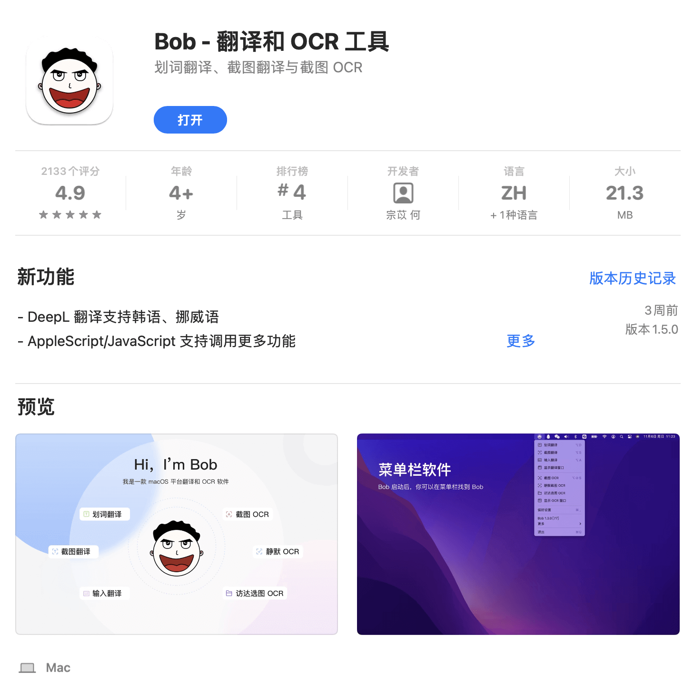
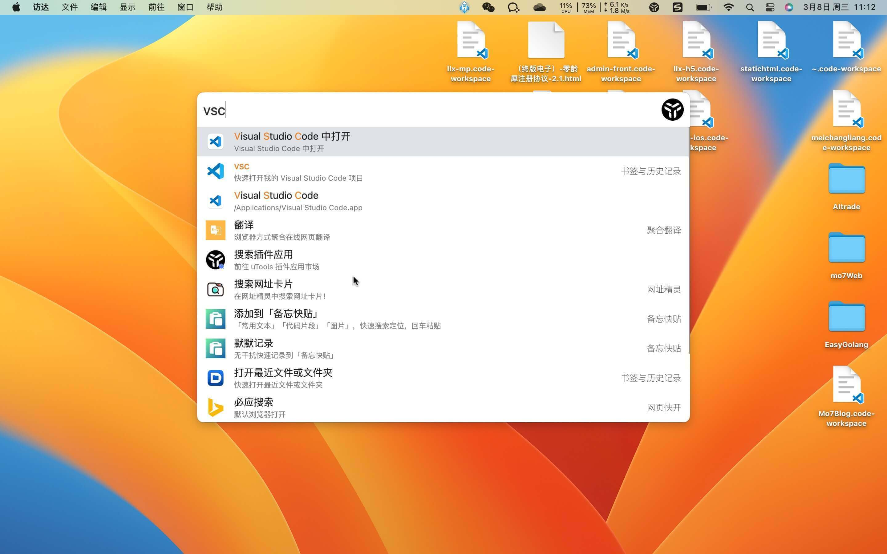
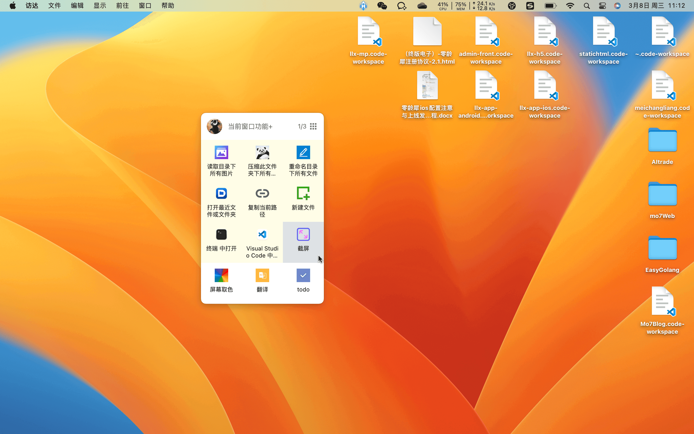
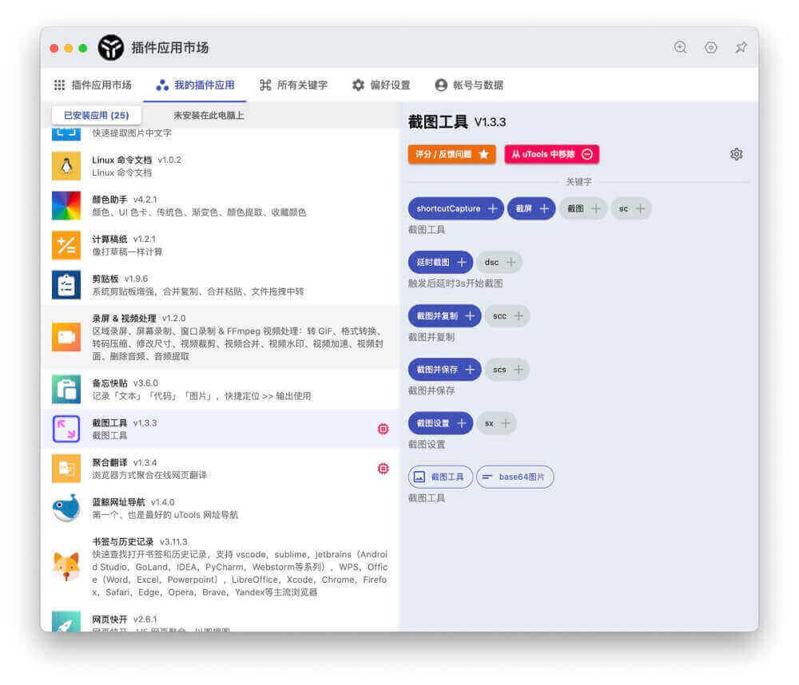
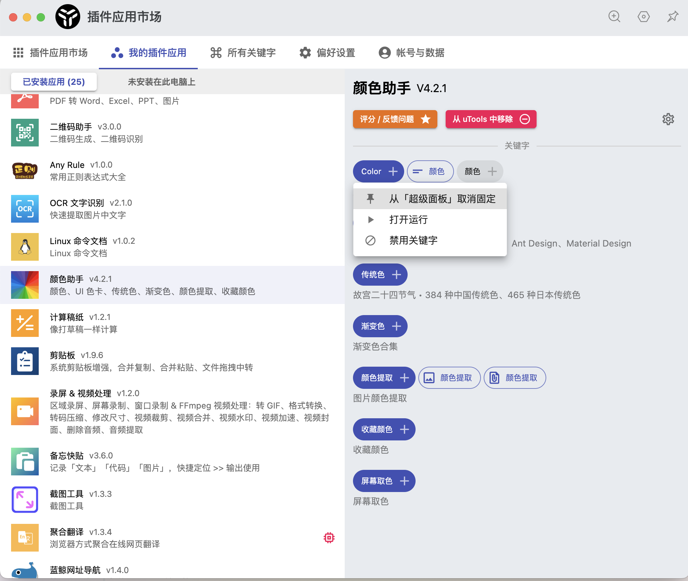
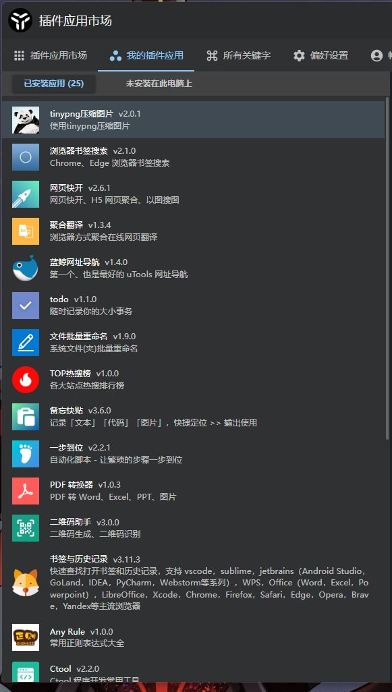
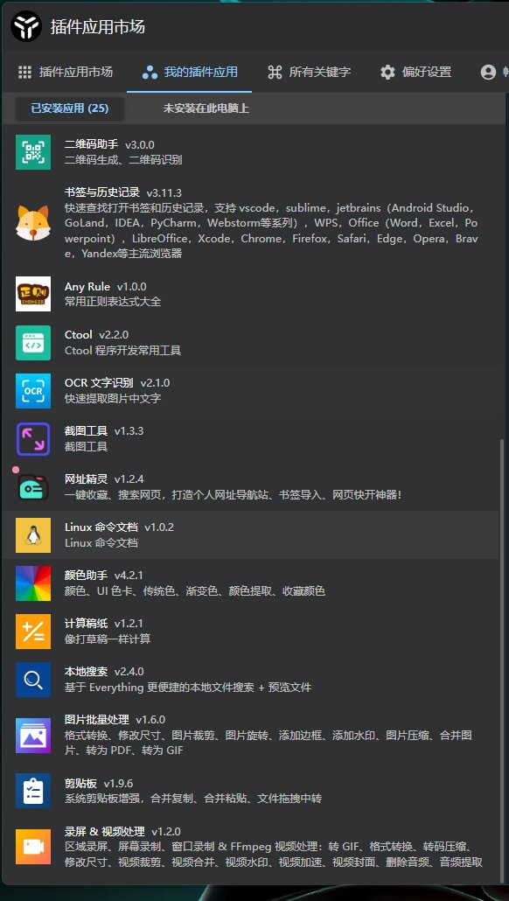

---
category:
  - 技巧
  - 使用指南
  - 工具
tag:
  - uTools
  - uTools
---

# uTools

::: info 相见恨晚的 PC 端工具集

当我搞明白这货的使用方法和运行逻辑之后，不仅效率提升了很多，我还卸载了十几个软件。

:::

## 本文重点

https://open.u-tools.cn/445779.html

基于 nodejs 开发的跨平台工具集合。\
横跨 Mac、Windows、Linux 三大平台，设计体验一致。它使得你的工具软件不再零碎。\
有了它，你的电脑只需要安装必要的核心软件就可以了。

## 一个截屏翻译软件引发惨案

在 windows 下有一个神器： `有道词典`\
我少数几个允许开机启动且后台常驻的软件。我的英文阅读水平一般，但我的工作经常会用到各种英文文档，所以翻译工具基本上是必不可少的。我一般都是把文字复制下来然后丢到软件当中去翻译，习惯了之后其实也没啥。但是有些文字是无法被复制的，这个时候是非常不方便的。

有道词典设置快捷键，直接像截图一样去识别屏幕上的英文语句，然后直接显示翻译结果，极大地提高了我的学习和工作效率。

但是！Mac 下没有这个功能。。。。

Mac 下我用的是这个玩意儿

{class="img-center" height="320"}

还特么花了我 50 大洋，现在想一想，自己真是个大怨种。

嗯，这货号称 Mac 下最好的截屏翻译工具，也确实好用。但是，它采用的是 Mac 系统`快捷指令`实现的截屏翻译功能。但是 Mac 的 api 是不允许代理方问的。每次使用我都得关闭代理。。天呐，烦透了，但是没办法。配置其它的访问 api 都存在一定的限制或者费用。但是将就将就又不是不行。

然后前段时间 B 站发现了一个 UP 主推荐了 `uTolls`，好奇心驱使下就去下载体验了一下。

{class="img-center" height="320"}

{class="img-center" height="320"}

{class="img-center" height="320"}

> 注：Mac 和 Windows 体验完全一致

其内部实现了一个叫做 `关键字` 的调用逻辑，每个插件都可以使用关键字来调用其它的关键字，一个插件可以有多个关键字。所有插件之间都是可以相互进行调用的。

于是就出现了各种组合，比如：\
`截图插件` + `OCR 识别插件` + `翻译插件` = **截屏翻译功能**\
`截图插件` + `二维码解析插件` = **扫码功能** (PC 能扫码了，喜极而泣)\
`文本提取` + `网址精灵` = **一键收藏网址**\
`文件提取` + `PDF转换器` = **一键转换 PDF 文件**\
`文件提取` + `图片压缩` = **一键压缩本地图片**\
`文件提取` + `搜索插件` = **一键搜索本地文件**\
.....

VSCode 能像如今这般如火如荼，离不开丰富的插件生态，其插件生态丰富是因为它的插件核心语言是 Javascript。\
uTools 的插件语言，也是 Javascript。开发一个插件快捷而迅速，而且 uTools 软件本身磨平了一些系统 API 之间的差异。你编写的插件可以很方便的进行进行系统的各项操作。\
目前 uTools 插件市场 400 + 各类插件，他们组合搭配起来基本上可以`[一键]`解决你 90%以上的快捷问题。

自从有了 uTools ，我把电脑上大部分快捷键都取消了，并且卸载了一大票工具类软件。后台只需要运行一个工具类软件，那就是 `uTools`。

虽然它的截图功能存在一些问题，但是够用。我们一般使用截图也只是方便标注和发送而已。遇到一些特殊情况的截图，可以搭配使用系统自带的截图使用。关键问题是，一堆 IM 软件和工具不用再相互打架了。节省时间就是延长生命。

> 截图工具并非 uTools 官方开发所以体验和功能很一般。但是官方开发的录屏工具却十分好用。可以看得出，社区出品的插件跟官方出品的插件质量上还是存在着一些差距。截图是一个很常用的功能，希望 uTools 官方能出手优化一下。

## 软件的使用演示

<BiliBili bvid="BV11x4y1T7iR" />

录制的比较粗糙，可以直接去 B 站观看高清视频。

## 使用技巧

1. 搜索框
   {class="img-center"}
   设置好快捷键之后，在任何地方都可以使用快捷键唤醒这个搜索框，在里面输入关键字或者词语，就可以调出对应的插件，或者搜索自己想要的东西，包括，网址，本地文件，最近使用的文件等等等.....

2. 【超级面板】
   {class="img-center"}
   在 windows 下按下鼠标中键，Mac 下双指长按(右键长按，可自定义时长)，任何屏幕都可以快捷唤醒超级面板，超级面板中的元素可以任意调整位置和增删

3. 关键字设置
   {class="img-center"}
   鼠标左键点取对应的关键字即可设置到【超级面板】中，或者禁用，以及测试运行，关键字前面带有特殊符号的。表示如果当前选中某个文件或者文字，超级面板中也可以触发唤醒选项。

[更多技巧](https://u.tools/docs/guide/about-uTools.html)

uTools 的一个关键字，就相当于一个小功能！

## 内存占用

{class="img-center" height="400"}

内存占用目测是取决于当前正在运行插件。基于 node，这个内存占用算是相当优秀了，可以看得出开发团队具有相当的水准。\
但是，因为 uTools ，可以把一大票工具都卸载掉，我的笔记本减负了不少。\
更别提 Mac 和 Win 完全一致的体验是多么难能可贵了！

## 常用插件

因为其良好的代码结构设计以及背靠 Javascript，使得其插件生态非常丰富。uTools 拥有一个插件市场，可以任意组合和下载使用各类插件，不用的插件之间还可以任意搭配。
下面是我常用的一些插件：

{width="50%"}
{width="50%"}

> uTools 所有关键字的唤醒快捷键都是可以自定义的，换句话说，**你可以通过插件以及快捷键组合搭配出任意的快捷功能**。

## 付费

免费的 uTools 已经够用了，三年年会员费用才 180 软妹币(我果断买了三年的)。

> 免费和付费的区别仅仅在于使用过的插件设置，数据是否可以云同步。

::: info 相见恨晚

感觉自己在寻找各种趁手工具上面浪费了大量的时间，就仅仅只是为了能让使用电脑的体验好那么一丢丢。但是 `uTolls` 无论是从产品设计还是程序架构上，都可以说是「快捷工具终结者」。\
快捷工具就应该长这样。

uTools 之于电脑，
就像 VSCode 之于前端一样。

而且，它的插件生态一定会像 VSCode 一样越来越大。我可以放心的把自己的使用习惯交给它。

> 世界上只分为两种人： `用过 uTools 的和不知道 uTools 的`。

身为一个前端开发者，我也非常乐意吧自己开发的功能对接到这个平台上面去。

:::
