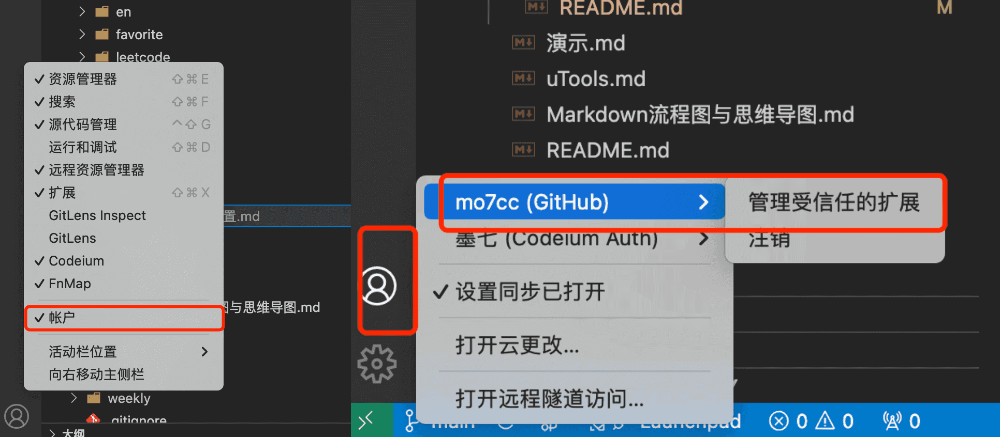
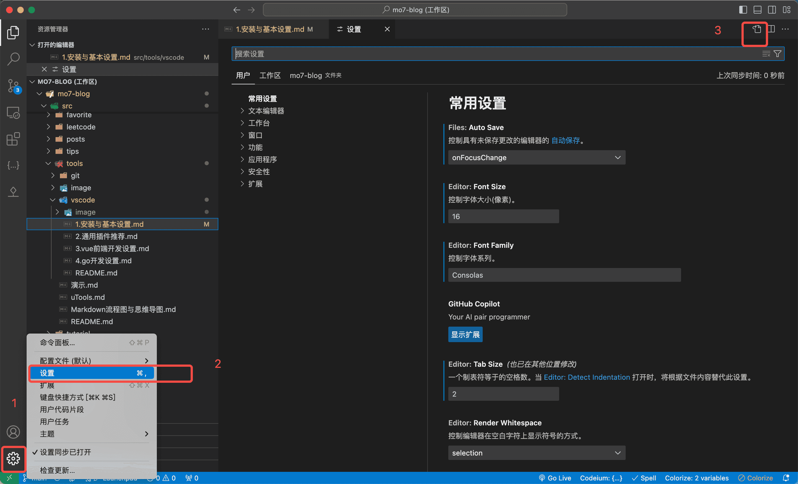
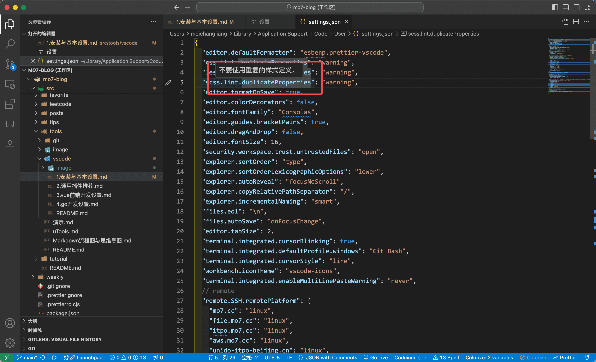

---
category:
  - 工具
tag:
  - VSCode
  - 目录

order: 1
permalink: /tools/vscode/vscode_ready.html
---

# 1.安装与基本设置

## 安装流程

可以参考这篇文章：
[Visual Studio Code 入门教程](https://juejin.cn/post/7037449594900316173)

## 基本设置

初次使用建议点开左下角设置浏览一下设置项都有哪些。

右键侧边栏可以控制显示哪些选项。勾选账户。
然后登录你的 Github 或者 Microsoft 账户，这样就可以在多台设备中同步你的设置以及插件了。



## 一些基本的设置项





下面是我个人的一些设置项

```json
{
  "css.lint.duplicateProperties": "warning",
  "less.lint.duplicateProperties": "warning",
  "scss.lint.duplicateProperties": "warning",
  "editor.defaultFormatter": "esbenp.prettier-vscode",
  "editor.formatOnSave": true,
  "editor.colorDecorators": false,
  "editor.guides.bracketPairs": true,
  "editor.dragAndDrop": false,
  "editor.fontSize": 16,
  "editor.tabSize": 2,
  "editor.fontFamily": "Monaspace Argon Var",
  "editor.fontLigatures": "'calt', 'ss02'",
  "security.workspace.trust.untrustedFiles": "open",
  "explorer.sortOrder": "type",
  "explorer.sortOrderLexicographicOptions": "lower",
  "explorer.autoReveal": "focusNoScroll",
  "explorer.copyRelativePathSeparator": "/",
  "explorer.incrementalNaming": "smart",
  "explorer.compactFolders": false,
  "files.eol": "\n",
  "files.autoSave": "onFocusChange",
  "files.associations": {
    "*.json": "jsonc",
    "*.nvue": "vue",
    "config": "ssh_config",
    "*.cjson": "jsonc",
    "*.wxss": "css",
    "*.wxs": "javascript",
    ".wxml": "html",
    ".env*": "dotenv"
  },
  "go.useLanguageServer": true,
  "gopls": {
    "formatting.gofumpt": true,
    "ui.semanticTokens": true
  },
  "terminal.integrated.cursorBlinking": true,
  "terminal.integrated.defaultProfile.windows": "Git Bash",
  "terminal.integrated.cursorStyle": "line",
  "terminal.integrated.enableMultiLinePasteWarning": "never",
  "terminal.integrated.fontSize": 16,
  "terminal.integrated.defaultProfile.osx": "zsh",
  "workbench.tree.enableStickyScroll": true,
  "workbench.colorTheme": "Default Dark+",
  "remote.SSH.remotePlatform": {
    "itpo.mo7.cc": "linux"
  },
  "remote.autoForwardPortsSource": "hybrid",
  "diffEditor.ignoreTrimWhitespace": false,
  "px-to-rem.px-per-rem": 16,
  "git.openRepositoryInParentFolders": "always",
  "colorize.languages": ["javascript", "html", "vue", "markdown"],
  "[shellscript]": {
    "editor.defaultFormatter": "foxundermoon.shell-format"
  },
  "[go]": {
    "editor.defaultFormatter": "golang.go"
  },
  "codeium.enableConfig": {
    "*": true,
    "markdown": true,
    "ignore": true
  },
  "[dotenv]": {
    "editor.defaultFormatter": "foxundermoon.shell-format"
  },
  "[vue]": {
    "editor.defaultFormatter": "esbenp.prettier-vscode"
  },
  "go.toolsManagement.autoUpdate": true,
  "[nginx]": {
    "editor.defaultFormatter": "ahmadalli.vscode-nginx-conf"
  },
  "hediet.vscode-drawio.resizeImages": null,
  "vsicons.dontShowNewVersionMessage": true,
  "workbench.iconTheme": "vscode-icons",
  "shellformat.path": "/usr/local/bin/shfmt",
  "[markdown]": {
    "editor.defaultFormatter": "esbenp.prettier-vscode"
  },
  "terminal.external.windowsExec": "C:\\Program Files\\PowerShell\\7\\pwsh.exe"
}
```
