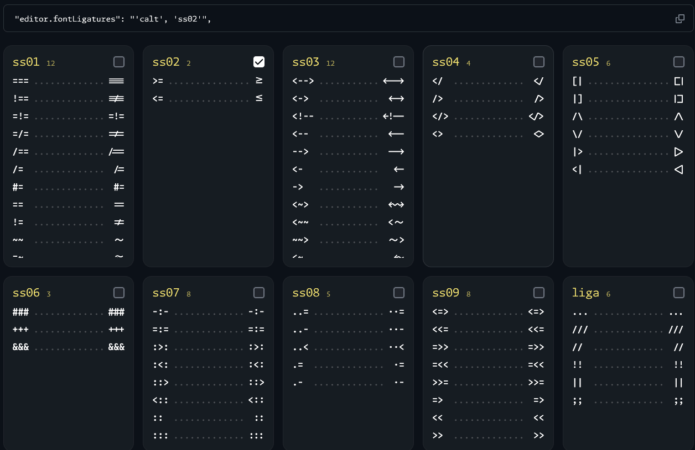
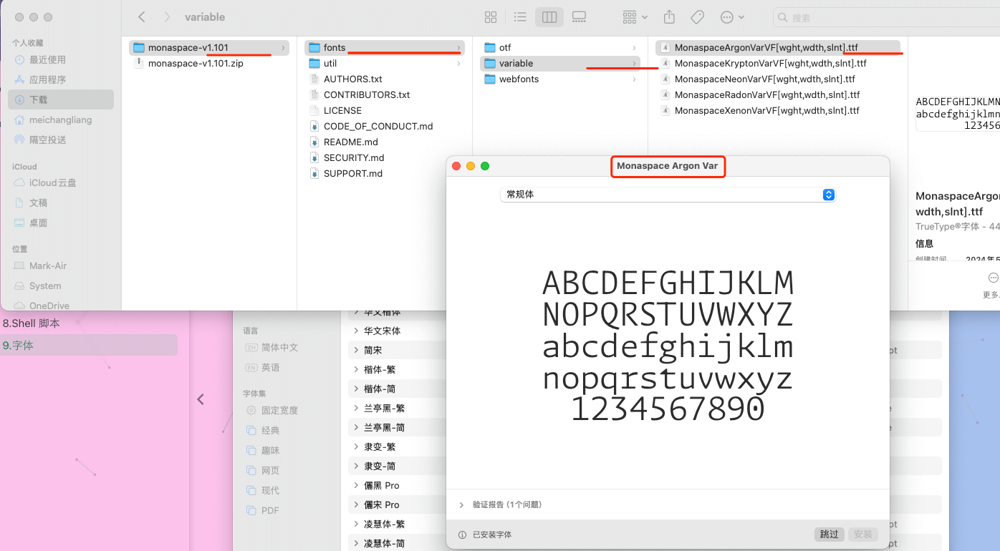
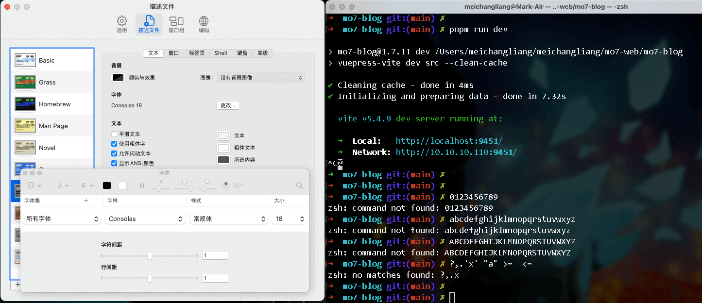
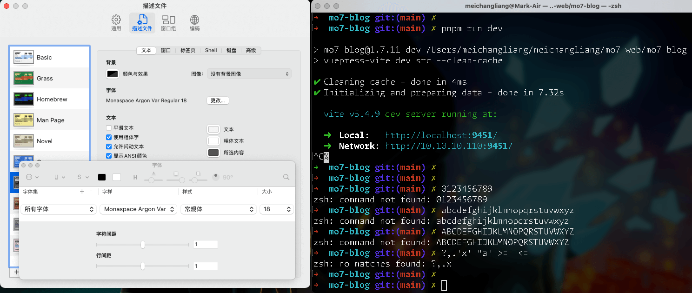
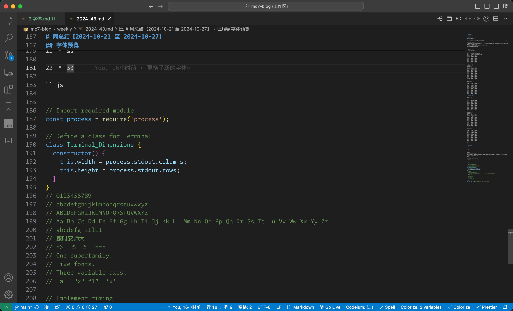

---
category:
  - 工具
tag:
  - VSCode
  - 目录

order: 9
permalink: /tools/vscode/vscode_font_setting.html
---

# 9.字体

最开始用的是系统默认的字体来编写代码，但是有点费眼睛。但一直也没什么。后来无意中发现了 `Consolas`，瞬间感觉整个代码界面都清爽了好多好多，辨识度也高了很多。
Consolas 就这样被我用了好多年。

然后前几天我打算好好重新给自己找一款字体。

然后发现了这个神级的编程字体： `Monaspace` \
尤其是它的 `Argon` 系列，怎么看怎么爱，比 Consolas 舒服太多了。

https://monaspace.githubnext.com

然后我就饶有兴趣的研究了一下字体相关的知识。

## 辨识度

首先对于编程来说有一些非常硬核的需求: \
`1ilLI0oO` \
你能分得清这些都是啥嘛？

他们分别是，数字 `1`，小写字母 `i`，小写字母`l`，大写字母 `L`，大写字母 `I`数字 `0`，小写字母 `o`，大写字母 `O`。
包括命令行。

所以一些字母和数字之间的区分，是非常重要的一项指标。

## 等宽

另一项重要指标是 `等宽` 也就是很多字中带有的 `mono` 标识。

https://zh.wikipedia.org/wiki/等宽字体

等宽字体在阅读，排版，代码对比上会非常省力，基本上是编程字体的赢需求。

## 衬线

又称为有衬线体、衬线字、曲线描边字，俗称白体字。
比如 宋体 就是标准的衬线字体，他们的特点是在笔画的起始和末端设置一些装饰。

https://zh.wikipedia.org/wiki/衬线体

我个人非常讨厌衬线字体，因为末端的装饰在我看来就是一种干扰。我比较喜欢黑体这种无衬线风格的，还有隶书这种近似手写风格弱衬线的。

所以选择字体一定必须是 `等宽无衬线` 的

## Consolas

Consolas 是微软专门为编程设计字体，是`宇宙 IDE Visual Studio` 的默认字体。

https://zh.wikipedia.org/wiki/Consolas

它是非常标准的 `等宽无衬线` 字体。当然，我在最初使用 Consolas 的时候并没有什么等宽衬线这些概念，仅仅是无意识之举，因为这个字体的名称很像 `Console` 我就选择了它，结果一下子感觉就像给眼睛来了一次大保健！然后就一发不可收拾，我的好几台电脑，浏览器，编辑器，命令行，所有的可以显示英文的地方我都换上了这种字体。看起来贼舒坦。

但是这款被我用了好几年的字体前昨天被我用 `Monaspace Argon` 取代了。

## 字体文件格式与选择

这里我就不赘述了，直接看链接

https://ziyouziti.com/art-23.html

总结一下，我们一般需要关注的几个名词：

`.ttf` 也就是 `TrueType` 格式，Win 和 macOS 通用格式，也是主流格式，特点显示和打印一致性很好，可以随意缩放不会出现锯齿，兼容性也是最好的。

`.otf` 也就是 `OpenType` 微软和 Adobe 共用研发的字体，macOS 也有很好的支持。致力于取代 `ttf`

`woff` 和 `woff2` `Web Open Font Format` 的缩写，前者兼容老旧浏览器，后者泽专用于现代浏览器，特点是体积小，专用于 web 网页。

`.ttc` 是多个 `ttf` 的合成字库，多个字体糅合在一起，以减小体积。

其余的字体格式多多少少都会存在一些兼容性问题，建议直接忽略。

`Light`, `Medium` 和 `Bold` 是字体的粗细版本。

我们一般关注 `Regular` 常规版本就好了。

还有一种是 `variable fonts` 一般标注 `variable` 或者 `VF`

俗称 `可变字体`，它是一种多种字体格式的单文件版，是一种数字时代制作的字体技术，它将斜体，粗体，拉伸，变形全都存储在一个 字体文件中。

如果你下载的字体包里面有 VF 字样的字体，则只需要安装这个即可，无需犹豫。

> 相关阅读 https://zh.wikipedia.org/wiki/可变字体

## 字体的安装与卸载

目前来说，在 Windows 下和 macOS 下直接双击下载好的字体文件，左上角就会出现安装按钮，直接点击安装即可。

Windows 下打开控制面板搜索 `字体 -> 添加和删除字体` 找到对应的字体文件右键就会出现删除选项。

macOS 下直接打开 `字体册.app` 找到对应的字体右键移除即可。

## 字体的选择

选择字体的时候我想把中文也给换了，弄一套中英文都兼容的字体。

一般来说在设置 fontFamily 时，系统会按顺序使用字体，比如：

```css
font-family: 'Consolas', '霞鹜文楷GB Mono SC';
```

其中 `Consolas` 只包含 英文字母，数字，以及一些英文的标点符号，大小只有几十 KB 左右。它的字体渲染并不包含中文，而 `霞鹜文楷GB` 则是包含字母，数字，英文，汉字，繁体，甚至是日文的字体渲染，大小几百 M。如果 `霞鹜文楷GB` 放前面，那么基本上你的任意一个字符都可用 `霞鹜文楷GB` 去展示，`Consolas` 字体压根就没有任何效果。
所以把英文字符放在前面，中文字体放后面，字母数字就会使用英文字体，显示汉字的时候找不到，退而求其次系统会使用第二位置的字体，再找不到会使用第三位直到最后使用系统字体。

> 如果系统字体也无法显示该字符，则会展示是一个 _方框问号_ 表示乱码。不同的字体族显示的乱码会不太一样，有的字体甚至会用一个表情来进行占位。

我花了一天时间亲身尝试了以下字体以及组合。

`霞鹜文楷 GB Mono SC`
很优秀的字体，很全面，开源免费，中文看起来很好看，英文紧凑大气。
`GB` 是作者做了一些修改，表示这个是遵循国家标准的，适合用来打印的字体。
https://github.com/lxgw/LxgwWenKaiGB
我的推荐榜单第四名。

---

`思源黑体`
https://github.com/adobe-fonts/source-han-sans/blob/master/README-CN.md
很好看的一款字体，非常适合阅读。血脉纯正。
我的推荐榜单第三名。

---

`MiSans`
小米手机系统的默认字体，我觉得很大气很好看。版式很多，支持的语言也很多，很全，但是他有一个很严重的缺陷，就是一般的字体渲染字库里面没有的文字时会显示一个乱码占位符，但是小米的这款 `MiSans` 就是一个空白的，这会给人一个错误的信息。这个是完全不能忍的。当然，你也可以选择安装更全的版本。
https://hyperos.mi.com/font/zh/

---

`更纱黑体`
这个字体很棒，英文中文都很 Nice，看起来很不错，而且非常标准，开源，是一组整合字体，基于思源黑体。字母数字写代码都没啥问题。所以 `更纱黑体` 可以看作是`思源黑体`的上位替代。我的推荐榜单第二名。
https://github.com/be5invis/Sarasa-Gothic

---

还有其它的字体，但是多多少少都会存在一些不满意的地方。
因为我家里用的是 Windows 台式机，在公司用的 macOS，所以在公司看一天电脑回到家之后会发现各种不对劲儿，原因就是因为同一个字体在不同系统之下显示效果会不一样....

## 最佳编程字体组合

`Monaspace`

https://monaspace.githubnext.com

这货我就不过多介绍了，大家看官网，这货和 go 语言一样，主打一个 `现代化血脉牛逼 + 政治无解`。
是`GithubNext`的子项目之一，主打一个专为编程而生。

### 风格

一种字体族五种风格可选。

`Neon（现代风格字体）`：无衬线的等宽风格，看起来很规整，非常适合大标题，打印这种形式的。缺点是 `e o c` 这些字母都是圆的，太圆了，区别度不高看起来很闹心。太过板正。作为标题我是首推的，但是编程大部分都是一排排的小字母。

`Argon（人文风格字体）`：这是我最满意的一款字体，各个方面都非常接近 `Consolas` 但是比 它更清晰，更大气，更规整更宽阔，字母整齐划一，辨识明显。缺点是作为标题不如 `Neon` 大气规整，但也不差。还有一点是 它的小写字母 `t` 的左上角是连起来的，但是看习惯之后也还可以。

`Xenon（衬线风格字体）`：它的衬线是很弱的那种，但是和 `Neon` 一样 `e o c` 这些太圆了，摆在一起看着闹心。而且带衬线，对我来说干扰太严重了。

`Radon（手写风格字体）`：手写体风格，看习惯之后很好看，但是对我来说手写体是一种识别负担。

`Krypton（机械风格字体）`：机械体，非常直愣愣的拐角，我想说，作为编程字体来说这种字体显示效果真的非常干净清爽，识别率非常高。但是缺点就是作为大标题太丑了！不过编程都是小字母问题不大的。

综上所述，我最终选择了一个中庸的方案: `Argon（人文风格字体）` 综合各个方面来看，这款字体没有短板但是优于 `Consolas` 这就够了。


### 编程连字

它最棒的地方在于，它的连字风格是可以选择的！
很多时候一些连字纯纯的是干扰，但是有一些连字确实非常有用的

比如 `>=` 和 `<=`，以及 `===` 和 `!==` 双斜杠 `//` `/**` 等 ，因为这些字符在编程上面基本属于通用的 `基本组合`。
但是另外一些什么 `==>` `-~` 这些连字之后看起来和一些现有字符太像了，容易误判。

但是 Monaspace 直接提供了一些选择供你挑选，这服务意识直接拉满！



比如我只选择了 大于等于和小于等于 那么在 VSCode 中做如下设置即可。

```json title="settings.json"
{
  "editor.fontFamily": "Monaspace Argon Var",
  "editor.fontLigatures": "'calt', 'ss02'"
}
```

至于中文字体，我折腾了好久好久，我发现还是使用系统默认字体最舒服。要相信资本做出的选择，它们花了几百亿打造的操作系统，怎么可能会用一款让人不舒服的字体呢?

PS：实测，在 Mac 上 `苹方-简` 显示最好，在 Windows 上 `微软雅黑` 显示最好，当然这俩也是系统默认字体。其它的字符渲染总有毛边。所以配置文件这么写中文字体就会直接用系统默认字体进行显示了。

当然，如果想要在 Windows 上使用 苹方-简，可以在这个地址下载。
https://github.com/ZWolken/PingFang
那么配置文件就是:

```json title="settings.json"
{
  "editor.fontFamily": "'Monaspace Argon Var','PingFang SC'",
  "editor.fontLigatures": "'calt', 'ss02'"
}
```

然后我日常看电子书的时候使用的是思源黑体，习惯了，所以我的设置是这样的:

```json title="settings.json"
{
  "editor.fontFamily": "'Monaspace Argon Var','Sarasa Mono SC'",
  "editor.fontLigatures": "'calt', 'ss02'"
}
```

这里我安装的是 `SarasaMonoSC-Light.ttf` 也就是 `等距更纱黑体 SC` 。个人感觉比 `PingFang SC` 和 `微软雅黑` 要舒服一点点。
然后 `Monaspace` 常规体比 `Light` 要粗一点，所以在 VSCode 中数字 和字母就比 汉字粗一点点，直接变相的相当于突出显示了 字母和汉字。这样在阅读一些说明文档的时候非常有用。
当我禁用 等距更纱黑体 SC 的时候，就会直接看到 苹方-简 或者 微软雅黑 的效果。

> SC 指的是简体中文。

## Monaspace 的下载与安装

通过官网 https://monaspace.githubnext.com 进入到 Github 仓库，右边的 `Releases` 当前是 `v1.101` 版本，然后直接下载 `.zip` 文件。



顶部显示的 `Monaspace Argon Var` 就是这款字体的名字，直接把名字放到配制文件中即可。然后重启 VSCode，当你的数字 `0` 中间显示有圆点则表示使用成功。

与 Consolas 对比





> 可以明先看到 Monaspace 要清晰大气不少



> 在 Markdown 中连字效果依然存在，代码阅读体验上升好几个档次。

## 文字渲染预览(可以直接复制粘贴使用)

```txt
0123456789
abcdefghijklmnopqrstuvwxyz
ABCDEFGHIJKLMNOPQRSTUVWXYZ
披绣闼，俯雕甍，山原旷其盈视，川泽纡其骇瞩。闾阎扑地，钟鸣鼎食之家；舸舰弥津，青雀黄龙之舳。云销雨霁，彩彻区明。
落霞与孤鹜齐飞，秋水共长天一色。
渔舟唱晚，响穷彭蠡之滨，雁阵惊寒，声断衡阳之浦。(迷津 一作：弥津；云销雨霁，彩彻区明 一作：虹销雨霁，彩彻云衢)
魣𡈼𮬛
?
?。，,. "" '' ''" "x" 'x' “” ‘’ “asd” ‘爱仕达’
落霞与孤鹜齐飞，秋水共长天一色。
11 <= ss
22 >= 33

```

```js
// Import required module
const process = require('process');
// Define a class for Terminal
class Terminal_Dimensions {
  constructor() {
    this.width = process.stdout.columns;
    this.height = process.stdout.rows;
  }
}
// 0123456789
// abcdefghijklmnopqrstuvwxyz
// ABCDEFGHIJKLMNOPQRSTUVWXYZ
// Aa Bb Cc Dd Ee Ff Gg Hh Ii Jj Kk Ll Mm Nn Oo Pp Qq Rr Ss Tt Uu Vv Ww Xx Yy Zz
// abcdefg iIlL1
// 按时打油
// =>  <= >=  ===
// One superfamily.
// Five fonts.
// Three variable axes.
// 'a'  "x" “1”  ‘x’

// Implement timing
let timing_start;
const time_limit => 9999; // maximum time limit in milliseconds

```
