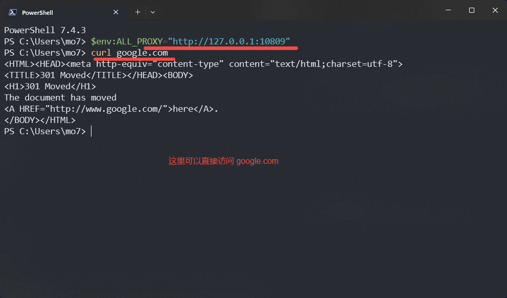
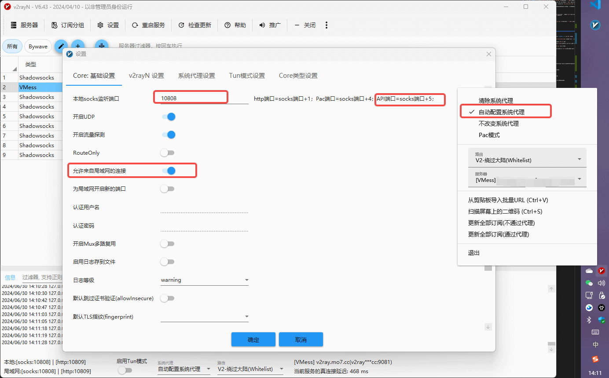
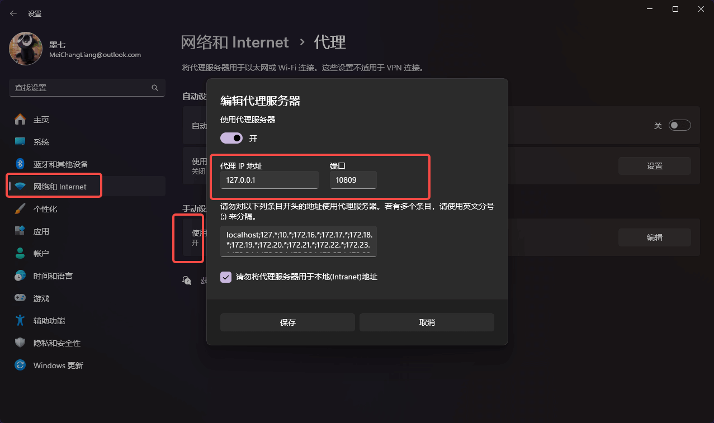
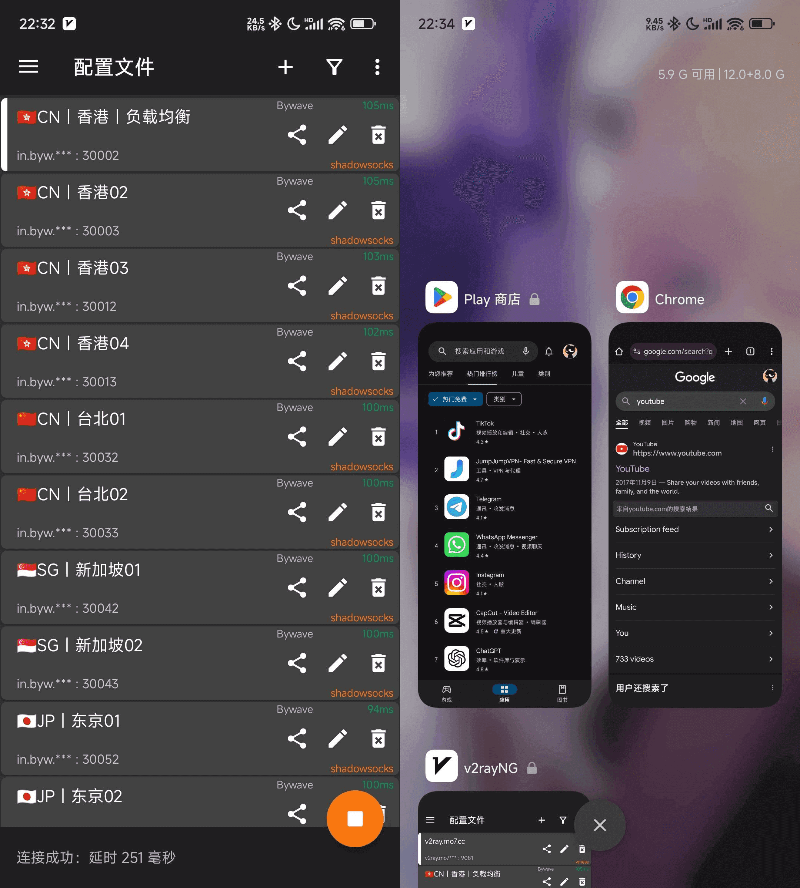

---
category:
  - 教程
tag:
  - 代理
  - 科学上网
  - 技巧
  - 教程

order: 1
permalink: /tutorial/proxy_wall_ready.html
---

# 1.科学上网与本地代理教程

为了学习目的，诸如国外的一些优秀网站访问速度会很慢，甚至是无法访问，导致一些依赖的下载和软件的更新无法完成，资料都无法查阅。
这个时候可能需要一些使用一些代理手段。

我之前使用过的方案是 [ByWave](https://cn.bing.com/search?q=ByWave) ，实测还蛮好用的，一年也就一百来块挺实惠。


> 点进去之后，直接注册/登录，然后购买对应的服务，然后下载安装即可。

## 自建代理服务的方案

::: warning 注意
以下方案可能需要你对 `Linux 运维` 以及 `云服务器的采购` 具有一定的熟练度。
:::

1. 准备一台 **海外服务器**， 假设名为:`服务器A` (假设 IP 为:`456.456.456.4567`) 并设置安全组开放 `10086` 端口。

2. 然后在 **`服务器A`** 上搭建搭建 [v2ray](https://github.com/233boy/v2ray) 服务，并设置端口为 `10086` 。如果步骤没问题，你会获得一些配置参数和 v2ray 协议链接。

3. 然后下载一个 [代理客户端](https://github.com/v2rayU/v2rayU) ，并把协议链接录入测试 `456.456.456.4567:10086` 的代理服务是否可用。

::: details
亲测，这里服务器的采购可以使用 [阿里云](https://www.aliyun.com/) 等国内厂商没有问题。但是依然推荐一些国外厂商的云主机，比如 [硅云](https://www.vpsor.cn)。
然后服务器地点一般选择 香港、新加坡 延迟会比较低。

代理客户端的选择后文有相关说明。
:::

## 保护你的代理服务器

::: warning 注意
如果你已经自建代理服务并用起来了，但是别开心的太早，因为`456.456.456.4567`的 IP 可能过几天就会被`GFW`扫描并封禁。
虽然你可以更换 IP ，但是这毕竟很麻烦，而且并不安全，而且更换 IP 会产生一定的费用。
这个时候你需要采用如下做法来保护你的海外服务器以及 IP。

> 需要对 Nginx 有一定的熟练度。

:::

4. 再准备一台国内的服务器，假设名为:**`服务器B`** (假设 IP 为:`123.123.123.1234`) 并设置安全组开放 `10809` 端口。
5. 在 **`服务器B`** 中安装 Nginx 并添加如下配置:

```js
stream {
  upstream v2ray {
    server 456.456.456.4567:10086;
  }
  server {
    listen 10809;
    proxy_pass v2ray;
    ssl_preread on;
  }
}
```

::: details
这一步的意思是: 在 **国内`服务器B`** 中来自 `10809` 端口的请求将全部转发给 **国外** `服务器 A` 的`10086` 端口。
:::

6. 打开[代理客户端](https://github.com/v2rayU/v2rayU)的设置界面，将 `456.456.456.4567:10086` 代理服务修改为 `123.123.123.1234:10809`。然后测试代理服务是否可用。

::: details
这一步的意思是，在其它设置不变的情况下，将原本的 `服务器A` 的 地址和端口换成 `服务器B` 的。

到这一步之后，你每次使用代理客户端时，实际上全都是在请求国内的服务器，这时`GFW`的扫描不会发觉任何异常，也无法封禁国内 IP。
:::

7. 修改 **`服务器A`** 的安全组，让 `10086` 端口只允许 ip 为 `123.123.123.1234` 的机器访问。

::: details
到这一步之后 `GFW` 扫描 **`服务器A`** 就不会发现任何异常，毕竟这个端口的安全组会阻拦 `GFW` 的访问，表面看它就是一个平平无奇的服务器而已。
然后国内的 **`服务器B`** 本身就在国内，不受 `GFW` 约束。

日常的代理客户端，只会被抓到它在请求国内服务器，则 IP 地址安全。

> 当然，两台服务的成本确实会有点点高，实测这种方案最为安全和稳定。

:::

## 本地代理客户端的选择

https://github.com/v2rayU/v2rayU

**Windows:**
https://github.com/2dust/v2rayn/releases

::: details
v2rayN 的使安装方法是: 下载 `v2rayN-With-Core.zip` 和 `v2rayN.zip` 并解压，然后将前者目录中的内容覆盖替换到后者目录中，然后就可以双击 `v2rayN.exe` 文件进行使用了。
:::

**安卓:**
https://github.com/2dust/v2rayNG/releases

::: details
下载对应的 `apk` 文件然后安装即可。如果打不开或安装失败就多换几个安装包试试。
:::

**macOS:**
https://github.com/yanue/V2rayU/releases

::: details
下载对应的 `.dmg` 文件安装即可。如果打不开或安装失败就多换几个安装包试试。
:::

## 设置命令行代理

第一步，如下图所示，打开代理软件(这里用的是 V2rayU)，设置好 http 端口，确认系统代理已生效


第二步，设置如下环境变量。

```bash
#  ~/.zshenv 或 ~/.bashrc 文件中:
export http_proxy=http://127.0.0.1:10809
export https_proxy=http://127.0.0.1:10809
export ALL_PROXY=http://127.0.0.1:10809

```

::: tip
Windows，Linux，WSL，MacOS 基本同理
:::

```powershell
# Powershell 是这么设置的
$env:ALL_PROXY="http://127.0.0.1:10809"

## 全局永久生效
#  我的电脑->属性->更改设置->高级->环境变量，添加环境变量
#  变量名  ALL_PROXY
#  变量值  http://127.0.0.1:10809

```









## v2rayU 的卸载

在 macOS 下，正常移入回收站是无法干净的删除 v2rayU 的，还需要使用如下命令彻底删除:

```bash
cd ~/Library/LaunchAgents/
/bin/launchctl remove yanue.v2rayu.v2ray-core
/bin/launchctl remove yanue.v2rayu.http

rm -f ~/Library/LaunchAgents/yanue.v2rayu.v2ray-core.plist
rm -f ~/Library/Preferences/net.yanue.V2rayU.plist
rm -f ~/Library/Logs/V2rayU.log

rm -fr ~/.V2rayU/
```
