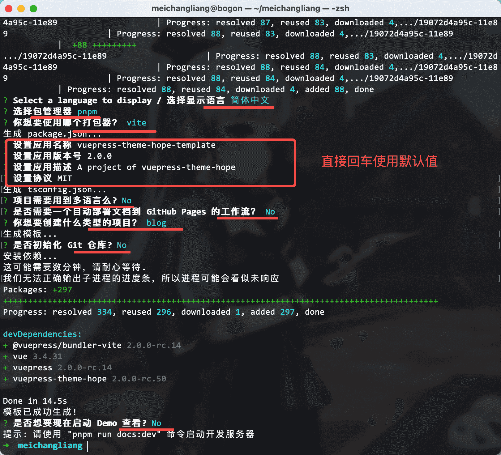
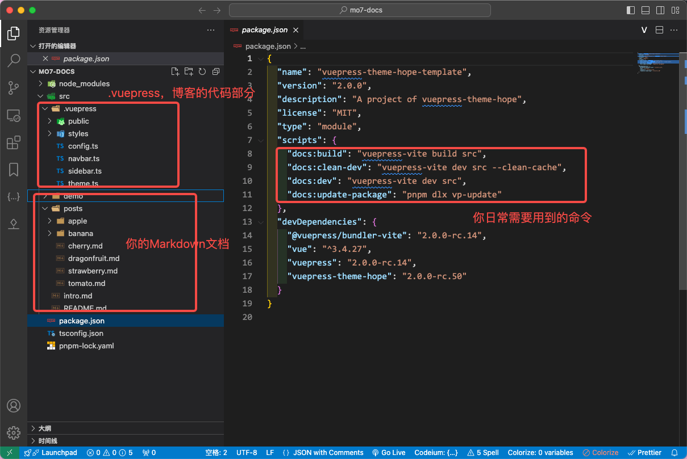
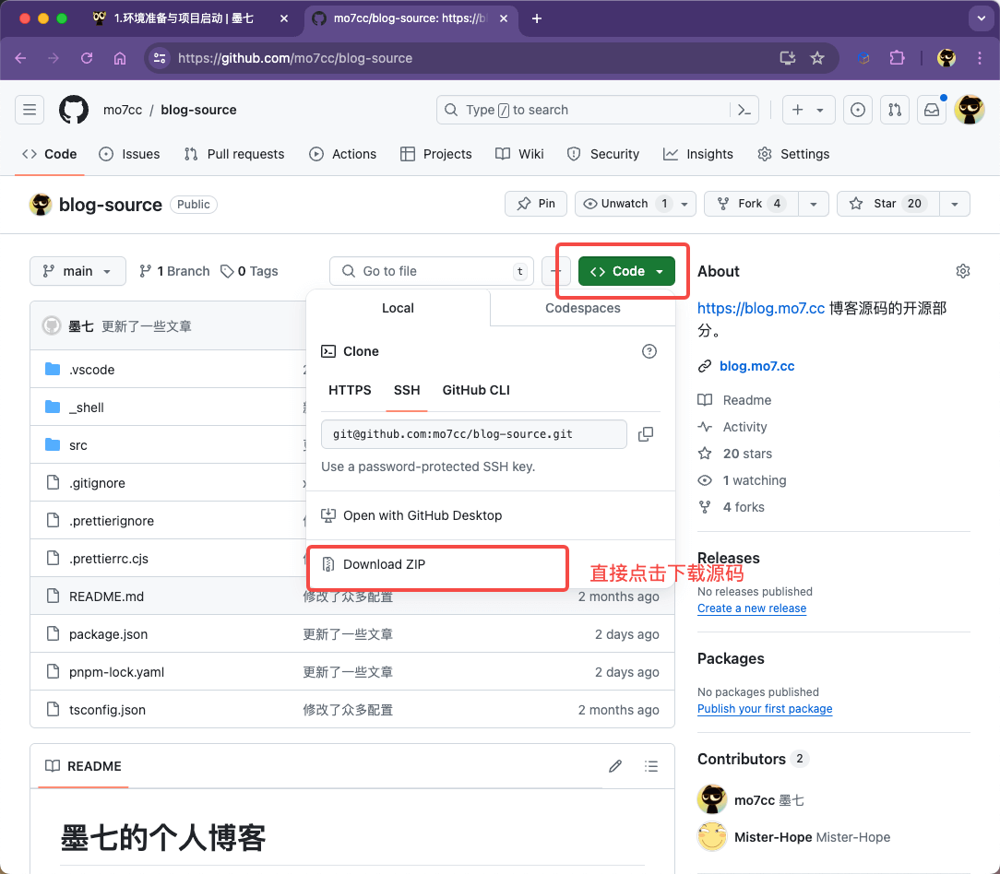
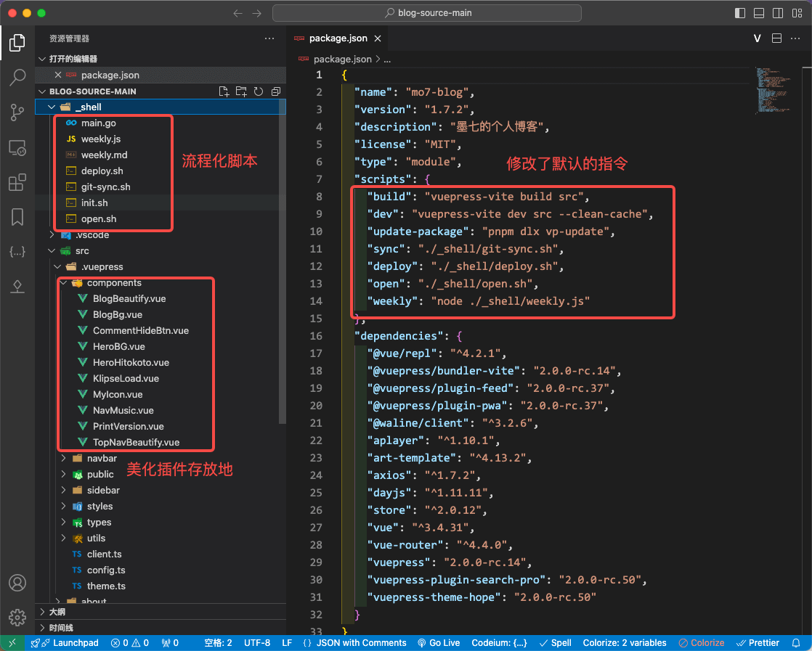

---
category:
  - 博客搭建教程
tag:
  - 教程

order: 1

permalink: /tutorial/vuepress-hope/step_ready.html
---

# 1.环境准备与项目启动

当前博客采用 [vuepress-hope](https://theme-hope.vuejs.press/zh/) 搭建，这是一个免费开源的项目，是我用过的最强大和灵活的静态博客生成工具。

但是想要完全用好这款工具搭建出符合自己心意的博客，必须得具有一定的知识储备和掌握必要的工具。

## 必要的知识储备

[墨七编写的 编程基础入门](/developer/basic/)

相对路径，命令行，文件编码，开发工具，Git，Github 都需要具备一定的概念才可以。

## 工具准备

### 命令行环境

[Nodejs 基础环境搭建](/developer/front_end_web/nodejs_ready.html)

### 编辑器

[Visual Studio Code 使用说明](/tools/vscode/)

为了良好的体验，需要安装的插件：

**Vue - Official**
https://marketplace.visualstudio.com/items?itemName=Vue.volar

**Prettier - Code formatter**
https://marketplace.visualstudio.com/items?itemName=esbenp.prettier-vscode

## 官方文档说明

打开 [vuepress-hope 官网](https://theme-hope.vuejs.press/zh/)

它的文档结构长这样：


一般来说，按照顺序一步步走下去就可以把项目成功启动起来。

## 开始

如果准备工作妥当，我们这里直接开始。

打开命令行，找一个自己心仪的目录执行以下命令：

```bash
pnpm create vuepress-theme-hope my-docs
```

::: details 命令解读

`pnpm`: 这个是 `Nodejs` 当下最流行的的包管理器，上文中有写到。
`create`: 这个是 pnpm 内置的一个命令，意思是 通过 模板创建一个项目
`vuepress-theme-hope`: 模板的名称
`my-docs`: 这个是项目名称，你完全可以自定义这部分改成自己喜欢的名字。建议使用英文字母、下划线以及中短杠
:::

执行完命令之后会有一些问题需要你回答一下:


完成之后当前目录就会创建一个项目目录，我们用 vscode 打开这个项目：



其中 博客的程序和配置部分全部都会存放在 `src/.vuepress` 目录下。
`src/` 目录下除开 `.vuepress` 目录之外的目录和文件都会被视作文档。

`node_modules` 是依赖存放的目录，一般不需要去管它。

`package.json` 是项目描述文件，其中

```json
"scripts": {
  "docs:build": "vuepress-vite build src",
  "docs:clean-dev": "vuepress-vite dev src --clean-cache",
  "docs:dev": "vuepress-vite dev src",
  "docs:update-package": "pnpm dlx vp-update"
}
```

部分是你可用的脚本。比如这里就提供了 4 个脚本，你可以这么使用它：

```bash
# 安装依赖 这个是 pnpm 提供的基本能力
pnpm install

# 将项目进行打包，准备发版 ， 对应 package.json scripts 里面的  docs:build  命令
pnpm run docs:build

# 清除缓存并启动服务
pnpm run docs:clean-dev

# 启动本地预览服务
pnpm run docs:dev

# 升级所有的依赖
pnpm run docs:update-package

```

对的，其基本的语法就是 `pnpm run xxx` 。 `xxx` 就是 `package.json` 的 `scripts` 属性提供的。

如果没什么问题，你应该可以成功启动项目并看到你的博客雏形了。

## 另一种方案

我当前的博客源码已经在 `github` 中开源了，地址为
https://github.com/mo7cc/blog-source

你可以直接点击下载并解压。



项目结构说明如下:



也就是说，我的博客项目 命令如下:

```bash
# 安装依赖
pnpm install

# 本地启动预览
pnpm run dev

# 打包变异准备发版
pnpm run build

# 更新依赖
pnpm run update-package

# 一条指令同步到远程仓库
pnpm run sync <同步说明>

# 一条指令发布博客
pnpm run deploy <发布说明>

# 开源博客的源码部分
pnpm run open <开源说明>

# 新建一个周工作计划表
pnpm run weekly

```
