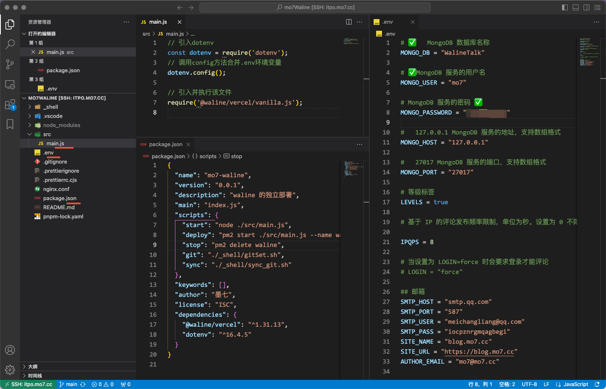

---
category:
  - 博客搭建教程
tag:
  - 教程

order: 7

permalink: /tutorial/vuepress-hope/step_talk.html
---

# 7.搭建评论系统

这里的评论系统使用了

https://waline.js.org

其实搭建起来很方便也很容易。跟着文档一步步走就可以了。

我因为有自己的服务器，所以是在自己的服务器上进行搭建的。

对于小白来说，这里面的难点可能在于 **数据库** 和 **Nginx** 部分。

## 部署流程

### 创建项目

```bash
# 初始化一个项目
pnpm init "mo7-waline"

# 安装依赖
pnpm add @waline/vercel dotenv

# 安装 pm2 进行后台程序管理
npm install -g pm2

```

### 编写入口文件

`src/main.js`

```js title="src/main.js"
// 引入dotenv
const dotenv = require('dotenv');
// 调用config方法合并.env环境变量
dotenv.config();

// 引入并执行该文件
require('@waline/vercel/vanilla.js');
```

### 配置命令

```json
{
  "name": "mo7-waline",
  "version": "0.0.1",
  "description": "waline 的独立部署",
  "main": "index.js",
  "scripts": {
    "start": "node ./src/main.js",
    "deploy": "pm2 start ./src/main.js --name waline",
    "stop": "pm2 delete waline",
    "git": "./_shell/gitSet.sh",
    "sync": "./_shell/sync_git.sh"
  },
  "keywords": [],
  "author": "墨七",
  "license": "ISC",
  "dependencies": {
    "@waline/vercel": "^1.31.13",
    "dotenv": "^16.4.5"
  }
}
```

然后就可以使用如下命令进行快捷操作了。

```bash
# 启动 服务
pnpm run start

# 部署，用 pm2 启动后台进程
pnpm run deploy

# 停止服务
pnpm run stop

```

### 配置环境变量

`./.env` 文件

相当于对服务的一个设置。

```py
#MongoDB 数据库名称
MONGO_DB = "WalineTalk"

#	MongoDB 服务的用户名
MONGO_USER = "mo7"

#	MongoDB 服务的密码
MONGO_PASSWORD = "*****"

#  127.0.0.1	MongoDB 服务的地址，支持数组格式
MONGO_HOST = "127.0.0.1"

# 27017	MongoDB 服务的端口，支持数组格式
MONGO_PORT = "27017"

# 等级标签
LEVELS = true

# 基于 IP 的评论发布频率限制，单位为秒。设置为 0 不限制

IPQPS = 8

# 当设置为 LOGIN=force 时会要求登录才能评论
# LOGIN = "force"

## 邮箱
SMTP_HOST = "smtp.qq.com"
SMTP_PORT = "587"
SMTP_USER = "meichangliang@qq.com"
SMTP_PASS = "iocpznrgmqagbegi"
SITE_NAME = "blog.mo7.cc"
SITE_URL = "https://blog.mo7.cc"
AUTHOR_EMAIL = "mo7@mo7.cc"

```

我这里用的数据库 MongoDB ，实际上评论服务这种的完全可以用 本地 json 来实现，没必要搞什么数据库的。只能说作者对这个插件的期望很高，考虑到了大数量的查询问题。

Github 也不错其实，但是国内 Github 访问会抽风。

如图：


## Nginx 配置

这个时候其实服务已经没问题了，但是想要让其它网络的人都能访问，还需要进行 Nginx 的配置。

```js
server {
  listen 80;
  listen 443 ssl http2;
  server_name talk.mo7.cc;
  root /root/talk.mo7.cc;

  if ($server_port !~ 443) {
    rewrite ^(/.*)$ https://$host$1 permanent;
  }

  # SSL setting
  ssl_certificate /etc/letsencrypt/live/talk.mo7.cc/fullchain.pem;
  ssl_certificate_key /etc/letsencrypt/live/talk.mo7.cc/privkey.pem;
  ssl_protocols TLSv1.1 TLSv1.2 TLSv1.3;
  ssl_ciphers EECDH+CHACHA20:EECDH+CHACHA20-draft:EECDH+AES128:RSA+AES128:EECDH+AES256:RSA+AES256:EECDH+3DES:RSA+3DES:!MD5;
  ssl_prefer_server_ciphers on;
  ssl_session_cache shared:SSL:10m;
  ssl_session_timeout 10m;
  add_header Strict-Transport-Security "max-age=31536000";

  # proxy to 8360
  location / {
    proxy_pass http://127.0.0.1:8360;
    proxy_set_header Host $host;
    proxy_set_header X-Real-IP $remote_addr;
    proxy_set_header X-Forwarded-For $proxy_add_x_forwarded_for;
    proxy_set_header X-Forwarded-Proto $scheme;
    proxy_set_header REMOTE-HOST $remote_addr;
    add_header X-Cache $upstream_cache_status;
    # cache
    add_header Cache-Control no-cache;
    expires 12h;
  }
}
```

我这里 专门配置了 域名 `talk.mo7.cc` 以及 ssl 证书。

## 在 vuepress-hope 中使用

`src/.vuepress/theme.ts`

```js
import { hopeTheme } from 'vuepress-theme-hope';

export default hopeTheme({
  // ...
  plugins: {
    // ...
    comment: {
      provider: 'Waline',
      serverURL: 'https://talk.mo7.cc',
      copyright: false,
      reaction: true,
    },
    // ...
  },
  // ...
});
```

你没看错！使用的时候只需要填写 `https://talk.mo7.cc` 就可以了！ 不需要任何令牌和密码！你完全不需要部署过程是什么样的！

也就是说，如果你信任我的话，也可以直接在自己的 博客 配置文件这么填写，评论服务一样可以生效。只不过评论时的邮件和数据全都会存放在我这里。哪天一不开心我也可以关停评论服务。
