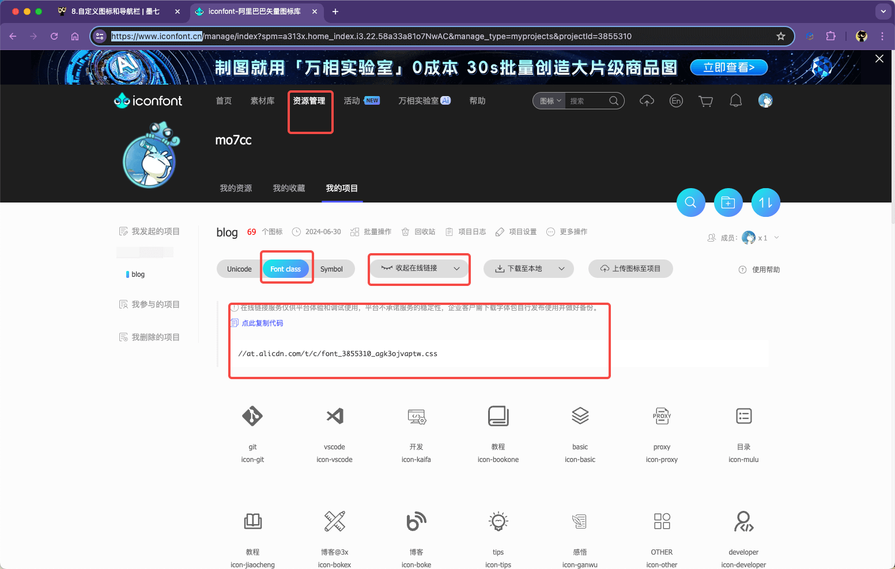
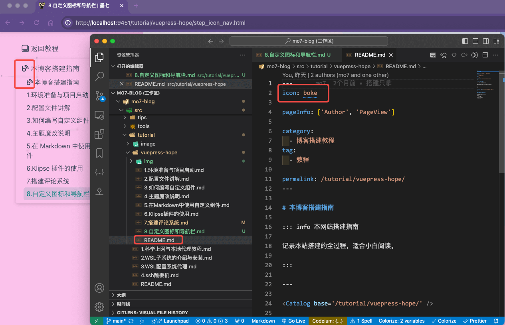

---
category:
  - 博客搭建教程
tag:
  - 教程

order: 8

permalink: /tutorial/vuepress-hope/step_icon_nav.html
---

# 8.自定义图标和导航栏

这个篇章会讲解如何自定义自己的图标

这里我们会用到一个网站：
https://www.iconfont.cn/

如下图所示：



你可以挑选自己喜欢的图标并命名加入到你的项目中去，然后你可以获得 例如:
`icon-git`
`icon-vscode`
`icon-basic`

这样的图标名称 ，和一个 css 文件网络地址。

## 使用方式

`src/.vuepress/theme.ts`文件中填入这个地址

```js
import { hopeTheme } from 'vuepress-theme-hope';
export default hopeTheme({
  // ...
  iconAssets: '//at.alicdn.com/t/c/font_3855310_agk3ojvaptw.css',
  // ...
});
```

然后就可以在项目中使用它们了:


但是记住，没有前面的 `icon-` 部分，只有名字部分。

## 导航栏

这部分我觉得可以不用多讲，官方文档写的很清楚了。

https://theme-hope.vuejs.press/zh/guide/layout/navbar.html

https://theme-hope.vuejs.press/zh/guide/layout/sidebar.html

这里是我的导航栏源码:

---

`src/.vuepress/navbar/zh.ts`

::: details 文件内容

```js title="src/.vuepress/navbar/zh.ts 文件内容"
<!-- @include: @src/.vuepress/navbar/zh.ts -->
```

:::

---

`src/.vuepress/sidebar/zh.ts`

::: details 文件内容

```js title="src/.vuepress/sidebar/zh.ts 文件内容"
<!-- @include: @src/.vuepress/sidebar/zh.ts -->
```

:::
