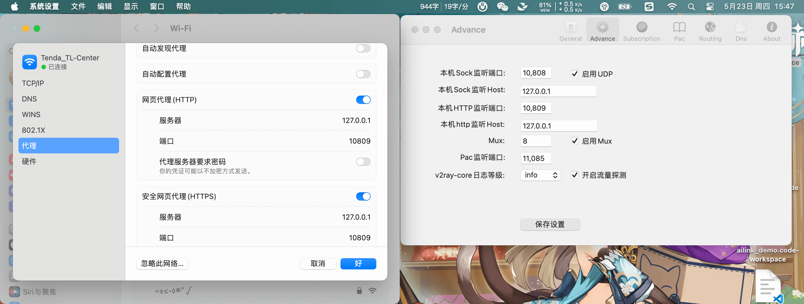

---
category:
  - 教程
tag:
  - 代理
  - 科学上网
  - 技巧
  - 教程

order: 1
permalink: /tutorial/proxy_wall_ready.html
---

# 科学上网与本地代理

为了学习目的，诸如国外的一些优秀网站访问速度会很慢，甚至是无法访问，导致一些依赖的下载和软件的更新无法完成，这个时候可能需要一些使用一些网络加速器或者代理服务。

我经常使用的第三方网络加速器是 [ByWave](https://www.bing.com/search?q=ByWave) ， 实测还蛮好用的，也挺实惠。

## 自建代理服务

1. 准备一台海外 **`服务器A`** (假设 IP 为:`456.456.456.4567`) 并设置安全组开放 `10086` 端口。

2. 然后在 **`服务器A`** 上搭建搭建 [v2ray](https://github.com/233boy/v2ray) 服务，并设置端口为 `10086` 。如果步骤没问题，你会获得一些配置参数和 v2ray 协议链接。

3. 然后下载一个 [代理客户端](https://github.com/v2rayU/v2rayU) ，并把协议链接录入测试 `456.456.456.4567:10086` 的代理服务是否可用。

## 保护你的代理服务器

::: warning
如果你已经自建代理服务并用起来了，但是别开心的太早，因为`456.456.456.4567`的 IP 可能过几天就会被`GFW`扫描并封禁。
虽然你可以更换 IP ，但是这毕竟很麻烦，而且并不安全。
这个时候你需要采用如下做法来保护你的海外服务器以及 IP。
:::

4. 再准备一台国内的 **`服务器B`** (假设 IP 为:`123.123.123.1234`) 并设置安全组开放 `10809` 端口。
5. 在 **`服务器B`** 中安装 Nginx 并添加如下配置:

```js
stream {
  upstream v2ray {
    server 456.456.456.4567:10086;
  }
  server {
    listen 10809;
    proxy_pass v2ray;
    ssl_preread on;
  }
}
```

::: details
这一步的意思是: 在 **`服务器B`** 中来自 `10809` 端口的请求将全部转发给 `456.456.456.4567:10086`。
:::

6. 打开[代理客户端](https://github.com/v2rayU/v2rayU)的设置界面，将 `456.456.456.4567:10086` 代理服务修改为 `123.123.123.1234:10809`。然后测试代理服务是否可用。

::: details
到这一步之后，你每次使用代理客户端时，实际上全都是在请求国内的服务器，这时`GFW`的扫描不会发觉任何异常，也无法封禁国内 IP。
:::

7. 修改 **`服务器A`** 的安全组，让 `10086` 端口只允许 ip 为 `123.123.123.1234` 的机器访问。

::: details
到这一步之后`GFW`无论是扫描海外的 **`服务器A`** 还是国内的 **`服务器B`** 都不会发现任何异常。
:::

::: tip
当然，两台服务的成本确实会有点点高，是否划算见仁见智了。
:::

## 本地代理客户端

https://github.com/v2rayU/v2rayU

**Windows:**
https://github.com/2dust/v2rayn/releases

::: details
v2rayN 的使安装方法是: 下载 `v2rayN-With-Core.zip` 和 `v2rayN.zip` 并解压，然后将前者目录中的内容覆盖替换到后者目录中，然后就可以双击 `.exe` 文件进行使用了。
:::

**安卓:**
https://github.com/2dust/v2rayNG/releases

**macOS:**
https://github.com/yanue/V2rayU/releases

## 设置命令行代理

第一步，如下图所示，打开代理软件(这里用的是 V2rayU)，设置好 http 端口，确认系统代理已生效



第二步，设置如下环境变量。

```bash
#  ~/.zshenv 或 ~/.bashrc 文件中:
export http_proxy=http://127.0.0.1:10809
export https_proxy=http://127.0.0.1:10809
export ALL_PROXY=http://127.0.0.1:10809

```

::: tip
Windows，Linux，WSL，MacOS 基本同理
:::

```powershell
# Powershell 是这么设置的
$env:ALL_PROXY="http://127.0.0.1:10809"

```
